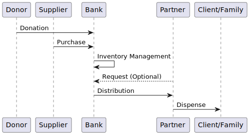

# Overview

> :warning: **WORK IN PROGRESS**: This document is currently (March 2023) under review, but committed to exercise the diagram generation code.

## The Physical Flow of Inventory


<details><summary>(Diagram Code - Physical Flow)</summary>

```plantuml:physical-flow
skinparam componentStyle rectangle
skinparam linetype ortho

[Purchase] --> [Intake]
[Donation] --> [Intake]

rectangle "Bank" {
  [Inventory] --> [Adjustment]
  [Inventory] --> [Transfer]
}

rectangle "Partner" {
  [Distribution]
}

[Intake] -> [Inventory]
[Inventory] -> [Distribution]
[Distribution] --> [Recipient]
```
</details>


<details><summary>(Diagram Code - Timeline)</summary>

```plantuml:timeline-flow
participant Donor
participant Supplier
Donor -> Bank: Donation
Supplier -> Bank: Purchase
Bank -> Bank: Inventory Management
Partner --> Bank: Request (Optional)
Bank -> Partner: Distribution
Partner -> "Client/Family": Dispense
```
</details>


### Intake

A Essentials Bank will acquire inventory primarily through one of two methods: a **Donation** or a **Purchase**. Purchases are straightforward; the Essentials Bank spends its own money to purchase inventory. Donations can be received through a few different means.

**Product Drives** are like food drives -- a campaign, typically with advertisement to the community, for the general public to provide needed items to the Essentials Bank. Sometimes people will also donate inventory at a local **Donation Site**, outside of a Product Drive. Other than those two primary methods, there is a miscellaneous classification for essentials that are received (but not purchased) through other means.

Donations can also dropped off at **Donation Sites**. These are locations that have been designated as places where people can drop off donations.

Donations that don't fit into either of those types are classified as "Miscellaneous Donations."

Both Donation Sites and Product Drives have to be created in the application beforehand, but can be used repeatedly after that.

### Inventory Management

All inventory is physically stored at **Storage Locations**. This is one area where the application is particularly useful, as some storage locations accrue large quantities of inventory over time. Each storage location can contain any number of **Items** or types of items, and if a Essentials Bank has multiple storage locations, it is possible for the same item type to exist at multiple locations. Generally a Storage Location corresponds to one general physical area, like an entire room or building.

Sometimes, the Essentials Banks will need to make a correction, this application calls them **Adjustment**s.

When an Essentials Bank wants to move inventory from one storage location to another, they do so with a **Transfer**.

### Partner Distribution

A Partner is another organization that receives items from an Essentials Bank and then provides them to their local community. An Essentials Bank might serve an overall region, and a Partner might be more localized to a neighborhood. Local community centers, churches, and similar organizations get supplies from the Essentials Bank to then share with the individuals and families that they serve.

When inventory leaves an Essentials Bank, it does so via a **Distribution**. These are either created implicitly from inbound Partner **Requests**, or created explicitly via the menu interface. The inventory is pulled from a single designated Storage Location, and the distribution is built in a similar fashion to Donations, Adjustments, Transfers, etc -- items are selected and quantities are specified.

Distributions can be exported as PDFs, which Banks can use as printable manifests for the packages sent to the Partner.

Partners then dispense the items they receive to the clients / families.

# Application Architecture

This section is a more detailed, and more technical, explanation of how the application works, internally.

## Multi-Organization


<details>
<summary>(Diagram Code - Multi-Organization)</summary>

```plantuml:multi-tenancy
skinparam componentStyle rectangle
skinparam actorStyle awesome

'skinparam linetype ortho

actor "User A\n(Admin)" as user_a
actor "User B" as user_b
actor "User C" as user_c
actor "User D" as user_d

cloud "humanessentials.app" {

user_a --> [Bank A]
user_b --> [Bank A]

[Bank A] --> [Partner A]
[Bank A] --> [Partner B]
[Bank A] --> [Partner C]

user_b --> [Bank B]
[Bank B] --> [Partner C]

user_c -u-> [Partner A]
user_d --> [Bank A]
user_d --> [Partner A]
}
```
</details>

This application is multi-organization -- that is, each Essentials (Diaper) Bank (used interchangeably with **Organization**) has its own templated "section" of the application, and may act in that section without concern that its changes will affect other organizations (and vice versa).

When a user is signed-in, they are automatically "isolated" to their current organizational space. They can work for different organizations, but must explicitly switch which organization view they are on at any point in time.

## Users
Every organization has a user who is the "organization admin", typically the first user to sign up for that organization. This user can perform administrative privileges on the organization, such as changing the descriptive details, inviting other users, etc. Additional users are able to use most of the functions of their organizational space.

## Items

These are an important, but perhaps not immediately intuitive, aspect of the application. Items are, for example, "3T Diapers", or "Baby Wipes", or "Boys Batman 4T Diapers" -- they can be as generic or as specific as necessary, and organizations have full control over what items they use in their instance of DiaperBase.

Every Item is also connected with a "Base Item". The Base Items are all very generic and refer to a functional commonality -- "3T Diapers", "Huggies 3T Diapers", "Boys Batman 3T Diapers" would all have "3T Diapers" as their Base Item.

For a much more detailed and technical description of how these work, see the Wiki article on [Base Items](/rubyforgood/diaper/wiki/Base-Items).

Base Items are only really noticeable in two places: When creating a new item, and when communicating between Essentials Banks and Partners. Aside from those, they're more of a concern of the `SiteAdmin` role. For the remainder of this document, when it refers to "Item", it is referring to `Item`, unless otherwise specified.

### Item "Boxes" (LineItems & InventoryItems)
Because Items are only defining *types* of physical inventory, we need a vehicle to track *quantities*. This application does this by piggybacking on the association. We currently use two different kinds of associations: **Line Items** and **Inventory Items**. The main practical difference between the two is that the quantities of "Line Items" are non-zero integers and the quantities of "Inventory Items" are natural numbers.

#### Line Items
These are the most common, and are used polymorphically for numerous models. The name "line item" was chosen because a "line item" is a single line on a list of items, perhaps found on a manifest or roster. In this application, line items are like a plain box, labeled with an item type, that some number of items are put into. That labeled box can only hold that kind of item, it can also hold negative quantities of that item.

Line Items are used in Donations, Distributions, Adjustments, Transfers, Purchases, and generally any place where inventory is being listed somehow.

The behaviors of Line Items are consistent enough that the logic has been captured largely in the [Itemizable](/rubyforgood/human-essentials/blob/master/app/models/concerns/itemizable.rb) model concern.

#### Inventory Items
Inventory Items are similar to Line Items in their function, except it might be better to abstractly think of them as "Shelves" -- they are only found in Storage Locations, and are the resting place for inventory while it's retained by the Organization. Like Line Items, each Inventory Item can only track a single item type, but instead of associating with a polymorphic type, they only associate with Storage Locations (which hold physical inventory). They also differ in that they cannot be negative (you can't have -5 Baby Wipes, right?)

### Barcoding
One of the reasons that the Human Essentials application was built was specifically to offer the ability to expedite inventory tracking with Barcodes. If you aren't familiar with the physical concept of how Barcodes function, read up on [Code 39](https://en.wikipedia.org/wiki/Code_39) specifically - this allows us to encode letters and/or numbers into machine readable barcodes.

#### Organization Barcodes
Organizations are encouraged to create their own Barcodes. So long as the barcode value has not already been used by that organization, they are free to use whatever Code39 barcode value they like.

Suggested uses include:

 * Using the actual UPC on the packaging
 * Creating barcodes that meaningfully track the item name and quantity in the value (ie. 100X3TDIAPERS)
 * Creating barcodes that track custom bundles the Essentials Bank frequently dispenses

Organization barcodes always take precedence when they do a lookup.

#### Global (Shared) Barcodes
These are barcodes that act as "fall-throughs" and will generally be used to track product UPCs and map them to the appropriate Base Item type. (For example: pointing the UPC for 40 Huggies 3T, 48 Pampers 3T, and 24 Luvs 3T diaper packs all to the "3T Diapers" Base Item type). These are only entered by Site Administrators, and must always point to a Base Item type.

#### Barcode Retrieval


<details>
<summary>(Diagram Code - Barcode Retrieval)</summary>

```plantuml:barcode-retrieval
skinparam componentStyle rectangle
skinparam linetype ortho

[Base Item] <-- [Item] : Fallback
[Base Item] <. [Global Barcode]
[Item] <. [Bank Barcode]
[Global Barcode] <-- [Bank Barcode] : Fallback
```
</details>

Barcode records are either connected to an organization and an `Item`, or they are labeled "global" and connected to a `BaseItem`. When a lookup is requested, it will look up the barcode (by its value) with this order of priority (this was established in [#593](/rubyforgood/human-essentials/issues/593)):

 1. Does the organization have its own barcode defined with this value? (yields an `Item`)
 2. Is there a global barcode defined for this value? (yields a `BaseItem`)
 3. Prompt the user to create a new barcode record using this value

For the second item, after the `BaseItem` is retrieved, it consults back to the Organization and finds the oldest `Item` (for that organization) that uses the retrieved `BaseItem`.

## Partner Requests


<details><summary>(Diagram Code)</summary>

```plantuml:partner-request
participant Partner as partner
participant Bank as bank

partner -> bank: Submit request
bank -> bank: Build distribution
bank -> partner: Fulfill distribution
```
</details>

Partners may submit requests to an Essentials Bank. These list the items and quantities of each item being requested. The Essentials Bank can use this request as the starting point for a Distribution, but often makes changes to the actual Distribution to more accurately capture which actual items and quantities are being distributed.

# Future Documentation

* Counties reporting
* Announcements
* New Kits architecture once it is merged
