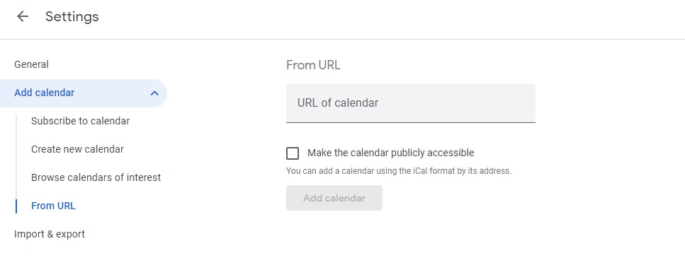

# Pick Ups & Deliveries Calendar

The calendar shows the pickup and delivery schedule. It shows past and upcoming distributions in a given month.

Click on the "Pick Ups & Deliveries" section to view the distributions. 

Click on any scheduled distribution to view more details about it.
The Distribution Schedule page shows details including the Partner,the time of distribution, source inventory, the total number of items, and the status of the distribution.

If the distribution has been done, you can mark it as complete by clicking on "Distribution Complete". Marking the distribution as complete does not remove it from the calendar.

Click "View" for more details on the source location, the agency representative, the delivery method, the shipping cost, comments and the state of the distribution.

If you want to print the details of the distribution to use as a contents list or receipt, click on "Print".

## Sync Pick Ups & Deliveries Calendar with Google Calendar

You can sync the Pick Ups & Deliveries Calendar with Google Calendar for more convenience.

Click on "Copy Calendar URL to clipboard" to get the calendar URL to be added to Google calendar. On Google Calendar, in the "Other calendars" section click on the "+" which will bring up several choices.

Select "From URL"and paste the URL you copied in the "URL of calendar" section and click on "Add Calendar"

Events from the Human Essentials Pick Ups & Deliveries Calendar should be accessible to you on Google Calendar when the sync is complete.