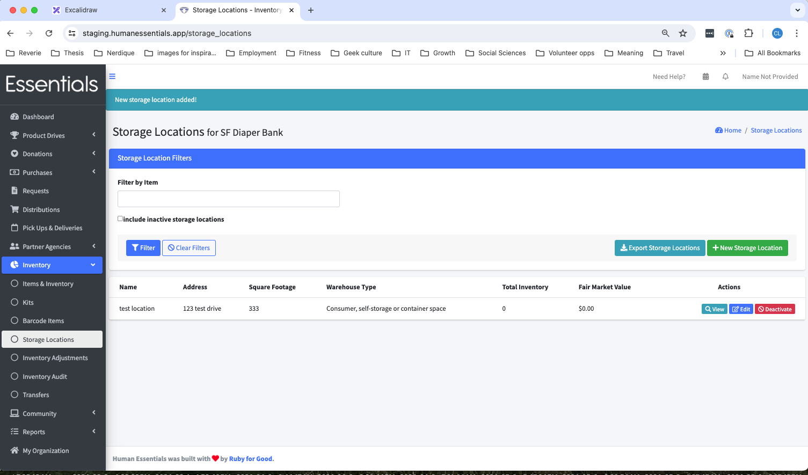

# Getting Started -- Storage Locations

A bank can have multiple storage locations -- these range from warehouses down to space in people's houses.  You need at least one storage location in the system.

Each storage location has its own inventory of a common list of items (e.g. different sizes of diapers)

When you are inputting donations, or purchases, you will specify the storage location, and the donated/purchased items will be added to that storage location's inventory.  Similarly, when you make distributions, you choose a storage location, and can see the inventory levels for each item before committing to the distribution.

How do you enter a storage location?   If you haven't any storage locations yet, you can click on "Add a Storage Location" in the "Just Starting?" sequence at the top of your dashboard.  

[TODO:   Add screen shot of dashboard -- it's going to be different when the user guide is finished than it is at drafting]

You can also click on "Inventory", then "Storage Locations" in the left-hand menu, then "New Storage Locations"

Either of these will bring up the new storage location screen

Fill in the information:
- Name and Address are mandatory
- Square Footage and Warehouse Type are used for the Annual Survey (our collection of information corresponding to the NDBN Annual Survey)
- Set Time Zone to the local time zone for the storage location.  This impacts the Pickup & Deliveries calendar but not much else.  

[TODO:  Understand *How* timezone affects the P&D calendar]

Click "Save"

You'll see a list of your storage locations.  Click "New Storage Location" if you want to enter another locations.

Next step:  [Entering or uploading your initial partner list](getting_started_partners.md) 
