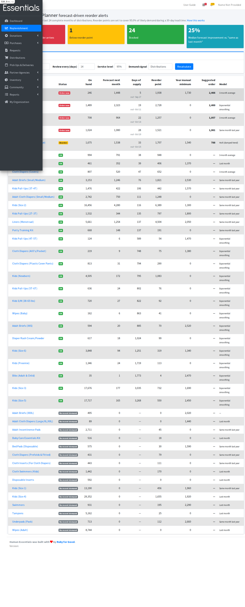
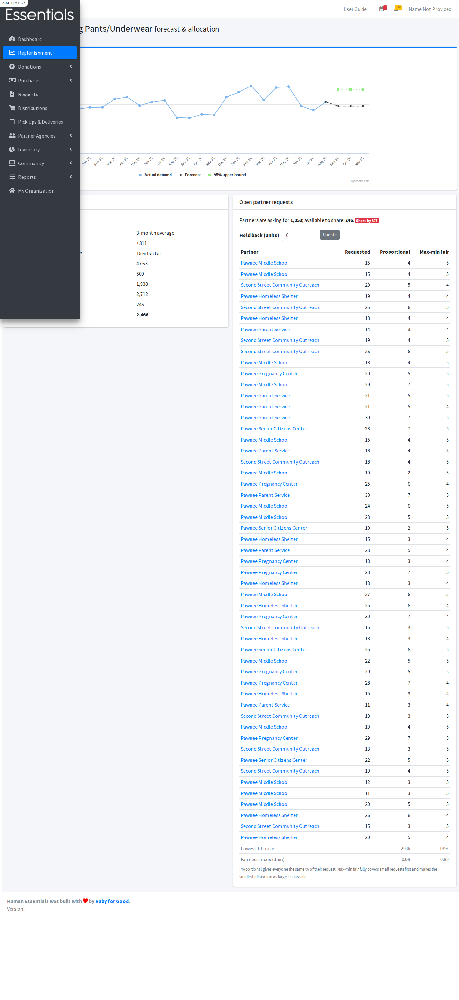

# Replenishment Planner

A demand-forecasting and inventory-policy module for Human Essentials. It is
read-only (no migrations, no changes to inventory events) and sits behind the
`replenishment_planner` Flipper flag.

Everything described here lives in:

| Piece | File |
|---|---|
| Forecasting engine | `app/services/replenishment/demand_forecaster.rb` |
| Inventory policy | `app/services/replenishment/reorder_policy.rb` |
| Shortage allocation | `app/services/replenishment/fair_allocator.rb` |
| Data plumbing | `app/services/replenishment/demand_history.rb`, `plan_service.rb`, `allocation_service.rb` |
| UI | `app/controllers/replenishment_controller.rb`, `app/views/replenishment/` |
| Tests | `spec/services/replenishment/`, `spec/requests/replenishment_requests_spec.rb` |
| Backtest / demo | `lib/tasks/replenishment.rake` |



## The problem

Diaper banks run on donated and purchased stock that arrives in large lumps
(diaper drives, grants, bulk buys). Stock goes out to partner agencies
(shelters, clinics, schools) every week. Before this module, Human Essentials let a
bank set a fixed **"minimum quantity"** per item and flagged items below
it. That number is typed in by hand, never updates, and has no link to how fast
the item actually moves. In the demo data, some slow items carry minimums
of 2,000+ units while fast movers have a minimum of 0.

The question staff actually need answered is: **"What will run out before I can
restock it, and how much should I get?"** That is a standard industrial
engineering problem, made of three parts.

## 1. Forecast demand

`DemandHistory` builds a monthly demand series per item from the last 24
*complete* months. The current partial month is dropped so it doesn't look
like a sudden dip. It can use either:

- **Distributions**: what was actually handed out. Reliable, but
  *censored*: in a month the bank ran out, recorded demand is lower than true
  demand.
- **Partner requests**: what partners asked for. Closer to true need.

`DemandForecaster` fits five candidate models:

| Model | Idea |
|---|---|
| Naive | next month = last month |
| 3-month moving average | smooth out noise |
| Simple exponential smoothing | weighted average, recent months count more (α tuned) |
| Holt, damped trend | level + trend, trend fades out (α, β tuned, φ = 0.9) |
| Seasonal naive | next month = same month last year (needs 24+ months) |

It **chooses between them with a rolling-origin backtest**. For each of the last
six months, each model is fitted only on data before that month and asked to
predict it. The model with the lowest mean absolute error wins, and simpler
models win ties. This is an honest out-of-sample test, not a fit to data the
model has already seen.

The backtest also produces **σ**, the typical size of a one-month forecast
error. That feeds directly into safety stock. Items that are hard to predict
automatically get a bigger buffer.

**Forecast skill** is reported as `1 − MAE_model / MAE_naive`: how much less
wrong the forecast is than just assuming "same as last month".

## 2. Decide when and how much to reorder

`ReorderPolicy` implements a periodic-review, order-up-to **(R, S) policy**:

```
L  = lead time (days until a purchase / drive arrives)
R  = review period (how often staff check stock)
z  = inverse-normal of the target service level   (95% → 1.645)

safety stock     SS  = z · σ · √(L / 30.4)
reorder point    ROP = forecast demand over L + SS
order-up-to      S   = forecast demand over (L + R) + z · σ · √((L + R) / 30.4)
suggested order  Q   = S − on hand      (only if on hand ≤ ROP)
```

- Demand over a window follows the month-by-month forecast, so a rising trend
  raises the reorder point.
- σ scales with √time because forecast errors in different months are assumed
  independent.
- `z` comes from the inverse normal CDF (Acklam's approximation), not a lookup
  table, so staff can pick any service level.

Each item gets a status:

| Status | Meaning |
|---|---|
| **Order now** | on hand < expected demand during the lead time: it will run out before a new order can arrive |
| **Reorder** | at or below the reorder point |
| **OK** | above the reorder point |

The table shows the data-driven reorder point **next to the bank's manual
minimum**, so staff can see where the old number was too high (cash and
warehouse space tied up) or too low (stockouts).

## 3. Split stock fairly when there isn't enough

When open partner requests for an item add up to more than is on hand,
`FairAllocator` proposes two splits:

- **Proportional**: every partner gets the same percentage of its request.
- **Max-min fair (water-filling)**: supply is poured evenly across
  partners. Anyone whose request is fully met drops out, and the leftover is
  re-poured over the rest. Small requests are covered completely, and the
  smallest allocation is as large as possible. Optional weights (e.g. children
  served) tilt the pour.

Both use largest-remainder rounding, so allocations are whole units, never
exceed a request, and add up exactly to supply. The page reports the
**lowest fill rate** and **Jain's fairness index** for each policy. This shows
the trade-off instead of hiding it: proportional is fair by *percentage*,
max-min is fair by *units*. Staff can hold back a reserve before splitting.



## Running it

```bash
bin/setup                              # upstream setup
bin/rake replenishment:demo_data       # DEV ONLY: 24 months of synthetic history
bin/rake "replenishment:backtest[1]"   # forecast accuracy report for org 1
bin/rails runner "Flipper.enable(:replenishment_planner)"
bin/start                              # then open /replenishment
bundle exec rspec spec/services/replenishment spec/requests/replenishment_requests_spec.rb
```

On the synthetic demo data, the backtest reports forecast error about **36% lower**
than the naive "same as last month" baseline across 15 items. That number is
from **synthetic data** and is only a sanity check. The real test is a pilot
with an actual diaper bank.

## Known limitations / next steps

- Distribution history under-counts demand in stockout months. A proper fix
  is to detect stockout months and treat them as censored observations.
- Lead time is a single number. Donations and purchases have very different,
  uncertain lead times. Modeling lead-time variance would add a
  `d̄² · σ_L²` term to safety stock.
- Allocation weights currently default to equal. Partner profiles already
  store the number of children served, which would be a natural weight.
- Validate on a real bank's data and measure stockout-days before and after.
