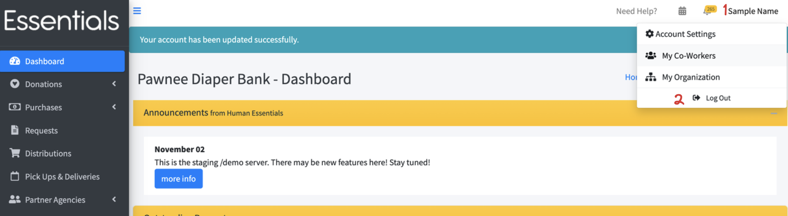
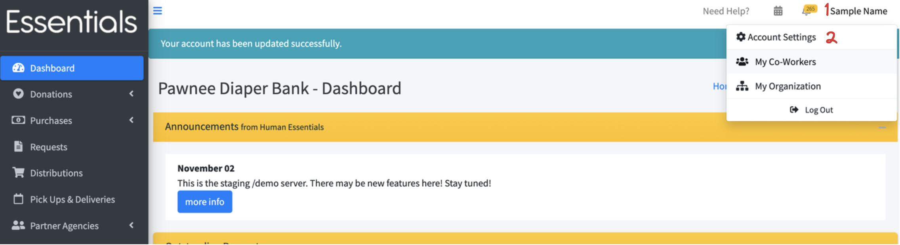
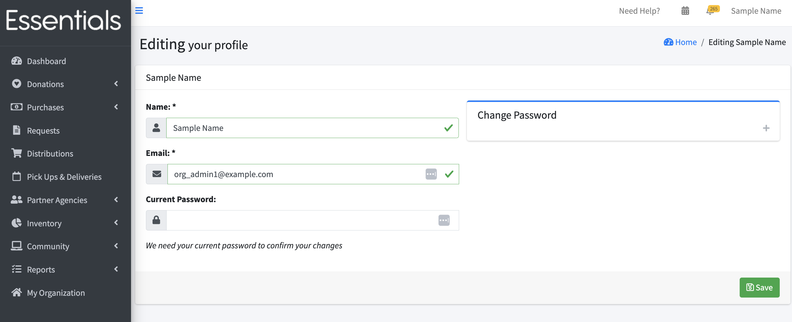
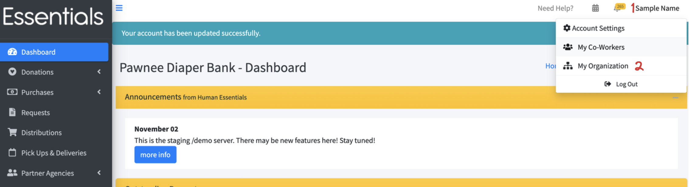

READY FOR REVIEW
# Account Management

## Logging out
You can log out be clicking your name in the top right corner, then clicking 'Log out'.

## Account settings
You can change your name, email, and password in account settings.  Any of these changes will need your current password.
Click your name in the top right corner,  then "Account Settings"

Provide your updated information, including your current password,  then click save.
If you want to change your password, you can do it here -- click the Change Password section to show the new password and confirmation fields.

hen click save.

## My organization
If you are an org admin,  you can also manage your organization and users through the top-right menu, by clicking on your name, then "My Organization"

This goes to the same screen as clicking on "My Organization" in the left-hand menu.  For details, see [Customization](getting_started_customization.md#basic-information) and [User Management](user_management.md)

## Switching to another role
You may have an id that works with multiple banks, or, more commonly, with a bank and a Partner.  To switch between these,  click on your name in the top right corner,  then the name of the organizaation (bank or Partner) that you want to switch to.

[Prior: User management](user_management.md) [Next: Asking for changes](asking_for_changes.md)