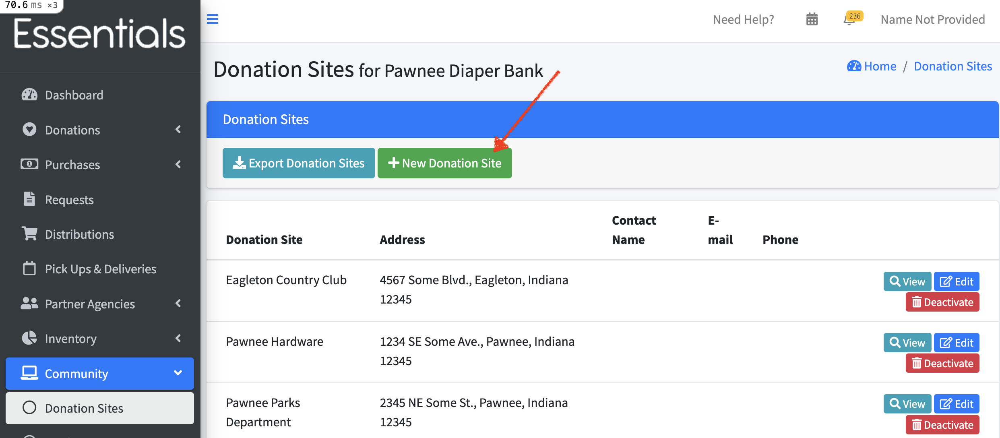
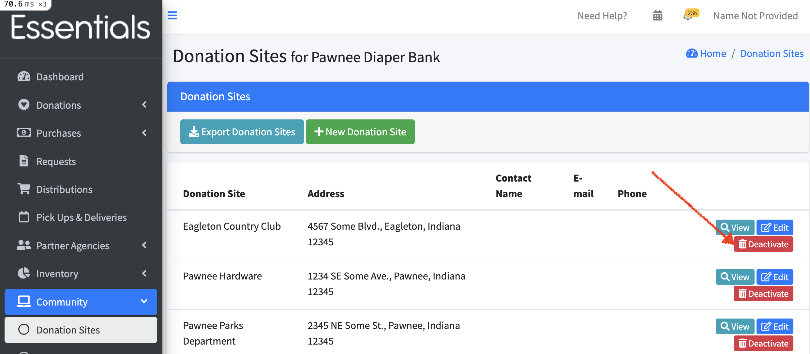

READY FOR REVIEW
# Donation Sites

Donation Sites are places where people drop off Donations.

## The Donation Site list
You can manage the sites' information on the "Donation Sites" page under the "Community" section.

Previously recorded information about Donation Sites appears on this page including the name of the Donation Site name, address, contact name, e-mail and phone number.

### Adding a Donation Site

Create a new site by clicking the "+ New Donation Site" button.

This renders a form for you to fill the site's name, address, contact name, e-mail, and phone number. After entering the required details, click the "Save" button to create the new Donation Site.

Note that the Donation Site and address fields are mandatory while the contact name, email and phone are optional.

After saving the site's details there will be a new row on the Donation Sites page.

## Viewing Donation Site information

Clicking on the "view" button beside a Donation Site will show detailed information for that site, including the Donation Site name, address, contact name, e-mail, phone number, storage location. It also shows a list of the Donations for that site including the quantity of items and variety of items. You can drill down to see the full details of each Donation by clicking "View Donation details".

## Editing Donation Site information

Clicking on the "Edit" button beside a Donation Site in the Donation Site list lets you edit the name, address, contact name, email and phone number.

## Deactivating a Donation Site

Use the "Deactivate" button to hide a Donation Site that is no longer active.

##### (NB) at time of writing there is no way for you to undo this.

## Exporting Donation Sites

You can export the active Donation Sites by clicking on the "Export Donation Sites" button. This will provide a .csv file containing the name, address, and contact information for each active Donation Site.

[Prior: Product Drive Participants](community_product_drive_participants.md)[Next: Vendors](community_vendors.md)
