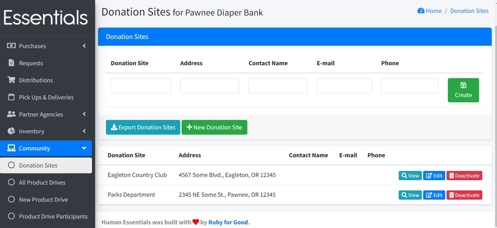
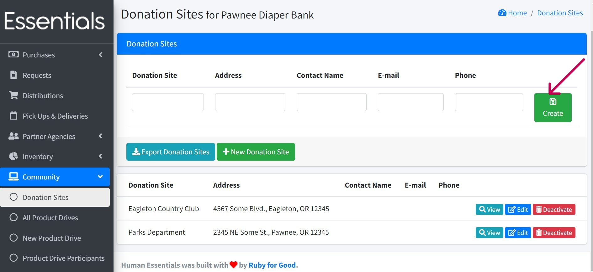
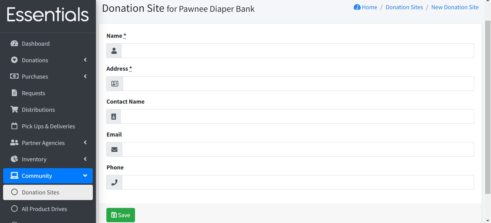
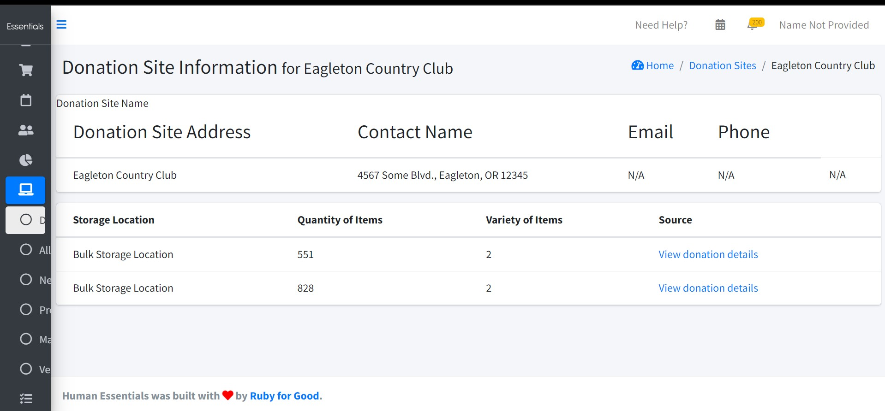
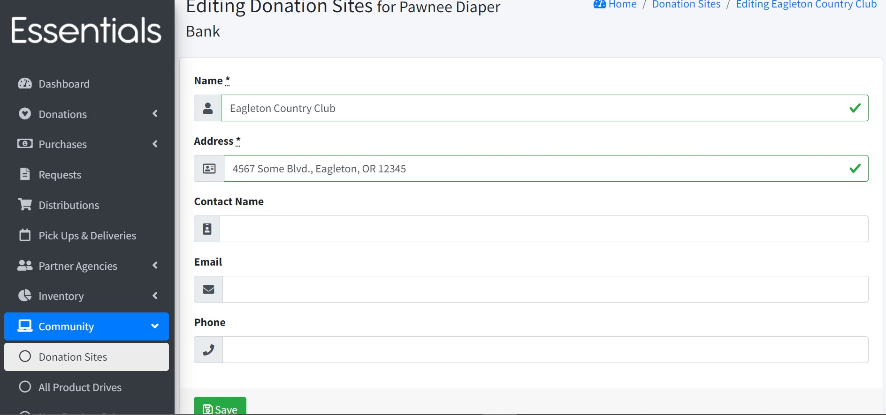
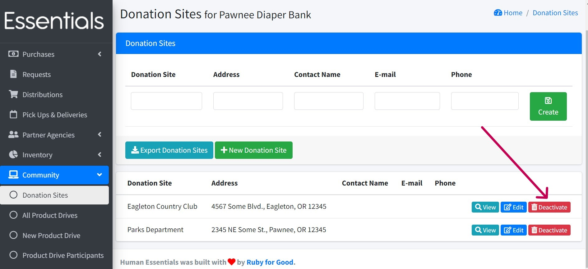

# Donation Sites

Donation sites are places where people drop off supplies and donations. You can manage the sites' information on the "Donation Sites" page under the "Community" section. 

Previously recorded information about donation sites appears on this page including the name of the donation site name, address, contact name, e-mail and phone number.

### Adding a Donation Site

Create a new site by populating the donation site, address, contact name, e-mail and phone fields and clicking the "Create" button. 

Note that the donation site and address fields are mandatory while the contact name, email and phone are optional.

You can also use the "+ New Donation Site" button which renders a form for you to fill in details of a new donation site.

After saving the site's details there will be a new row on the Donation Sites page.

## Viewing Donation Site information

Click on "View" which shows the donation site name, address, contact name, e-mail, phone number, storage location, quantity of items, variety of items	and lets you view the full details of each donation from the source section. 

## Editing Donation Site information

Clicking on the "Edit" button lets you edit the donation sites's details where you can change the name, address, contact name, email and phone number.

## Deactivating a Donation Site

Use the "Deactivate" button to delete information about a donation site that is no longer active.

## Exporting Donation Sites

You can export all the donation sites by clicking on the "Export Donation Sites" button.

