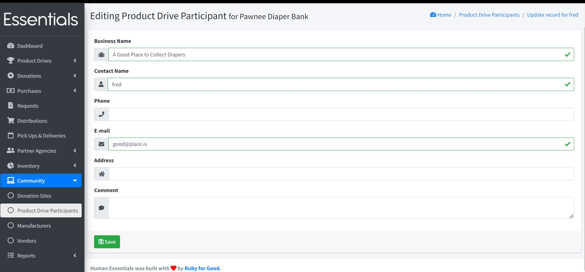

# Product Drive Participants

If you conduct product drives, the product drive participants list lets you manage the participant's contact information and see their donation history.

To manage product drive participants, click on "Product Drive Participants" under the "Community" section.

This page lists some basic details from all previously entered product drive participants -- business, contact, phone email, and total items, letting you drill down to more information, or to edit each participant's information.

## Adding participants

To add a new participant, click on the "+ New Product Drive Participant" button, add their details including the business name, contact name, phone, email, address and comments.

After saving the participant's details there will be a new row in the Product Drive Participants page.

You can also add new participants "on the fly" as you enter the donations, through the [New Donation](essentials_donations.md) page.

[TODO: link to new donations ]

## Viewing participant information

Click on "View" for more details about the product drive participant which also shows the date of each donation, volume, and donations details.

## Editing participant information

Click the "Edit" button to edit the participant's details.

## Exporting participants

You can export all the participants by clicking on the "Export Product Drive Paticipants" button.
Currently we are not providing all the participants' details in the export.

