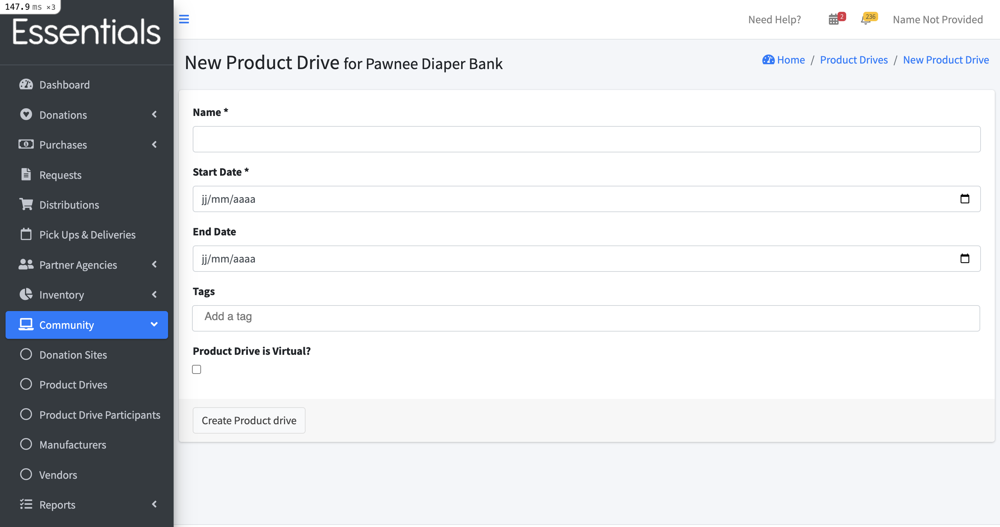
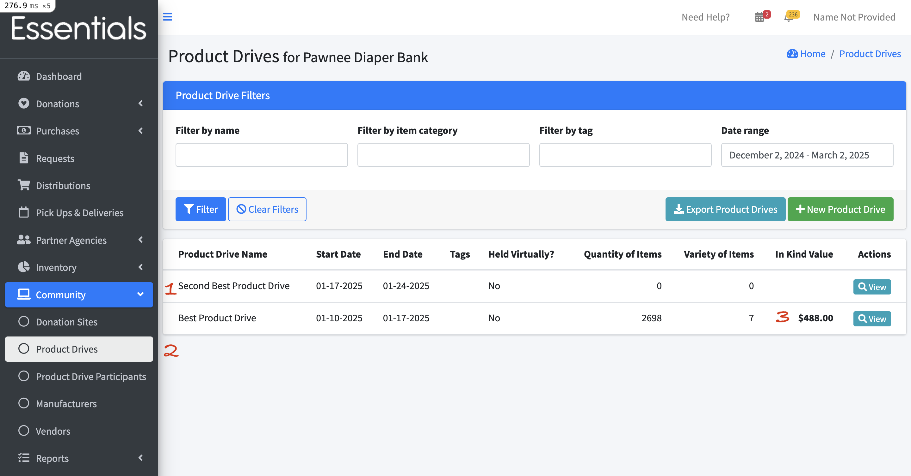
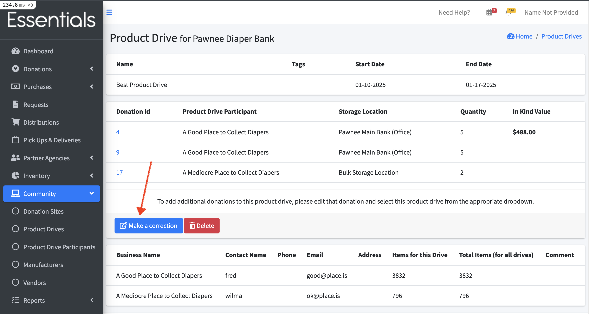

READY FOR REVIEW
# Product Drives
Many banks hold seasonal or one-off events where they are seeking Donations.  In Human Essentials, Product Drives help manage those events by providing a way to link specific Donations to the events.

## Product Drives list
To see all your Product Drives, click on "Community", then "Product Drives" in the left-hand menu.

This presents a filterable list of all your Product Drives, including the following fields:
- Product Drive Name
- Start Date
- End Date (this is optional)
- Held Virtually?
- Quantity of Items
- Variety of Items
- In-Kind Value
- Actions (only view at the moment)

The list initially shows all the Product Drives that are at least partly in our default period of 60 days past to 30 days in the future.

### Filtering your Product Drives list
The Product Drives list is filterable by any of the following.
- Product Drive name
- Item Category
- Date range (by starting date)

Provide the information you want to filter by, then click "Filter".  Clicking "Clear Filters"  will return the list to its defaults.

## Adding a Product Drive
To add a Product Drive, click "+New Product Drive" in the Product Drives list

This will bring up this screen, which contains all the fields you can specify for a new Product Drive:
- Name
- Start Date
- End Date (this is optional)
- Product Drive is Virtual? (check this if it's a virtual drive)

## Viewing a Product Drive
To view a specific Product Drive, click the "View" button beside it in the Product Drives list.

This will bring up the Product Drive view, which includes information about both the Donations for the Product Drive, and the participants in the drive, in addition to the basic information about the drive itself.

Basic info:
- Name
- Start Date
- End Date
Information about each donation:
- Donation ID -- this is a number the system applies to each donation
- Product Drive Participant
- Storage Location
- Quantity (this is the total number of items)
- In Kind Value
For each product drive participant associated with this product drive:
- Business Name
- Contact Name
- Phone
- Email
- Address
- Items for this drive (number of Items for this drive)
- Total Items (for all drives)
- Comment

You can also make a correction to your Product Drive or delete it from this page.

[!CAUTION] DO NOT DELETE your Product Drive if it has Donations in it.  It will not go well.  We have an outstanding issue to block you doing that.

##  Modifying your Product Drive
If you want to edit the base information in a Product Drive, you can do that by clicking "Community", then "Product Drives" in the left-hand menu,  then clicking "View" beside the product drive you wish to modify, and then clicking "Make a correction".

This will bring up the basic information for your Product Drive,  You can rename it, change the dates, or change whether it is a virtual drive.
Then click "Update Product Drive" to save your changes.

## Exporting Product Drives
To export your currently filtered Product Drives,  click "Export Product Drives" on the Product Drives List

[Prior: Transfers](inventory_transfers.md)
[Next: Product Drive Participants](community_product_drive_participants.md)
