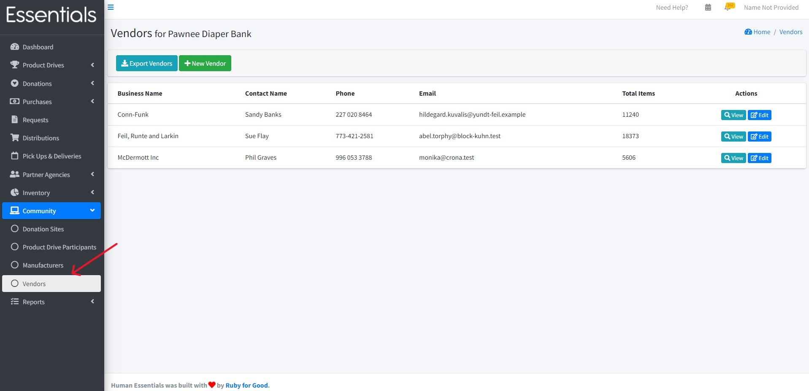
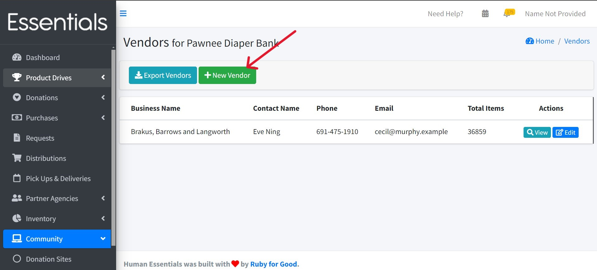
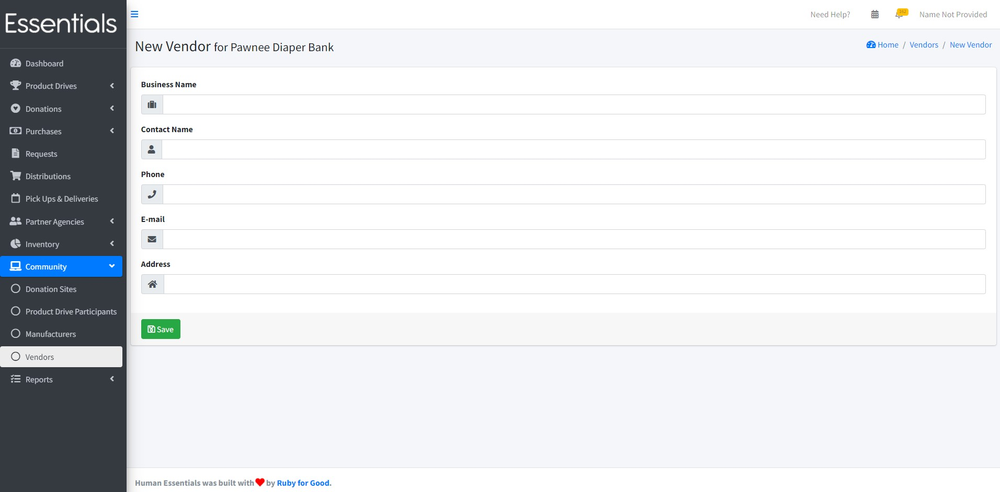
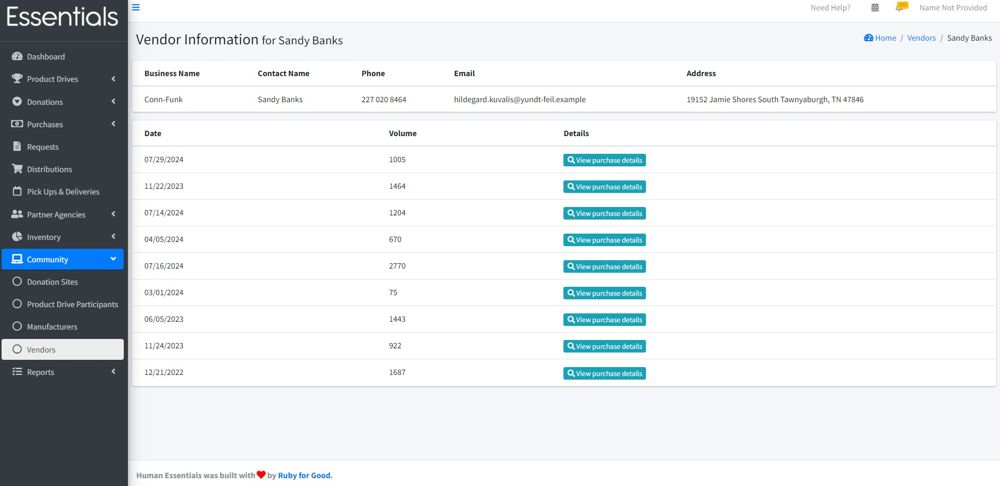
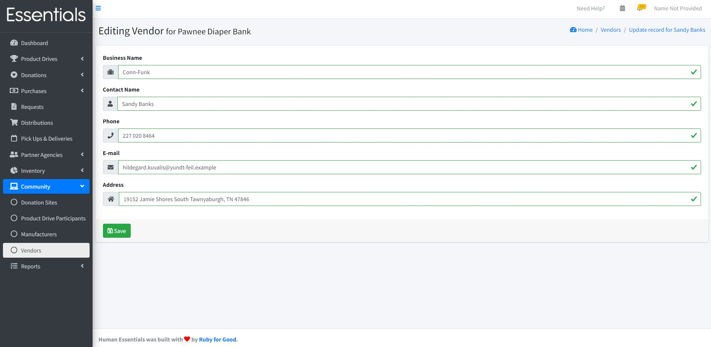
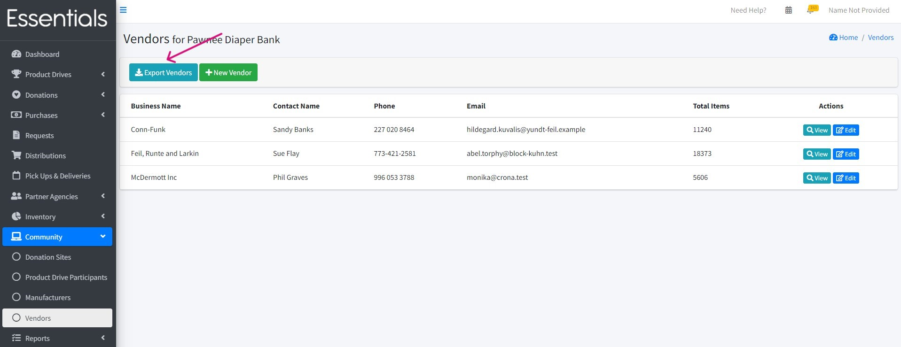

READY FOR REVIEW
# Vendors

The Vendors list lets you manage Vendor contact information and view your Purchases from each Vendor. To access it, click on "Vendors" under the "Community" section.

This page shows all previously entered Vendors -- business name, contact name, phone, email, and total items -- and lets you view or edit them.

## Adding Vendors

To add a new Vendor, click on the "+ New Vendor" button, add their details including the business name (mandatory), contact name, phone, email, and address.

After saving the Vendor's details there will be a new row in the Vendors page.

You can also add a new Vendor "on the fly" as you enter the Purchases, through the [New Purchase](essentials_purchases.md#entering-a-new-purchase) page.

## Viewing Vendor information

Click on "View" for more details about the Vendor which also shows the date of each Purchase, volume (total items in the Purchase), and lets you view the full details of each Purchase.

## Editing vendors

Click the "Edit" button to edit the Vendor's contact information.

## Exporting vendors

You can export all the Vendors by clicking on the "Export Vendors" button.
Currently we are only providing the Vendors' contact information in the export.

[Prior:  Donation Sites](community_donation_sites.md)[Next: Manufacturers](community_manufacturers.md)