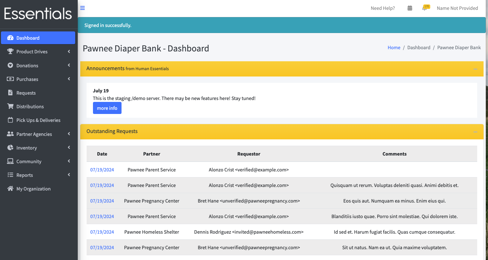
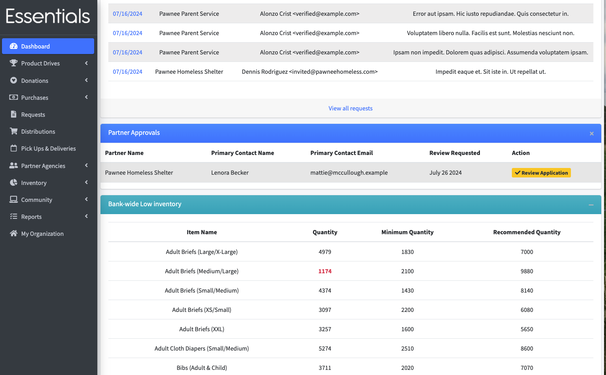

READY FOR REVIEW
# Your Dashboard
When you log in, your initial screen will be a dashboard with information that is useful on a daily basis for most banks.

If you haven't finished setting up your bank in the system,  the "getting started" steps (as described in an earlier section) will appear.

Otherwise, there are 4 sections to the dashboard: Announcements, Outstanding Requests, Partner Approvals, and Bank-wide Low Inventory. 

#### Announcements
This section contains announcements from the Human Essentials team.  This is where we tell you what changes there have been in the latest release, and let everyone know about any significant issues with the system that affect everybody (with workarounds, if we can.)
Look for new info here every Monday - as we put out new releases most Sunday mornings.

#### Outstanding Requests
This is pretty much what it sounds like - a list of the requests from your partners that have not yet been fulfilled.  You can bring up the details of each request by clicking on the date.

#### Partner Approvals
This lists the Partner Profiles that have been submitted for approval.  Partners can not submit requests until they have been approved.  To review the application, click on the "Review Applicant's Profile" button beside the partner in the Action column.  For more details on that, see [Approving a partner](pm_approving_a_partner.md)

#### Bank-wide Low Inventory
This lists Items whose *bank-wide* inventory has fallen below the recommended or minimum quantity levels you have set on the items. If the item's level in inventory across the bank has fallen below the minimum quantity, it will appear in red.

For help on setting those levels, see [Inventory Items](inventory_items.md).  If you haven't set those levels, the Items will not appear on this list, even if you have no inventory.

[Prior: User management](getting_started_user_management.md) [Next: Donations](essentials_donations.md)