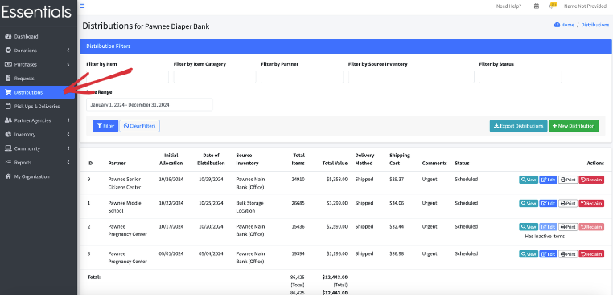
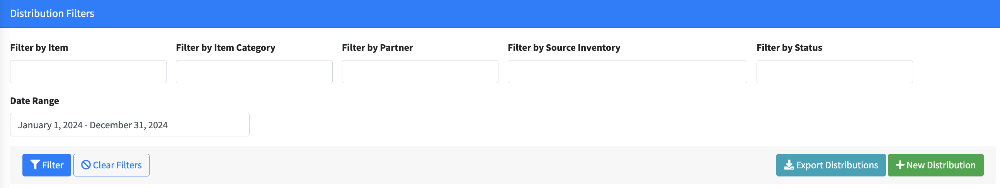
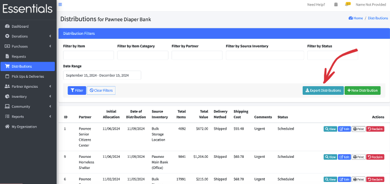
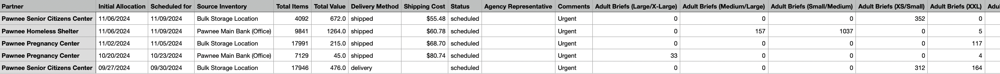
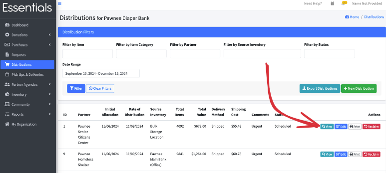
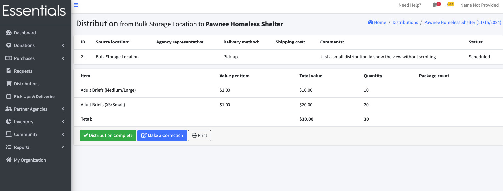
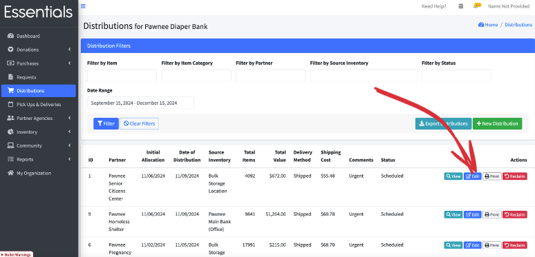
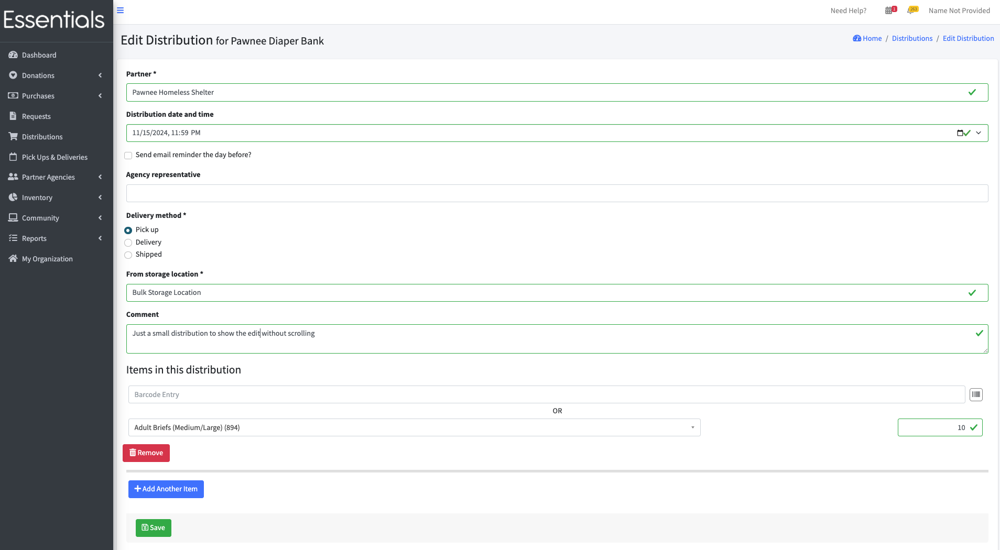
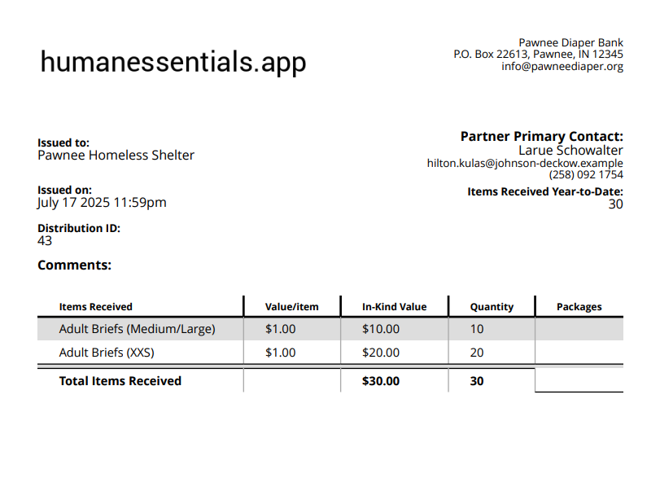

READY FOR REVIEW

# Distributions
Distributions are where you record what you allocate to your partner agencies.

Some things to know:
* Once you save a Distribution,  those items are allocated to the Partner, and are no longer part of your inventory in the system.
* If you are accepting Requests from partners,  you initiate the Distribution by "fulfilling" the Partner's Request. (see [Requests](essentials_requests.md#fulfilling-a-request))

## Seeing a list of your Distributions
To view a list of your Distributions,  click on 'Distributions' in the left hand menu.  This brings up a list of all your Distributions for the default period of 60 days in the past, 30 days in the future.   You can change what Distributions are displayed using the filters at the top of the list.

### Filtering the Distribution list

Your Distribution list may grow to the point that you really need to be able to narrow things down to find a particular Distribution.

To help with that, you can filter the Distribution list by several aspects: Item, Item Category, Partner, source inventory (i.e. Storage Location), status, and date range.
If you pick several things,  you will get only the Distributions that match all of them.

Except for date range,  all the filters are specified by picking from a drop-down list as follows:
- Item: all of your bank's Items.  This will filter to only the distributions that contain that Item.
- Item Category:  Item Categories (as specified in [Items & Inventory | Item Categories](inventory_items.md)).  This will filter the list to the distributions that contain items that are in the chosen item category.
- Partner:  This will filter the lists to just the distributions to the chosen partner.
- Source Inventory:  This will limit the list to the distributions from the chosen storage location.
- Status:  Distributions can be Scheduled or Complete. This will limit the list to those with the given status.
- Date range:  This is based on the "Distribution date and time" field, ignoring the time.  Date range is selected using a little calendar gizmo with several presets, or by typing the date range into the field.    We highly recommend using the calendar gizmo instead of typing in the field, as the text field is very particular as to the format - we have a few people experiencing mismatches there every month.

When you have have selected your filters,  press "Filter" to do the filtering.  If you still have too many Distributions showing, you can add another filter to narrow it down further.

Clicking "Clear filters" will blank out the filters that are drop-down selection, and revert the date range to the default period.

## New Distribution
To enter a new Distribution,  click on "New Distribution" in the Distributions list.

Here, you will enter some information about the whole Distribution,  then add the all the items that make it up.
The fields include:
- Partner (mandatory)
- Distribution date and time -- this is defaulted to midnight of the current day.  If you want to change it (if, for example, you have a specific time you are scheduling the pickup for), we recommend you use the little calendar gizmo at the right of the field.

- Send email reminder the day before  --> causes an email to be sent the day before
  
- Agency representative - for information only.  This is defaulted to the email of the person who sent the request.
- Delivery method -- we default this to pickup because it's the most common across banks.
- From storage location:  The storage location the distribution is coming from.  Mandatory.
- Comment
- All the items:
  - For each item:
      - If you have set up Barcodes for Items, you can just 'boo'p' the item in.  Otherwise,  select the Item from the list, and enter the quantity
  ## Exporting Distributions
To export your Distributions, click "Export Distributions" on the distributions view.  

This will include all the top-level information, and a column [or more, if you use custom units] for each Item in the distribution,  in alphabetic order.   It will include all the Distributions within the filter you have already applied.

## Viewing a Distribution
To view a Distribution,  click "view" beside it in the distributions view.   

This includes the following fields:
- distribution id (for our reference for support) ,
- Source location  (the storage location the inventory came from),
- Agency representative ,
- Delivery method (pickup delivery or shipped),
- Shipping cost (if shipped),
- Comments, and
- the current status, as well as 
- a breakdown of the items in the view including 
  - Item name
  - Value per Item
  - Total value
  - Quantity
  - Package count (only if you have defined a package size for the Item)
   

You can mark the Distribution "complete",  or make a correction (which brings up the edit page, below) from this page.

## Editing a Distribution
To edit a Distribution,  click on "Edit" beside the Distribution in the list,  or on "Make a Correction" in the view.

[!NOTE] When you edit a Distribution -- if is was in the past,  you will see a warning to that effect -- because we assumed that you wouldn't normally need to change the Distribution once it had been put together! Some banks will add things when the Partners come to pick up the distributions, based on additional needs and/or supply opportunities.
However,  We will give you a stern warning if there has been an Audit since the Distribution was entered, and you may be prevented from changing some Distribution information (such as the storage location), because we just don't know how to handle some of those cases.

## Printing a Distribution
Printing a Distribution produces an invoice-like page that can be used as a packing slip. 

This is the same pdf that is emailed to the Partner when a new Distribution is saved.  
[!NOTE] The partner does not get a new email when you edit a Distribution,  so you may want to print the Distribution to send them in that case.

The printout is somewhat configurable -- there are options on your [Organization](getting_started_customization.md#customizing-the-distribution-printout) page to allow you to: a) add a place for a signature, or b) hide certain columns in the printout.

Please note that your logo (also configurable on the [Organization](getting_started_customization.md#logo) ) is included on this printout -- we strongly advice keeping it fairly small, as a large logo will just be resized anyway, and will potentially break this function.

## Reclaiming a Distribution
What do you do if, for some reason, the Distribution that was entered was not picked up?   You can reclaim it,  adding the items back into your inventory.
To do this,  click "Reclaim" beside the Distribution in question, and cliock "Ok" in the confirmation screen that appears.

[!WARN]  You can not reverse a reclaim.  If you reclaim by accident, you will have to re-enter the Distribution.  If that happens,  you should be able to grab the Item quantities from the [History Report](reports_history.md), but we don't retain the rest of the information.

[Prior: Requests](essentials_requests.md)[Next: Pick Ups and Deliveries](essentials_pick_ups.md)