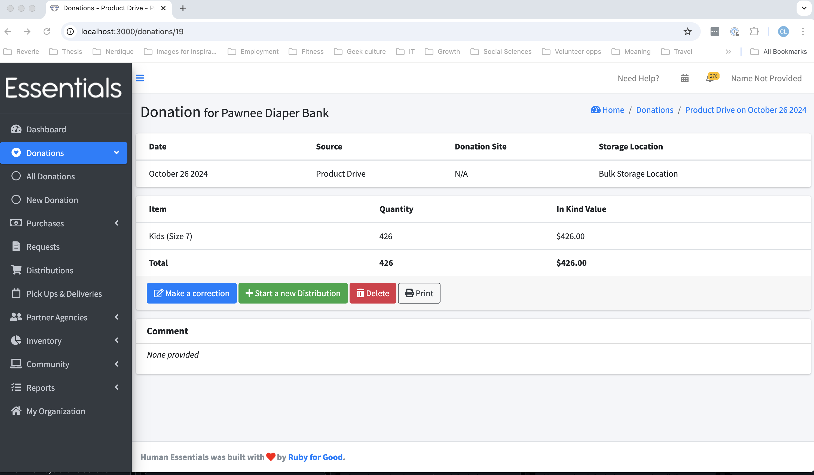

DRAFT USER GUIDE
# Donations
Donations are obviously one of the most important elements of an essential bank's operations, being the primary way most banks get the goods to distribute to their partners to help folk.

In Human Essentials you enter in-kind donations by specifying where they came from, where they are being stored, and how many of each item are included.  You can also record monetary or mixed donations.

## Seeing all your donations

To view a list of all your donations, click on 'Donations', then "All Donations" in the left-hand menu,

This screen includes a filter so you can narrow down your search to a particular donation, and some basic information on each donation:
- Source -- Whether this comes from a [Product Drive](product_drives.md),  Manufacturer, Donation Site, or Miscellaneous Donation
- Date --  The date of the donation
- Details -- this depends on the source -- it is the name of the product drive, or manufacturer, or donation site
- Storage location -- where you are stored the goods from this donation.
- Quantity of items -- total quantity of the items in the donation.
- Money raised - in dollars.
- In Kind value -- this is calculated by multiplying the number of each item by the current fair market value of that item (entered in [Inventory | Items](inventory_items.md) )
- Comments
- Actions - you can view or print donations from this screen.  Other actions are available on the view screen.

### Filtering the donation list

When you have been using human essentials for a few months, your donation list may grow to the point that you really need to be able to narrow things down to find a particular donation.

To help with that,  you can filter the donation list by several aspects: storage location, source, product drive, product drive participant, manufacturer, donation site, and date range.
Except for date range,  all the filters are specified by picking from a drop-down list.

Date range is selected using a little calendar gizmo with several presets.   We highly recommend using the calendar gizmo instead of typing in the field, as the text field is very particular as to the format - we have a few people experiencing mismatches there every month.

When you have have selected your filters,  press "Filter" to do the filtering.  If you still have too many donations showing, you can add another filter to narrow it down further.

Clicking "Clear filters" will blank out the filters that are drop-down selection, and revert the date range to the current year.

## New Donations

To enter a new donation, click "Donations", then "New Donation" on the left hand menu, or click the +New Donation button on the Donations list.

Here you can enter all the information for your donation:

- Source
  - What kind of donation this is.  You have a choice of product drive, donation site, manufacturer or misc. donation.  If you pick anything but misc. donation,  you will be prompted for more details.
- Storage Location
- Money raised in dollars (optional)
- Comment (optional)
- Issued On 
  - This is the date that the donation was made.  Note that inventory changes happen as of when you enter  the information.  They are not back-dated.
- Items in this donation
  - If you have set up [barcodes ](inventory_barcodes.md) for the items you are receiving,  you can use your barcode reader to enter your items.  Otherwise, pick the item from "Choose an item", and enter the number of that item in "Quantity".
  - Click "add another item" as needed to get room for more items.

When you are finished entering your information, click 'Save'.  

### Information entered in Donations
#### Source
Here you specify what kind of source the donation originated from.

For Product Drive, Manufacturer, or Donation Site, you will further specify the specific source.
##### *Product Drive
If  you specify Product drive,  you'll also need to specify the particular drive and participant for the donation -- but you can enter them "on the fly", here. You can view summaries for the product drives in [Product Drives](product_drives.md), and manage the contact info for a product drive participant under [Community | Product Drive Participants](community_product_drive_participants.md).
##### *Donation Site
Donation Site is meant to capture the concept of any place you have a more-or-less permanent place people can drop off donations at, such as your main office, or community locations such as fire halls, etc.
You can see the donations for each donation site and manage their contact information under [Community|Donation Sites](community_donation_sites.md).  Unlike product drives, you can't create a new donation site 'on the fly' through the fields here.

##### *Manufacturer
This is for the donations that come straight from the manufacturer.  You can view the total donations and a donation breakdown for each manufacturer under [Community | Manufacturers](community_manufacturers.md)
##### *Misc. Donation
Misc. Donation is a catch-all for any donation without an identified source.

#### Storage Location
Pick the storage location the donation is going to.  If it will be split among multiple locations, you can either enter separate donations,  or enter the donation using one location,  then use the [Inventory | Transfers] function to move the appropriate inventory to other locations.

#### Money raised in dollars
Self explanatory.  This number is used in the Annual Survey, and the Donations - Summary report as well as being shown in the main Donations page.

#### Issued On
This is the date we use for any and all date filtering that you might do on donations.  It is meant to be the date that you received the donation.  It defaults to the current date.

#### Items in this donation

There are a couple of ways to get items into the donation quickly:  
(1)You can "bloop" a barcode in to get your items into the system -- that requires some initial setup, as detailed in [Inventory | Barcodes] or (2)  You can pick the item from the drop-down of all *active* items in your system, and enter the quantity of that item.  
In either case,  you can click "Add Another Item" (3)  to open up another item for entry, or "Remove" (4) if you've added too many!
The quantity here is meant to be individual items (e.g. diapers), rather than packs.   The reason behind this is that, ultimately, your reporting will be based on the number of individual items,  and package size is inconsistent across manufacturers.

Note:  If you make two entries with the same item, they will be added together when you view them later.

When you are done entering your items,  click "Save".  Barring any errors, this will return you to the "All Donations" page

## Viewing the details of a donation
To view the details of a donation, click on the "View" button beside the donation on the All Donations page.

Here you'll see the donation, including:
- Date 
- Source 
- Donation Site
- Storage Location
- for each Item in the donation
  - Item name
  - Quantity in the donation
  - Total in-kind value for that item
- Total quantity of items, and
- Total in-kind value
- Comment

You can make a correction, to delete the donation, to print it.   You can also start a new distribution from this page.  (This is a convenience for banks that distribute the bulk of their donations immediately, and don't fulfill partner requests.)

## Editing a donation
Donations shouldn't need to be updated very often -- you usually have all the information you need when you enter them the first time.  Differences in the physical count, or new information may occasion a need for a correction, though.  If you need to correct a donation,  you first "View" it (see above), then "Make a Correction"

Here, you can change all the information on the donation, including adding and removing items.  

##### Note that changes you make to the levels of items will take effect as of the date you made the changes.  They will not be back-dated to the "issued on" date

##### Note also that donations do not currently work well with kits.  We have an open issue for this.

## Deleting a donation
Hopefully you won't need to delete a donation - but it's certainly possible that you might have entered a duplicate.   Should you need to delete the donation,  "View" it from the All Donations page, then click 'Delete'.  You'll be asked to confirm your decision.  Use this with extreme caution - because you won't be able to undelete it!

## Printing a donation
You can print a single donation by either viewing it, then clicking print,  or just clicking "Print" beside it on the All Donations page. The printout is meant to be useful for parallel record keeping, or as the basis for a tax receipt.
[Prior: Dashboard](essentials_dashboard.md)[Next: Purchases](essentials_purchases.md)