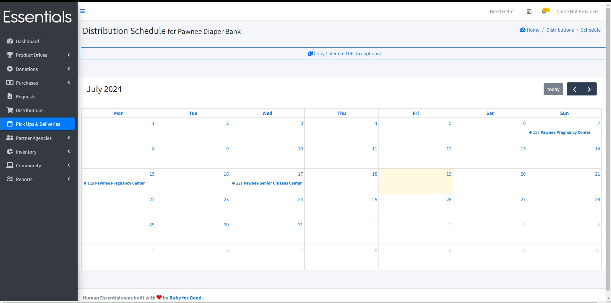
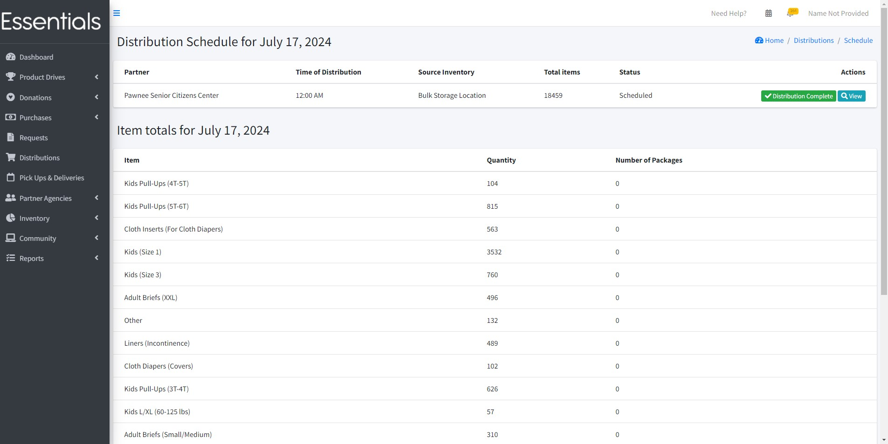
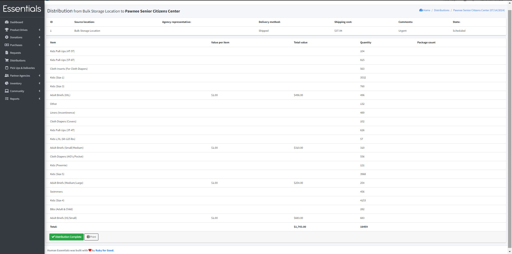
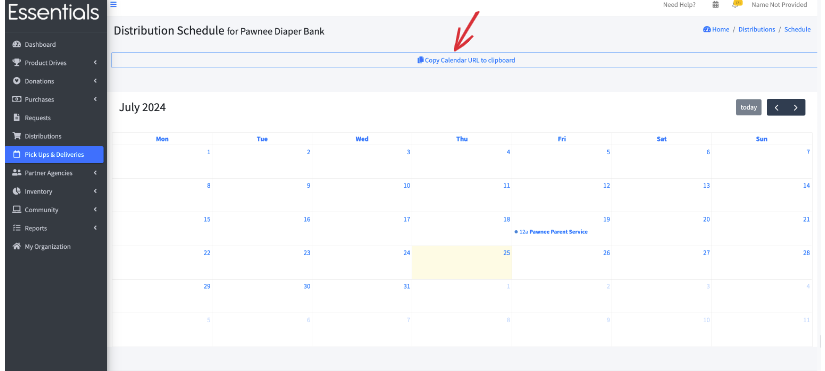
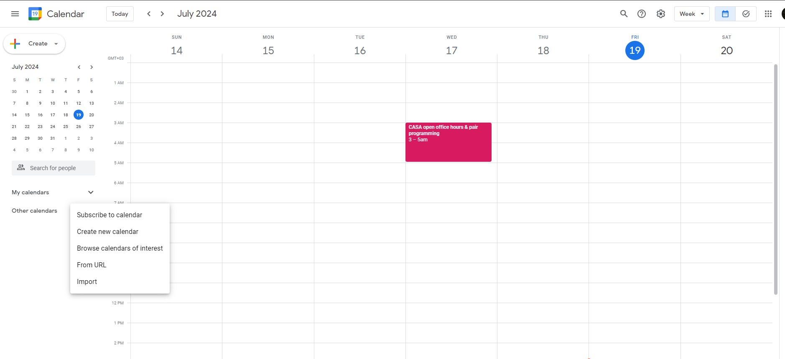
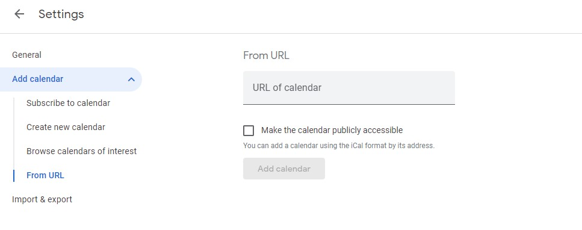

READY FOR REVIEW
# Pick Ups & Deliveries Calendar

Pick Ups & Deliveries shows scheduled and completed distributions in a calendar format on a monthly basis.

Click on "Pick Ups & Deliveries" in the left-hand menu to view the calendar.

Click on any scheduled Distribution to view details on all the Distributions for that day.
The Distribution Schedule page shows details including the Partner,the time of Distribution, Storage Location, the total number of items, and the status of the Distribution.

Once the partner has the distributed goods, clicking "Distribution Complete" changes the status of the distribution from "Scheduled" to "Complete", so you can track what is still in your hands and what is with your partners in the community. It does not, at this time, remove it from the calendar.

Click "View" for details on the Distribution's source Storage Location, agency representative, delivery method, shipping cost, comments, and state. This also shows a list of items included in the Distribution.

If you want to print the details of the Distribution to use as a contents list or receipt, click on "Print".

## Sync Pick Ups & Deliveries Calendar with Google Calendar

You can sync the Pick Ups & Deliveries Calendar with Google Calendar for more convenience.

From the calendar page, click on "Copy Calendar URL to clipboard" to get the calendar URL to be added to Google calendar.

Then, open your Google Calendar.  On Google Calendar, in the "Other calendars" section click on the "+" which will bring up several choices.

Select "From URL"and paste the URL you copied in the "URL of calendar" section and click on "Add Calendar"

Events from the Human Essentials Pick Ups & Deliveries Calendar should be accessible to you on Google Calendar when the sync is complete.

[Prior: Distributions](essentials_distributions.md)[Next: Partner Management:  Request/Distribution Cycle](pm_request_distribution_cycle.md)
