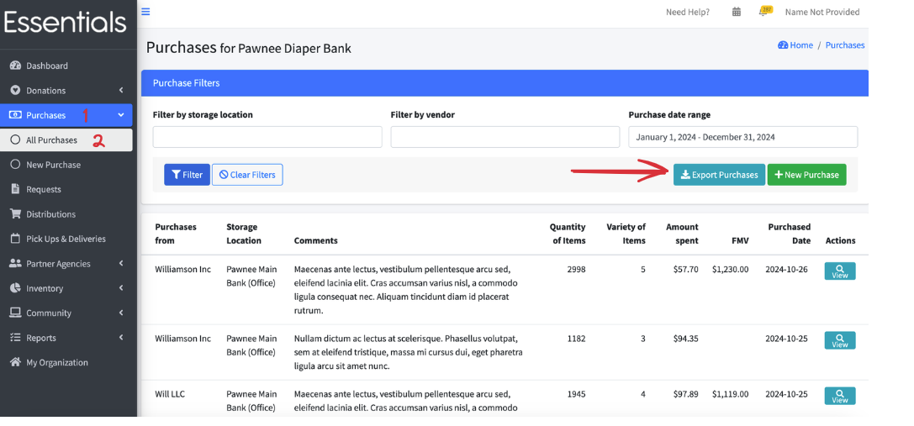

READY FOR REVIEW
# Purchases
The other major way we add to inventory in human essentials is through Purchases.

In Human Essentials you enter Purchases by specifying the Vendor, where they are being stored, and how many of each Item are included.

## Seeing all your Purchases

To view a list of all your Purchases, click on 'Purchases', then "All Purchases" in the left-hand menu,

This screen includes filters so you can narrow down your search to a particular Purchase, and some basic information on each Purchase:
- Purchases from - the Vendor you purchased the goods from
- Storage location -- where you are stored the goods from this Purchase.
- Comments
- Quantity of items -- the total number of Items in the Purchase
- Variety of items -- the number of different Items in the Purchase
- Amount spent (in dollars)
- FMV -- this is the Fair Market Value of the Purchase using the current fair market value of the Items in it.  Fair Market Value can be entered on the item in [Inventory | Items](inventory_items.md)
- Actions - you can view more details on each Purchase from this screen.

### Filters
You can filter your Purchases by single Storage Location , by Single vendor, or by date range.

The Vendors and Storage Locations are selected using drop-down lists of all your bank's Storage Locations / Vendors.
Date range is selected using a little calendar gizmo with several presets.   We highly recommend using the calendar gizmo instead of typing in the field, as the text field is very particular as to the format - we have a few people experiencing problems there every month.
Once you have selected your values,  click Filter to make the list conform to your selection.  To reset the selection, just click "Clear Filters".  This will set the list to all the Purchases from the current calendar year.

## Entering a new Purchase
To enter a new Purchase,  you can either click "Purchases | New Purchase" on the left hand menu, or click the +New Purchase button on the Purchases list

Enter the following information (starred items are mandatory):
### Vendor *
Select the Vendor from a drop-down list of all your vendors. If you choose "Not Listed", you can enter a new vendor on the fly.  The Business Name is mandatory.
### Storage Location *
Select the storage location from a drop-down list of all your active storage locations.
### Purchase Total *, and broken down Purchase totals
The Purchase total has to be greater than 0,  and it should equal the sum of the 4 fields that break down the Purchase into categories:
- Amount spent on diapers,
- Amount spent on adult incontinence,
- Amount spent on period supplies, and   
- Amount spent on other.

These are used in the Annual Survey report.
### Comment
This is optional.  
### Purchase date
This should be the date the Purchase was made - it is defaulted to today's date.  This is used for filtering,  but also for what year the Purchase is included in for the annual survey.
### Items in this Purchase
There are a couple of ways to get items into the Purchase quickly:  
(1)You can "bloop" a barcode in to get your items into the system -- that requires some initial setup, as detailed in [Inventory | Barcodes] or (2)  You can pick the item from the drop-down of all *active* items in your system, and enter the quantity of that item.  
In either case,  you can click "Add Another Item" (3)  to open up another item for entry, or "Remove" (4) if you've added too many!
The quantity here is meant to be individual items (e.g. diapers), rather than packs.   The reason behind this is that, ultimately, your reporting will be based on the number of individual items,  and package size is inconsistent across brands.

Note:  If you make two entries with the same item, they will be added together when you view them later.

When you are done entering your Items,  click "Save".  Barring any errors, this will return you to the "All Purchases" page

## Viewing a Purchase
To view Purchase details, click the "View" button beside the Purchase on the All Purchases list.
[ Navigational screenshot for view Purchase](images/essentials/purchases/essential_purchases_4.png)
This brings up a page with the Purchase's details, including all the information you entered and the entry date.   From here you can make a correction to the Purchase or delete it.

## Editing a Purchase
Editing a Purchase should be relatively rare, but it happens.  To edit a Purchase,  view it (see above), then click "Make a correction".  This brings up the same screen as you used to enter the info -- make your changes and click save.

Note that any quantity changes will be reflected in inventory as of the day you make the changes,  not the Purchase date.

## Deleting a Purchase
If, somehow, you have entered a Purchase in error, you can delete it by viewing it, then clicking Delete, and then "OK".  This is a permanent deletion -- you can't undo it.

You'll be asked to confirm that you want to *permanently* remove the Purchase.   Click OK to confirm.

## Exporting your Purchases
You can export your Purchases from the "All Purchases" screen, above, by clicking "Export Purchases".

This creates a .csv file containing all the information for each of the Purchases in your filtered list.
It includes:
- "Purchases from" - the vendor
- Storage Location
- Purchased Date
- Quantity of Items (total number of items bought)
- Variety of Items (how many different kinds of items were bought)
- Amount Spent
- Spent on Diapers
- Spent on Adult Incontinence
- Spent on Period Supplies
- Spent on Other
- Comment
- For each Item in your bank (whether it was purchased or not), in alphabetical order
  - the quantity of that Item that was purchased

    
[Prior: Donations](essentials_donations.md)[Next: Requests](essentials_requests.md)