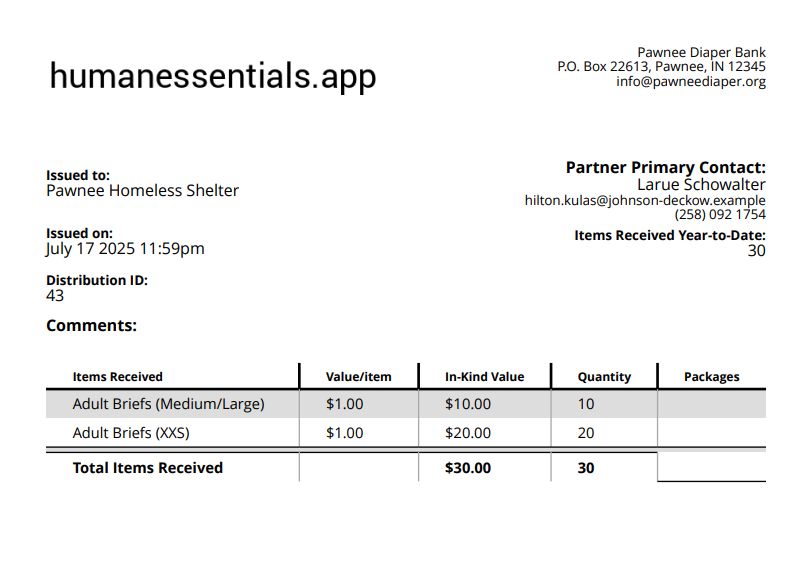

READY FOR REVIEW
#Requests
Requests are how you get the information on what items the partners need.  (You may think of them as orders.)

The unfulfilled ones appear in your dashboard, but you can also manage them in the Requests area.

For a more fulsome description of how the whole shebang works,  see [Partner Management -- Request Distribution Cycle](pm_request_distribution_cycle.md).

## Seeing your unfulfilled Requests
We show the unfulfilled Requests in two places -- on the [dashboard](essentials_dashboard.md),  and as part of the Requests list, which you access by clicking "Requests" in the left hand menu.

On the Request list,  the Requests are in order by the status (with pending first, then started, then fulfilled), then reverse chronological by date
You can view or cancel any Request by using the buttons under "Actions"
To see a list of Requests, click on "Requests" in the left hand menu

This list is defaulted to a date range of the 60 days in the past to 30 days in the future (though there will be no future-dated Requests), all items, all partners, and all statuses, ordered by
status, then reverse chronological (i.e. newest first).

The list contains:
- Date -- the date the Request was entered by the partner
- Request was sent by -- the name of the partner that sent the Request
- Request sender -- the user that sent the Request
- #of Items (Request limit)  -- the number of items in the Request, and, if you have entered it, the quota for the partner (see [Partners](getting_started_partners.md)
- Comments -- the comments the partner entered on the Request
- Status 
  - pending -- haven't started fulfilling it yet
  - started -- have started fulfilling, but haven't saved the resulting distribution
  - fulfilled -- have created the distribution for this Request
  - discarded -- have cancelled the Request
- and the actions you can take on that Request

### Filtering your Requests
You can filter the Request list by:
- Item
- Partner
- Status
- Date range

Fill in the fields with the values you want to filter by, then click "filter"
To reset to the defaults,  click "Clear Filters"

## Product totals
You can find out how much of each product you'll need to fulfill the current filtered open (pending and started) Requests by clicking "Calculate Product Totals".

This brings up a scrollable list showing the quantity of each Item you need to fulfill the Requests.  It takes into account the current filters. Click the "x" in the top right corner of the list to close it.

## Viewing a Request
To view a given Request, click "View" beside it in the Request list.

This brings up details of the Request including:
- Partner
- Date the Request was sent
- Who sent the Request
- Request status
- Comments
- and, for each Item in the Request:
  - Item
  - Quantity
    - If you are using [custom units](special_custom_units.md), those custom units will appear here.
  - Total Inventory (across all Storage Locations)
At the bottom of the screen are buttons letting you start to fulfill the Request, or to cancel it.

## Fulfilling a Request
To fulfill a Request, bring up the Request list by clicking on "Requests" in the left-hand menu,  then click on "view" beside the request,  then scroll to the bottom of that screen and click "Fulfill request".
That will bring you into a screen that allows you to specify the details for the distribution based on that Request -- you'll see a notice "request started".
Fill in the remaining needed information.  The fields include:
- Partner (It would be rare indeed to change this)
- Distribution date and time (the scheduled pickup delivery or shipment date)
- Send email reminder the day before?
- Agency representative (defaulted to the user who sent the Request)
- Delivery method
  - Pick up,
  - Delivery, or 
  - Shipped
- Shipping cost (if the delivery method is shipped)
- From Storage Location (if you have chosen a default location for the Partner, or for your organization,  this will be filled in)
- Comment
- For each Item in the Request
  - The Item
    - When you have chosen the Storage Location,  the quantity of this Item that is available at that Storage Location will appear here in parentheses.
  - A field for the quantity to be distributed
  - the requested amount.   
    - For any Item that has [custom units](special_custom_units.md), this will show both the amount and the unit
You can remove any Item by clicking the associated "remove" button, and you can add more iIems, by clicking the "Add Another Item" button.
  
When you have finished filling in the information, save the Distribution by clicking the "save" button.You'll see a page showing the details of the Distribution.

If you have set the [Partner](getting_started_partners.md) to receive emails for distributions and reminders from the system 
the partner will be sent an email letting them know that their Request has been fulfilled.  This will contain the text you have [customized](getting_started_customization.md), with an attachment showing the details of the distribution.

## Submitting a Request on Behalf of a Partner
Bank admins can submit a Request on behalf of a Partner by clicking the "New Quantity Request" button.

This will bring up a list of Partners to choose from. After selecting a Partner, the details for the Request can be entered.

## Cancelling a Request
To cancel a Request from the Requests list,  click the "cancel" button beside it.  

You can also cancel a Request from the single Request view by clicking the "cancel" button at the bottom of that page.

In either case,  
You will be prompted to provide a reason for the cancellation.

The Partner will receive an email notifying them of the cancellation.

NOTE:  This email goes to the Partner, rather than to the User who sent the request.

## Exporting Requests
To export the Requests from the Request list,  click "Export Requests"

This will create a .csv file with the following information for each filtered Request:
- Date
- Requestor (partner)
- Status
- For each of the bank's items.
  - the quantity requested
 Note:  If you use custom units,  there will be a column for each item/unit that is available to be requested. 

## Printing unfulfilled Request picklists

Finally,  you can also print "picklists" for your unfulfilled Requests.  
This function produces a printable pdf file showing all the items requested for each of your unfulfilled Requests

Click "Print Unfulfilled Picklists" on your Requests list.

Here is a sample picklist:

[Prior: Purchases](essentials_purchases.md)  [Next: Distributions](essentials_distributions.md)

