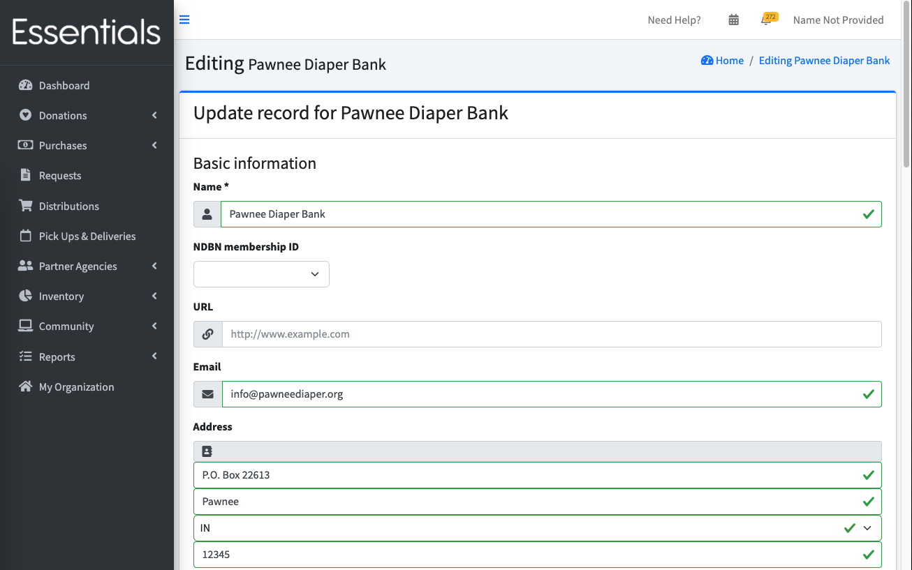

# Organization information and customization

Every Essentials Bank has its own way of doing things.
With that in mind, there are a number of things you can tweak.
This is done through "My Organization".
Only organization admins have access to this area.

## Getting to the organization edit

Scroll down to the bottom of the left-hand menu (you may have to collapse areas that you've opened) to the last option.  Click on "My Organization".

This brings up a view of the organization settings. It shows everything we are going to talk about for the rest of this section, as well as the users (more on them in the next section)

Scroll down until you see an Edit button.  Click it.

You should now be in a screen that is titled "Editing [Your bank name]".  Change the information to suit your organization's needs and then click the "save" button at the bottom

Here's all the fields, with a bit about the implications of each one:

## Basic Information
#### Name
The name of your Essentials Bank.   This appears in the headings on most screens, and will appear on printouts (such as the distribution printout many banks use as a packing slip), and most reports.

#### NDBN membership ID
This should be filled in already from your Account Request,but if it isn't, you can select it from the list.   That list is updated on an irregular basis,  so if you are an NDBN member, and you aren't on the list,  let us know and we'll get a fresh list uploaded.
This is included on the Annual Survey report.  That's the only effect.

#### URL
Your Essentials Bank's website address.  This is mostly used during the Account Request process, so we can check if you are a good fit before you invest a lot of time and energy into the system.

#### Email
Your Essential Bank's email address.  This is shown to the partners on their help page, and is included in reminder emails, so please use an email that is monitored.   This email is also included on Distribution and Donation printouts.

#### Address
Your Essential Bank's primary address.   This is shown on the distribution and Donation printouts.

#### Logo

The logo that you upload here will appear several places throughout the system, including on your Distribution and Donation printouts.  Larger logos will impact your performance -- the 763 x 188 size is a good guideline.

## Storage
#### Default intake Storage Location

This is the  default storage location for Donations and Purchases.  
If you specify this, it will be pre-populated as the storage location when you are adding new Donations or Purchases.

#### Default Storage Location

The bank-wide default Storage Location for Donations and Purchases.  
You can also specify a different default Storage Location on any Partner, which will override this default.
If you specify a default Storage Location, it will be pre-populated as the Storage Location when you are adding new Distributions.

## Partner approval process
#### Use one-step Partner invite and approve process?
Partners can't submit Requests until they are approved by the Bank.

The full Partner approval process requires the partner to fill in their profile and submit it for approval.  Some banks handle that for their partners, gathering the information through other means (such as a phone conversation).
Checking this box will change the process so that the partners are automatically approved when they are invited. 

> [!NOTE]
> Any already-invited partners that are not yet approved will still need to be approved by the bank.

#### Custom Partner invitation message
[!NOTE] The custom Partner invitation message is currently not working as advertised (as of November 13, 2024.).  The current behavior is as if you did not enter anything here.  We have fixing it on our "to do" list.

When you invite a Partner, they get an email.  This field lets you specify the message you are sending to them.  Just text -- we don't have any personalization capability for this email at this time.

If you do not specify a message, the invitation will contain:  

Hello [Partner's email]

You've been invited to become a partner with Pawnee Diaper Bank!

[Customer Partner Invitation Message If Present]

Please click the link below to accept your invitation and create an account and you'll be able to begin requesting Distributions.

Please contact [Bank's email] if you are encountering any issues.

[Accept Invitation button]

For security reasons these invitations expire. This invitation will expire in 8 hours or if a new password reset is triggered.

If your invitation has an expired message, go here(link to the log in page) and enter your email address to reset your password.

Feel free to ignore this email if you are not interested or if you feel it was sent by mistake.

#### Partner Profile Sections
The [Partner Profile](pm_partner_profiles.md) is a very large form that includes a lot of information.   You might not care about all of it.
This field lets you specify which of the sub-sections of that form will be used.  
The Agency Information subsection is always included.
If you do not specify any sections,  they will all be included.  
The sections are:  
- Media Information
- Agency Stability
- Organizational Capacity
- Sources of Funding
- Area Served
- Population Served
- Agency Distribution Information
- Attached Documents

## What kind of Requests can approved Partners make?
There are three different ways a Partner can request essentials -- a "Child based" Request, a Request by number of individuals, and a quantity-based Request.  Some banks want to limit which Requests the partners can make, in order to minimize partner confusion.
These three fields allow you to control which Requests the Partners can use.
If you allow more than one kind, the Partner can also limit their own.
Note that if any Partner limits themselves to a single type,  you won't be able to remove that type.  So, if you think you only want to allow quantity-based Requests, doing that up front is a fine idea.

#### Enable Partners to make child-based Requests?

#### Enable Partners to make Requests by indicating number of individuals needing each Item?

#### Enable Partners to make quantity-based Requests?

#### Custom Request units

NOTE:  This is not yet implemented as of Oct 12, 2024. We expect it to be implemented before this guide is launched.

This is a special topic that has its own guide page [here](special_custom_units.md).

## Other emails
#### Send reminders on a specific day of the month (e.g. "the 5th") or a day of the week (eg "the first Tuesday")?
You may configure when you would like reminder emails to be sent to your Partners.

This works in conjunction with the reminder configuration set on a partner group level (see [Partner Groups](pm_partner_groups.md)) and the partner specific configuration (see [Adding a single Partner](pm_adding_a_partner.md)).

For a full description of how the reminder schedules work, and how the different configurations interact, see [Partner Reminder Emails](pm_partner_reminders.md).

The text of this email will be:  

<blockquote>
Hello [Partner's name],
 
 
This is a friendly reminder that [Your bank's name] requires your human essentials requests to be submitted by [the deadline date, including month and year]
if you would like to receive a Distribution next month.
 
 
Please log into Human Essentials at https://humanessentials.app before this date and submit your request if you are intending to submit an essentials request.
 
 
Please contact [Your bank's name] at [Your bank's email]
if you have any questions about this!
 
 
[Additional text for reminder email (see below)]
</blockquote>

#### Deadline day in reminder email
This is the day which will be included in the reminder email message.

It is assumed that the deadline day always occurs after the day the reminder is sent, and in cases where the deadline date specified is in the past, the deadline will be set to the next month.

As an example, the reminder is set to be every month on the 14th, and the deadline day is set to be the 7th. On January 14th, a reminder will be sent out and, since the 7th is in the past, the deadline date will be listed as February 7th.

#### Additional text for reminder email
If present, this text will be included in the reminder email after the default text. In the above email template, this additional message will replace `[Additional text for reminder email (see below)]`.

#### Distribution email content
There is a checkbox on each partner that indicates if they are to receive Distribution emails.  We recommend you do customize this content, as the default text is abrupt.
You can customize this quite a bit!

Specifically, you can use the variables %{partner_name}, %{delivery_method}, %{distribution_date}, and %{comment} to include the partner's name, delivery method, distribution date, and comments sent in the email.  You can also format the text, and attach files by using the buttons above the field.

Here's a real-life example (except for the URL)

------

%{partner_name},

Your essentials request has been approved and you can find attached to this email a copy of the distribution you will be receiving.

Your distribution has been set to be %{delivery_method} on %{distribution_date}.

Friendly reminder: don't forget to keep up with important updates at https://example.com. Subscribe there to get email notifications when updates are posted!

See you soon!

%{comment}

-----

#### Receive email when Partner makes a Request?
If "yes", your organization's email address will be CCed on the request confirmation email partners receive when submitting a request to your organization.  This will be "no" by default, so you must opt into receiving these emails.

## Printing
There are four fields that allow you to tweak the appearance of the Distribution printout

#### Show year-to-date values on Distribution printout?
Some banks don't want to show year-to-date values on the receipt (1, below) because their fiscal year is not the calendar year.  

#### Include signature lines on Distribution printout?
If "yes", this will include a space for someone from the bank and from the Partner to sign the Distribution printout (2, below) - which can be useful as a receipt acknowledgement.

#### Hide value columns on Distribution and Donation printout?
The default is to show the in-kind value of the Items on the receipt (3, below).  Many banks don't need to show this information on the Distribution printout.
Note:  Hiding this also hides the corresponding values on the single Donation printout.

#### Hide package column on Distribution printout?
This hides the packages column on the Distribution printout (4, below).  Because different brands of essentials use different size packages,  this
column is useful mainly for banks that repackage their essentials into uniform package sizes.  If you have a uniform package size, you can specify that on the Item (see [Inventory Items](inventory_items.md))

## Exports

### Include in-kind value in donation and distribution exports?

You can configure whether the exports for donations and distributions include the "In-Kind Value" column for each item. By default, these values are excluded. To include them, set the "Include in-kind value in donation and distribution exports?" option to "Yes".

Click "My Organization" in the left hand menu. Click "Edit" button. Set the "Include in-kind value in donation and distribution exports?" to "yes", then click "Save".

[!NOTE] Setting this affects both the donation and distribution exports.

## Annual Survey
These two fields are only here to be reported on the Annual Survey.

#### Does your Bank repackage essentials?
#### Does your Bank distribute monthly?

[Prior: Inventory](getting_started_inventory.md) [Next:  Adding your Staff - levels of access](getting_started_access_levels.md)
