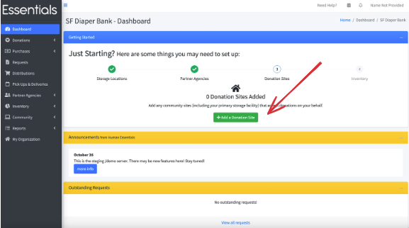
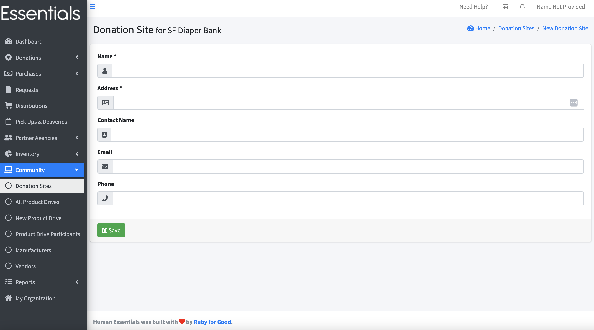

DRAFT USER GUIDE
# Donation Sites
A donation site represents a drop-off location for donations.
The information regarding a donation site is mainly for your reference.  There are, at time of writing, no automated emails that go to the donation sites' contacts.
Note that you can filter your donation list ( see [Donations](essentials_donations.md)) by donation site.

## Adding a single donation site
If you are following along in the "getting started", you'll have reached stage 3 "Donation Sites".  You can add a single donation site by clicking on "Add a Donation Site".

This will take you to the new donation site screen, where you can provide the basic information for your side.  Click save when done:

To add more donation sites, or if you are in a different place in the process, see the full entry on [Donation Sites](community_donation_sites.md).

[Prior: Partners](getting_started_partners.md)[Next: Inventory](getting_started_inventory.md)