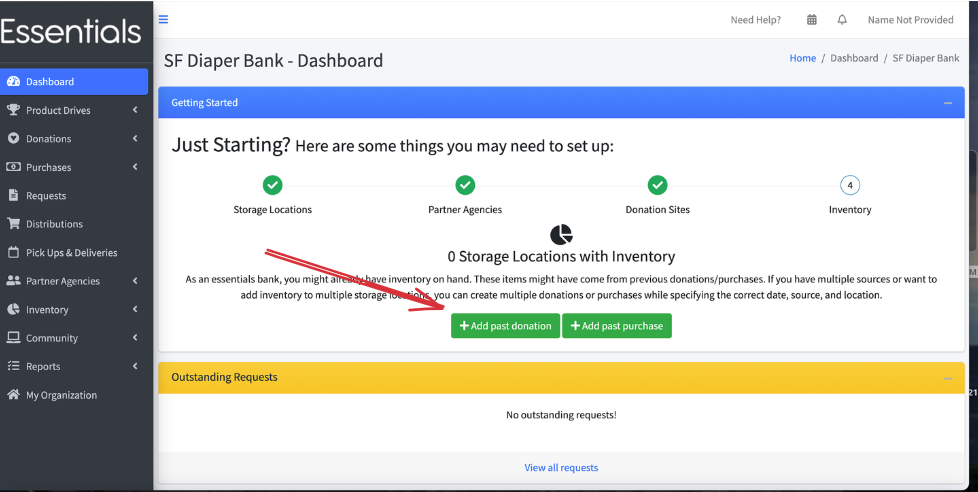
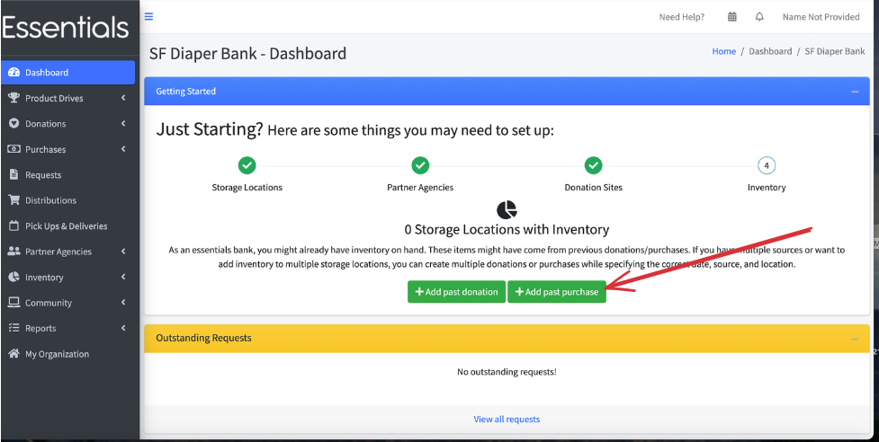
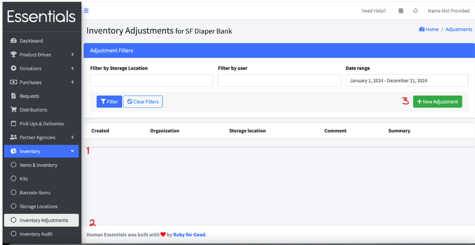

READY FOR REVIEW
# Getting started -- Inventory
When we set up your organization, we provide a default set of Items ranging from adult briefs to kids (newborn) 
to tampons. You can modify this list at any time, through the [Inventory Items](inventory_items.md) feature.  
This section of the guide will take you through a couple of ways to get your initial inventory in.

## Adding a past Donation
One easy way to get your current inventory set up is to just enter a Donation per Storage Location with all of the current inventory, and put a 
comment on it to indicate that this was your starting inventory.  The values you enter there will be included in your Donation reports for the year, 
so if you don't want that, either backdate the Donation to the previous year or use the Inventory Adjustments method, below.

To enter a past Donation, simply click on the "Add past Donation" button, which takes you to the New Donation screen, which is described in a lot of detail [here](essentials_donations.md)

## Adding a past Purchase
Similarly, if you've started your bank with a purchase of goods, you might want to enter the details as a purchase.  The values you enter here will be included in your purchase reports for the year chosen.

## Inventory Adjustment
Another (some say superior) way to set up your bank is through Inventory Adjustments.  This has the advantage of keeping your initial 
inventory, however it was acquired, out of Donation and Purchase reports.  The details on entering an Inventory Adjustment can be found [here](inventory_adjustments.md)

[Prior: Donation Sites](getting_started_donation_sites.md) [Next: Customization and other organizational-level info](getting_started_customization.md)