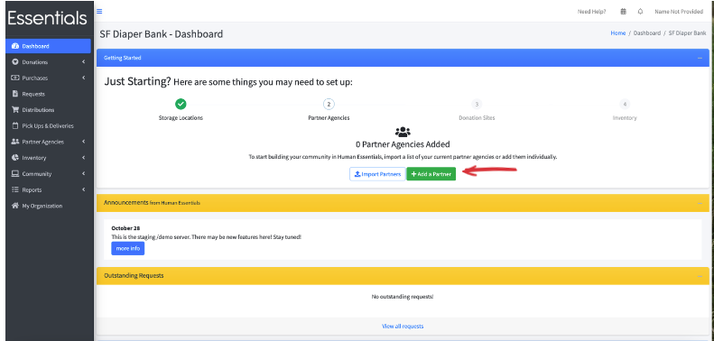
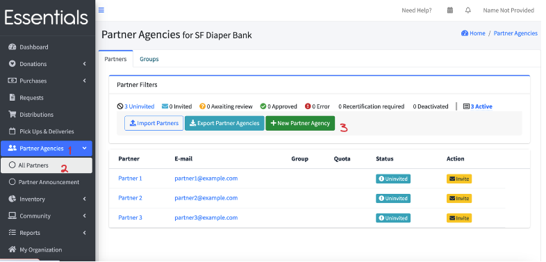

READY FOR REVIEW
# Getting Started -- Partner Management

## Things You need to know about Partners before deciding how you are handling them

1/  You need to have your Partners in the system to be able to record distributions to them.

2/  However,  if you're not ready to have your Partners make Requests yet, that's ok -- you can put them in the system without inviting them.   You'll still be able to record what you are distributing to them.

3/  You can import all your Partners at once.  You can only import Partners once, though -- this is a precaution to make sure we don't accidently create duplicates.

4/  The usual way to handle bringing on Partners to be able to make Requests is to invite them,  then have them fill in their profile before approving them, so that you get the information from them that your bank needs for grants, etc.   However, if that's not how you want to work,  it is also possible to invite and approve them in one step.

5/  A lot of Banks set up a Partner as a proxy for their direct distribution to people in need.  This is allowed, and you can switch back and forth between being a Bank and a Partner with the same login

6/  You can group Partners, and allow those Partber Groups to request different sets of items (One thing some banks use this for is handling grants that are geographically constrained.)

## Importing Partners

For details on how to do a bulk import of your partners, please click [here](pm_importing_partners.md)

## Adding a single Partner
For your first partner, you can Click on the "Add a Partner" button in your "Getting Started" portion of you dashboard.  

For any subsequent Partners, please click on "Partner Agencies", then "All Partners", then "Add a Partner")

Further details on adding a partner can be found [here](pm_adding_a_partner.md)

[Prior: Storage Locations](getting_started_storage_locations.md)[Next: Donation sites](getting_started_donation_sites.md)