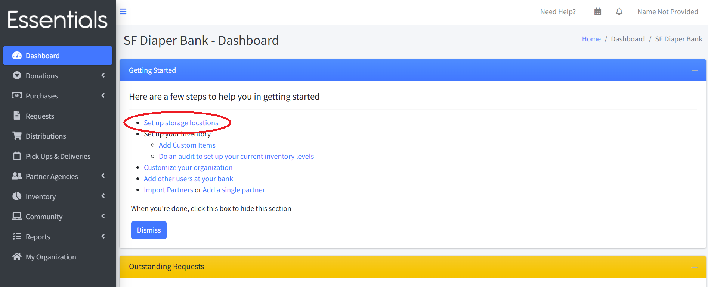

# Getting Started -- Storage Locations

A bank can have multiple storage locations -- these range from warehouses down to space in people's houses.  You need at least one storage location in the system.

Each storage location has its own inventory of a common list of items (e.g. different sizes of diapers)

When you are inputting donations or purchases, you will specify the storage location, and the donated/purchased items will be added to that storage location's inventory.

When you make distributions, you choose a storage location and can see the inventory levels for each item before committing to the distribution. When you save the distribution, the distributed items are subtracted from that storage location's inventory.

How do you enter a storage location?   If you haven't any storage locations yet, you can click on "Set up storage locations" in the "Getting Started" sequence at the top of your dashboard.  

You can also click on "Inventory", then "Storage Locations" in the left-hand menu, then "New Storage Locations"

Either of these will bring up the new storage location screen

Fill in the information:
- Name and Address are mandatory
- Square Footage and Warehouse Type are used for the Annual Survey (our collection of information corresponding to the NDBN Annual Survey)
- Set Time Zone to the local time zone for the storage location.

Click "Save"

You'll see a list of your storage locations.  Click "New Storage Location" if you want to enter another location.

[Prior: Choices to think about](getting_started_choices.md) [Next: Entering or uploading your initial partner list](getting_started_partners.md) 
