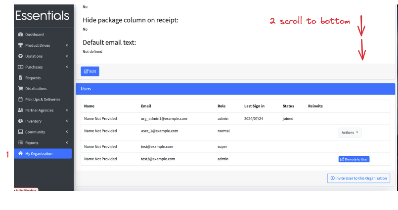
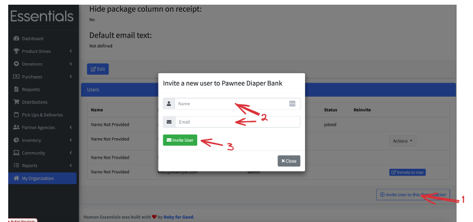
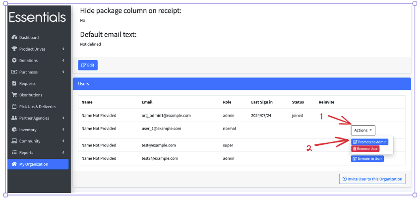
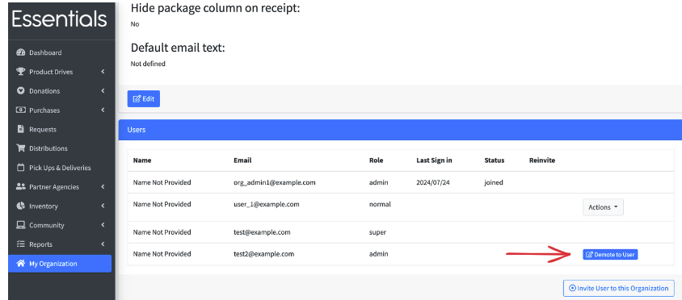
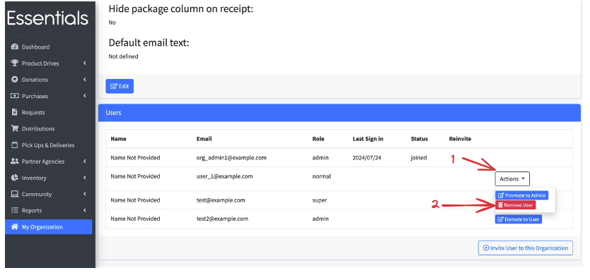

READY FOR REVIEW
# Essentials Bank User Administration

If you're not the sole worker at your Essentials Bank, you'll likely want other staff to have some access to Human Essentials. 

Note that only people with admin status can administer Users, and that Partners are administered on a partner-by-partner basis (see [Partner User Admin](pm_partner_user_admin.md)).  

To manage the rights for your Essentials Bank's Users:

Click on the My Organisation view, then  scroll down to the bottom. There is a User administration section there.

You can also manage the Users in your partners, see [Administering Partner Users](pm_partner_user_admin.md)

## Inviting new Users
Clicking "Invite User to this Organization" will open a popup where you will enter the name and email of the user.  Once you click "Invite User", they will receive an email with a link to follow to set up their password. 
Please note that this link expires. If they don't click on the link in time, the workaround is for them to go to the login screen (http::/human_essentials.app) and click on "Reset Password". 

## Promote a User to admin
To promote a User to admin, just click on the "actions" button beside their information, and then click on "Promote to Admin"

## Demote an admin
To remove an admin's admin rights, just click on the "Demote to User" button beside their information.
This is a necessary step if you want to remove their rights entirely. 

Also note that you can't demote yourself.  This reduces the risk of leaving the bank without an admin accidentally!

## Remove a user
To remove a user, just click on the "actions" button beside their information, and then click on "Remove User" (note that if they are an admin, you have to demote them first)

## What to do if your admin has left without assigning a new one.
Send an email to info@humanessentials.app (or DM one of the human essentials staff on slack) explaining the situation, and we'll walk you through our process for getting a new admin set up.
[Prior:  Levels of Access](getting_started_access_levels.md)
[Next:  Everyday Essentials -- your dashboard](essentials_dashboard.md)

