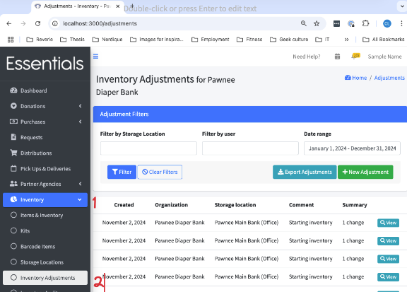
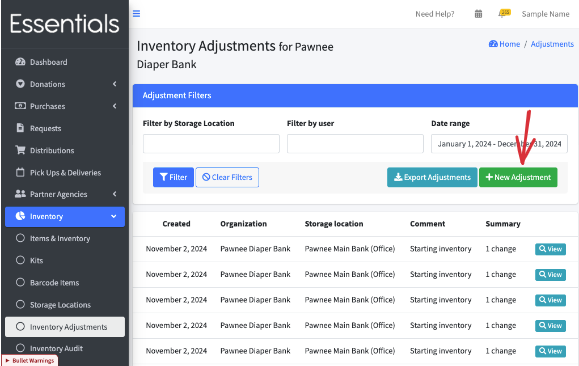
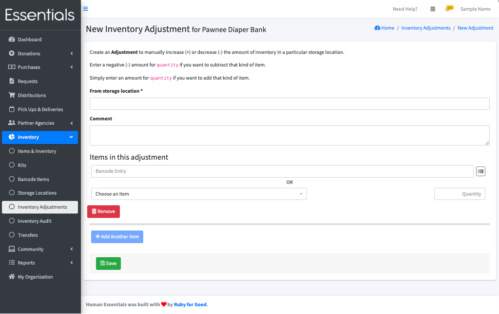
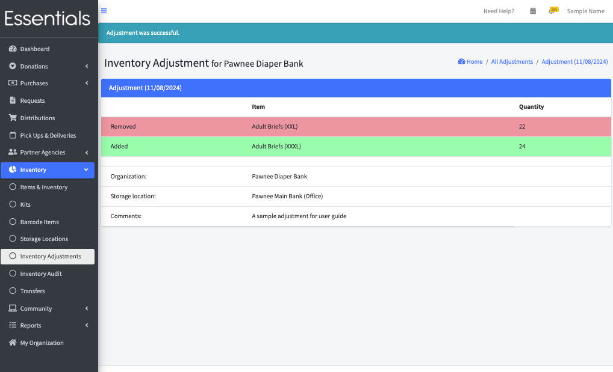
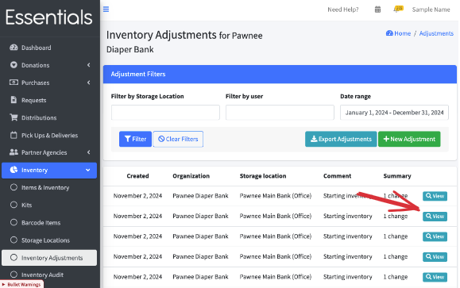
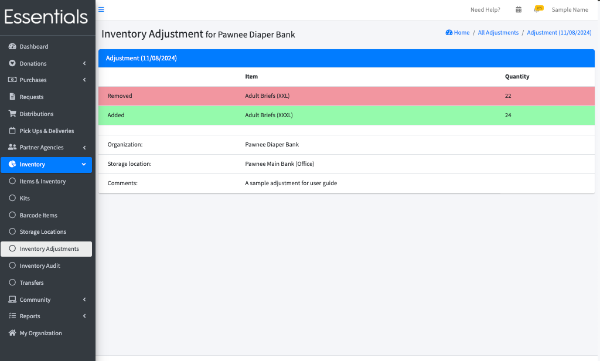

READY FOR REVIEW

# Inventory Adjustments

Inventory adjustments are an alternative way to record known differences in the inventory without going through the Audit process.  
They don't require the two step process that an Audit does, but are entered as adjustments, rather than as the actual inventory levels.

Note that Inventory Adjustments are permanent -- if you need to reverse them,  you have to enter an adjustment in the other direction.

Unlike the Audit, there is no review step.  The changes to inventory are made immediately.

You can not edit Inventory Adjustments.

## The inventory adjustment page
You can manage your Inventory Adjustments through the inventory adjustment page.  Click on "Inventory" in the left-hand menu, then "Inventory Adjustments"

## Making an inventory adjustment

To enter a new inventory adjustment,  click on "New Adjustment"

This brings up the page for entering Inventory Adjustments:

Choose the Storage Location, add any notes you have in the comments section,  and, for each item you are adjusting, enter either a number greater than 0 to increase the inventory, or a number less than zero to decrease it.

Click save to finish entering the adjustment.  This will change the inventory levels on those items.

In this sample there are both negative adjustments (showing in red, with "Removed") and positive adjustments (showing in green, with "Added)

## Viewing Inventory Adjustments

You can see the details of old Inventory Adjustments by clicking 'View' beside the adjustment

[Prior: Barcode Items](inventory_barcodes.md) [Next:  Transfers](inventory_transfers.md)
