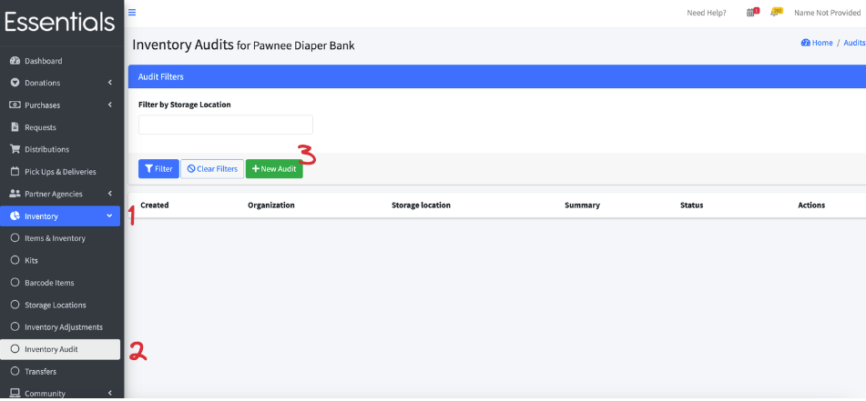
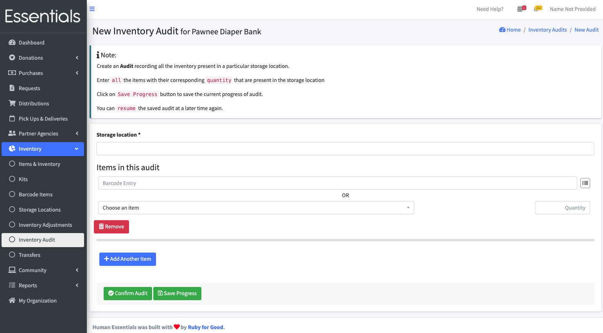
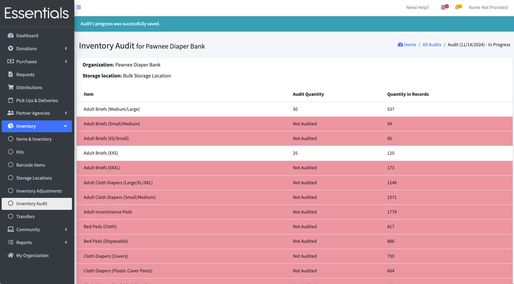
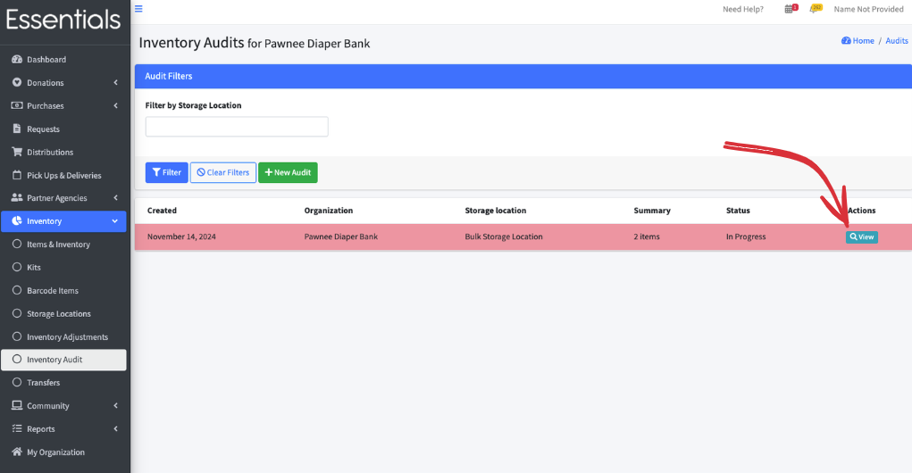
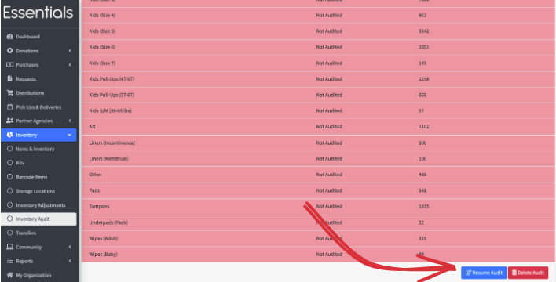
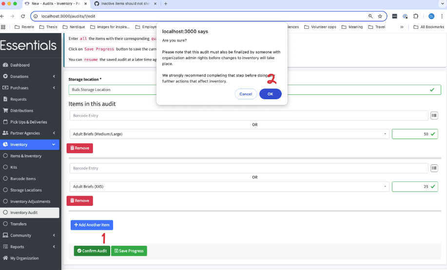
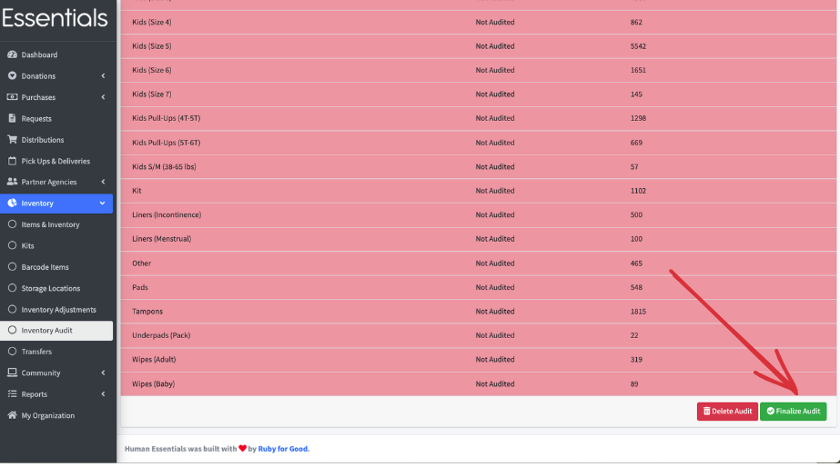
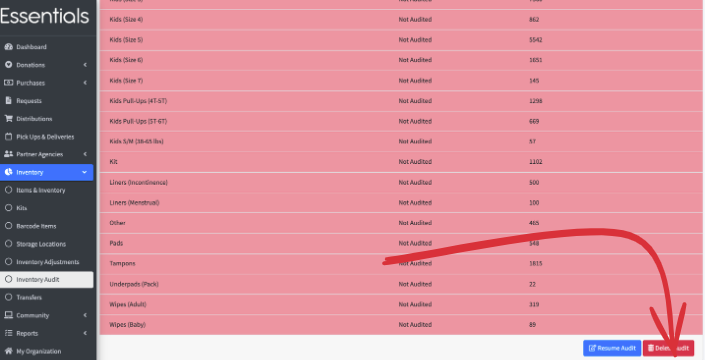

READY FOR REVIEW

# Audits

When you do an inventory count,  you'll want to set the inventory in each Storage Location to the physical count.  That's what the Audits function is for.

The big thing you need to remember is that Audits have to be 'finalized' by an organization admin before they update the inventory,  so don't record any activity after the physical count until the Audit is finalized.

## Starting an Audit

Click on "Inventory", then "Inventory Audit" in the left hand menu,  then "+New Audit".

This brings up the new Audit page.  

Specify the Storage Location, then each Item you have counted, along with its quantity.

[!NOTE] You can do partial Audits.  Any Item you don't specify during the Audit will keep its current quantity in the inventory.

Clicking "Save Progress" saves what you have done,  but you can come back and continue entering.
You *must* choose a Storage Location to save progress.

Clicking "Confirm Audit"  and clicking "OK" in answer to "Are you sure?"  will set the status to "confirmed" - that is ready for the org admin to review and "finalize" - so that should be done when you are finished your counts and have checked that you entered the right numbers.

When you save progress, you'll see this page, which shows the progress of the Audit.   Anything you haven't counted has a red background, and is noted as "Not Audited".

You will be able to return to this page from the list of Audits (Inventory | Inventory Audit).

The Audit Quantity is the amount that you entered, and the Quantity in Records is the amount that is currently recorded as being in your inventory.

You have two options from this page:  Resume Audit and Delete Audit, which we treat below.

## Resuming an Audit
When you want to continue entering your counts,  you can resume your Audit by going to the Audits page (Inventory | Inventory Audit).  You'll see the Audit you are working on listed with a status of "In Progress".   Click "View" to bring up the details on that Audit.

Scroll to the bottom of the page, and click "Resume Audit"

This will bring up the new Audit form you were working on, and you can continue to enter more Items.

You can "Save Progress" again, or  you can "Confirm Audit", and click "OK" in answer to "Are you sure?"  to set the Audit for approval (or "Finalizing") by a user with organization admin privileges.

## Confirming an Audit
When you are entering an Audit, and have completed the counts for that Audit,  you confirm it.   This indicates that the counts for the Audit are done, and available for final review before being set in stone.

This step is here so that a bank can have users without admin access enter the counts,  but have a final check (the "Finalize" step, below) before the inventory levels are permanently changed.

On the Audit entry screen, scroll to the bottom and click 'Confirm Audit'.  There is a detailed confirmation window with instructions for next steps. 

## Finalizing an Audit
Once an Audit had been confirmed,  it must be finalized before any inventory changes will take place.   Finalizing can only be done by someone with organization admin privileges.  
To Finalize an Audit,  sign in as an organization admin, Click Inventory, then Inventory Audit.  

Select the "View" beside the Audit,  review it, and if all is correct,  scroll down to the bottom and click "Finalize".  Then, if you are sure,  click "OK" to confirm.  

[!NOTE]  You will only see "Finalize" if the Audit has been confirmed.

[!WARN] **** THIS PERMANENTLY CHANGES THE LEVELS OF INVENTORY AND CANNOT BE UNDONE. *******

Now, when you view the Audit, the quantity in records will match the Audit quantity -- until you enter more activity.

## Deleting an Audit
If the Audit has not been finalized, you can delete it.  
From the Audits page (Inventory | Inventory Audit), click "View" beside the Audit you wish to delete, then scroll to the bottom,  click "Delete Audit", and "OK" to confirm.  
[!WARN] This cannot be undone

[Prior: Storage Locations](inventory_storage_locations.md)
[Next: Kits](inventory_kits.md)