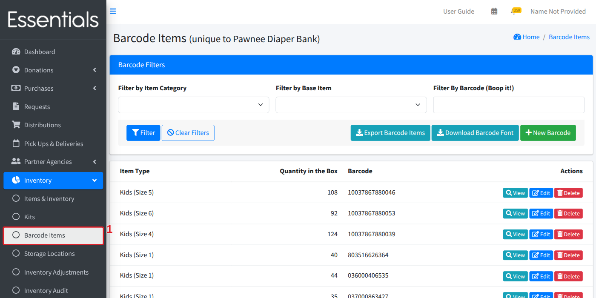
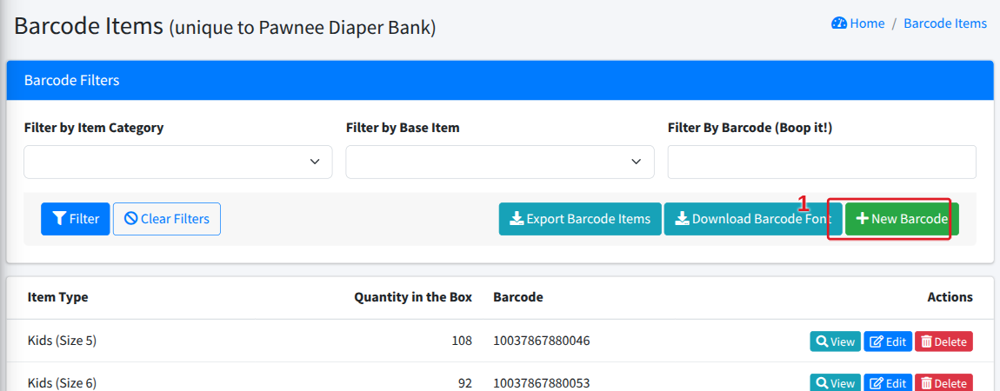
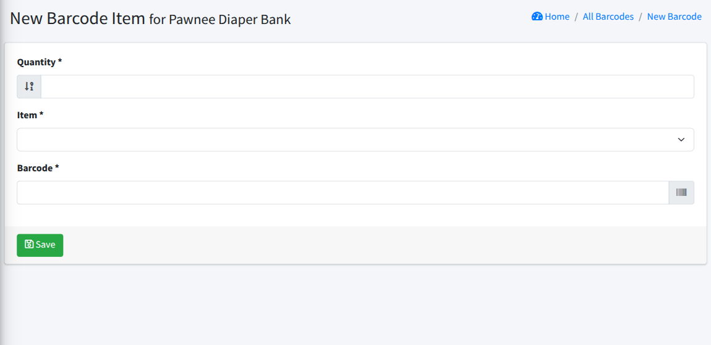
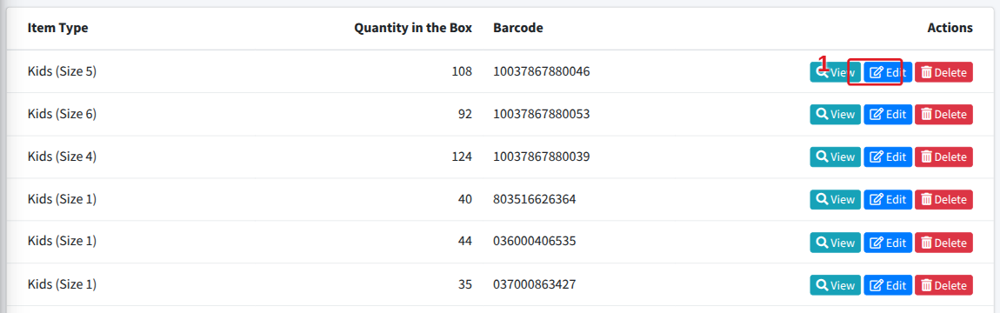
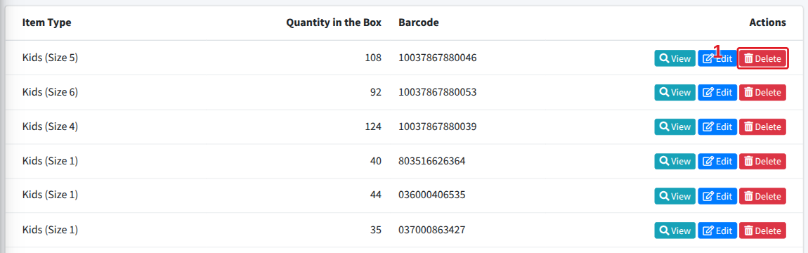
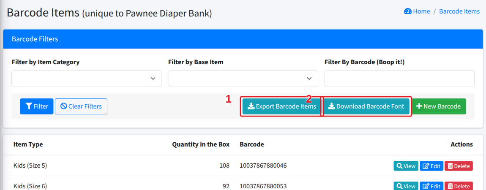
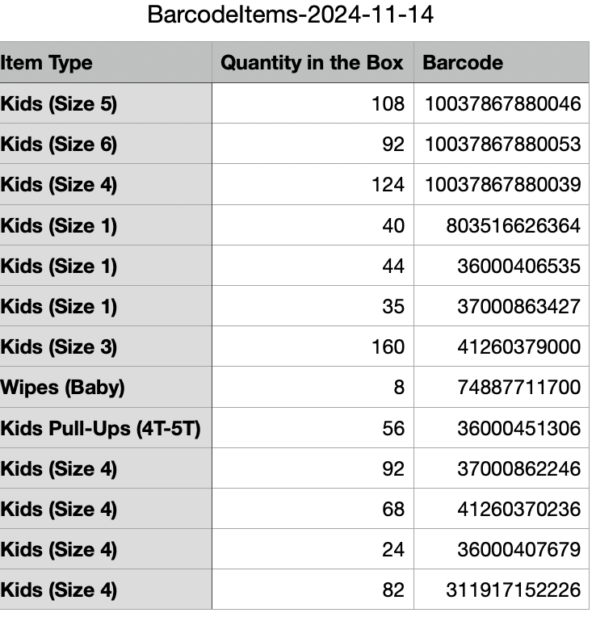

# Barcodes

## Introduction to Barcodes
You can set up Human Essentials to enable reading Barcodes for input of Items when entering Donations, Purchases, and Distributions.

Any barcode reader that acts like a keyboard (most inexpensive USB or Bluetooth scanners do) will work -- you click into the "Barcode Entry" field on the Donation, Purchase, Distribution, Transfer, Audit or Kit form, scan, and the Item and its quantity are filled in.  You can also use your device's camera with the camera button beside the field.

You can use the manufacturer's barcodes that are already on the packages, or print your own labels (see "Getting a Barcode font", below) -- for instance, one label per shelf or bin, each set to the quantity in a standard case.

## The Barcodes page
You can reach the Barcodes page, where you will administer your organizations Barcodes, by clicking "Inventory", then "Barcode Items"

The page lists each Barcode with its Item type and the quantity in the box, and you can filter the list by Item Category, by Base Item, or by scanning ("booping") a barcode into the "Filter By Barcode" field.  Beside each Barcode are View, Edit and Delete buttons.

### Getting a Barcode font for printing your own Barcodes
You can download a font file for printing Barcode labels from the Barcodes page by clicking the button "Download Barcode Font"
This can be used with MS Word on Windows, or with Pages on Apple machines.  (See "Exporting Barcodes", below, for where the button is.)  Consult the help on those for installation.

### Making a new Barcode
To add a Barcode to the system, click the "+New Barcode" button on the Barcodes page.

This will bring up a simple form that allows you to specify the quantity of the Item, select the Item and enter the Barcode - either as a number, or by using a Barcode reader.

You can scan the barcode into the "Barcode" field with your reader rather than typing it.

Enter those three fields and click "Save"

### Changing a Barcode
Should you need to edit this Barcode information, you can do so by clicking 'Edit' beside the Barcode you need to update.

### Deleting a Barcode
To delete a Barcode you are no longer using,  click "Delete" beside the Barcode,  and confirm by clicking "OK".

### Exporting Barcodes
To export a list of the Barcodes, just click "Export Barcode Items" (1) on the Barcodes page.  The "Download Barcode Font" button (2) is right beside it.

[Prior: Kits](inventory_kits.md) [Next: Adjustments](inventory_adjustments.md)