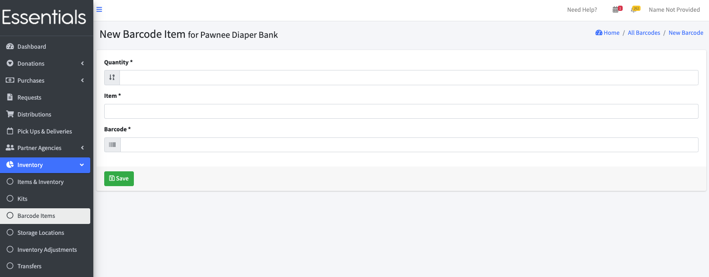

DRAFT USER GUIDE
# Barcodes

## Introduction to Barcodes
You can set up Human Essentials to enable reading Barcodes for input of Items when entering Donations, Purchases, and Distributions.

[TODO:  Hoping to get a paragraph or two from Scott on:

- Barcode readers
- making your own Barcodes 

]

## The Barcodes page
You can reach the Barcodes page, where you will administer your organizations Barcodes, by clicking "Inventory", then "Barcode Items"

### Getting a Barcode font for printing your own Barcodes
You can download a font file for printing Barcode labels from the Barcodes page by clicking the button "Download Barcode Font"
This can be used with MS Word on Windows, or with Pages on Apple machines.  Consult the help on those for installation.

### Making a new Barcode
To add a Barcode to the system, click the "+New Barcode" button on the Barcodes page.

This will bring up a simple form that allows you to specify the quantity of the Item, select the Item and enter the Barcode - either as a number, or by using a Barcode reader.

[TODO:  Question for Scott -- is this "boopable"?  I suspect it is, but I don't want to claim it is if it isn't].  

Enter those three fields and click "Save"

### Changing a Barcode
Should you need to edit this Barcode information, you can do so by clicking 'Edit' beside the Barcode you need to update.

### Deleting a Barcode
To delete a Barcode you are no longer using,  click "Delete" beside the Barcode,  and confirm by clicking "OK".

### Exporting Barcodes
To export a list of the Barcodes, just click "Export Barcodes" on the Barcodes page.

[Prior: Audits](inventory_audits.md) [Next: Adjustments](inventory_adjustments.md)