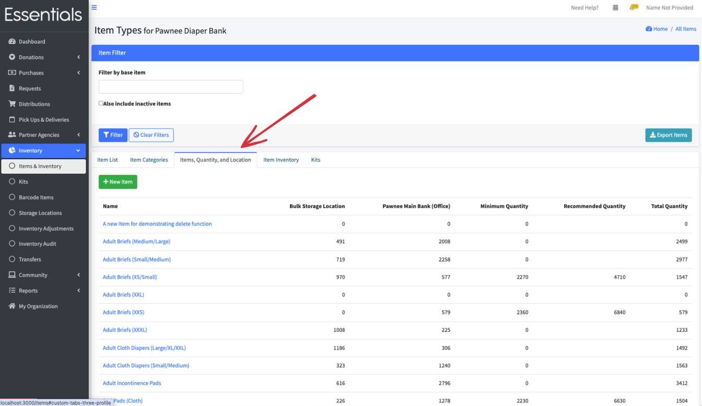

READY FOR REVIEW
# Items
## Introduction
Your bank is initialized with  a basic set of Items that contains many common product types that essentials banks distribute.   These Items represent the stock you have for distribution.  Here is the current default list:  

- Adult Briefs (Large/X-Large),
- Adult Briefs (Medium/Large),
- Adult Briefs (Small/Medium),
- Adult Briefs (XS/Small),
- Adult Briefs (XXL),
- Adult Briefs (XXS),
- Adult Briefs (XXXL),
- Adult Cloth Diapers (Large/XL/XXL),
- Adult Cloth Diapers (Small/Medium),
- Adult Incontinence Pads,
- Bed Pads (Cloth),
- Bed Pads (Disposable),
- Bibs (Adult & Child),
- Cloth Diapers (AIO's/Pocket),
- Cloth Diapers (Covers),
- Cloth Diapers (Plastic Cover Pants),
- Cloth Diapers (Prefolds & Fitted),
- Cloth Inserts (For Cloth Diapers),
- Cloth Potty Training Pants/Underwear,
- Cloth Swimmers (Kids),
- Diaper Rash Cream/Powder,
- Disposable Inserts,
- Kids (Newborn),
- Kids (Preemie),
- Kids (Size 1),
- Kids (Size 2),
- Kids (Size 3),
- Kids (Size 4),
- Kids (Size 5),
- Kids (Size 6),
- Kids (Size 7),
- Kids L/XL (60-125 lbs),
- Kids Pull-Ups (2T-3T),
- Kids Pull-Ups (3T-4T),
- Kids Pull-Ups (4T-5T),
- Kids Pull-Ups (5T-6T),
- Kids S/M (38-65 lbs),
- Liners (Incontinence),
- Liners (Menstrual),
- Other,
- Pads,
- Swimmers,
- Tampons,
- Underpads (Pack),
- Wipes (Adult), and
- Wipes (Baby)

"Under the hood" each of these basic Items belongs to a particular reporting category used for the annual survey, such as disposable diapers, cloth diapers, Kits (which are made up of other Items), cloth diapers, and other.

You can add more Items, basing them off our base Item list, and customize them.   The things you can do include:
 - hiding them from your Partners (useful if, for example, you only distribute Kits, but get donations of materials that go into the Kits)
 - grouping them into categories (you can limit which categories groups of partners can access) 
 - adding minimum and recommended bank-wide inventory levels (which enable warnings, and drive the low inventory list in your dashboard)
 - creating [Kits](inventory_kits.md) that will contain Items (the inventory levels show the Items that are yet not in the Kits)
 - remove an Item from your lists on a go-forward basis.

## The Items & Inventory Views
To bring up your Items & Inventory view,  click "Inventory", then "Items & Inventory" in the left-hand menu.

This brings up a multi-tabbed view - you have several different ways to look at your Items and bank-wide inventory (if you want to see everything that's in a particular Storage Location, that's under [Storage Locations](inventory_storage_locations.md))
### Item List
This shows all of your Items, and allows you access to view/edit/and delete them.
#### Viewing an Item
Clicking "View" will bring up details on the Item, including all the things you can change, and a breakdown of the inventory at each location you currently have stock at.

The fields are:
- Base Item -- this is the "Base Item" for this Item -- which determines what section it is in for the Annual Survey.  You can also search by Base Item (at this time)
- Category -- this is a category you define (see [Item Categories](inventory_items.md#item-categories), below
- Value per Item -- this is currently shown in cents (there is a request to change it to dollars in our list).  It is used for any "Fair Market Value" calculations -- including on donation and distribution printouts.  
[!NOTE] We only have one 'Value per Item' per Item -- so it's always the current fair market value not the historical.  If provided, this is used for the value column on the distribution and donation printouts (unless you hide those columns when [customizing your bank](getting_started_customization.md))
- Quantity per individual -- This is used for two things:  
  - If you have enabled "request by individual" for your partners (and they use it), this is the number of Items that will be in their request per individual they request for.  (so, if it's 25, and they indicate 3 individuals,  you will receive a request for 75 of that Item). 
  - It is also used in the annual survey for the estimated people served -- we take the total of the Item that was distributed, and divide it by this number to get the number of people helped.  
  - [!NOTE] We use 50 for this calculation in the annual survey if you don't give a value.
- On hand minimum quantity -- This is a bank-wide on-hand minimum quantity of the Item -- being below this triggers the Item appearing in your low inventory report in red.
- On hand recommended quantity -- This is the amount you want to have on hand -- if you don't have this, it will appear in the low inventory list on your dashboard, just not in red.
- Package size -- If you use this, the calculated number of packages for the Item will appear on the distribution printout, unless you hide it when [customizing your bank](getting_started_customization.md).
- Item visible to partners -- This is useful if you have Items that you do not want the partners directly requesting.   Uses include: Items you don't get very often,  or Items you only have because they are going into kits you haven't assembled yet. You can uncheck this to hide those Items from all your partners.
#### Filtering your item list
The most common thing you'll when filtering your item list is to include inactive items.  If you have deactivated an item, but are going to offer it again,  you'll need to check the "Also include inactive Items" box in the filter, and then click "Filter" to show it, so that you can reactivate it.

#### Editing an Item
Clicking "Edit" beside an Item on the Item list lets you edit the Item definition, with the fields as described above.

[!NOTE]  Value per Item is in dollars on this screen. 

#### Adding a new Item
To add a new Item,  click the "+ New Item" button on this page.   It will bring up the same page as "Editing an Item", above (only, of course, with none of the fields completed).

#### Deleting or Deactivating an Item
The button "delete" will appear beside an Item if there hasn't been any activity on it at all. (A) Deleting an Item is permanent

The button "deactivate" will appear if there has been activity.  But it will be greyed out unless your bank-wide level of inventory on that Item is 0. (B))
Deactivating an Item removes it whenever you are entering a new distribution/donation/purchase/transfer/audit, and removes it from the partner's new requests.
You can still see deactivated items in most reports, and can include them in your filtered lists.

#### Reactivating an Item
To reactivate an Item,  you'll need to
(1) click "Also include inactive Items"
(2) click "Filter", then
(3) click "Restore" beside the Item you wish to reactivate.

Click 'Ok' on the confirmation screen that appears.

### Item Categories

Item categories are largely used for limiting the Items specific [Partner Groups](pm_partner_groups.md) can see, though you can also filter distributions by them.  This tab shows all the Item categories you have, allowing you to view and edit each one, as well as enter new ones.

[!NOTE]  Each Item can only belong to one Item Category

To view your Item Categories,  click the "Item Categories" tab on the Items & Inventory page.

#### Adding a new Item category
To add a new Item category,  Click on Inventory, then Items & Inventory, then the Item Categories tab, then the "Add Item Category" button.  

This brings up the new Item Category page

Enter a unique Category Name, and a suitable description, then click Save.

#### Viewing an Item Category
All the information about an Item category is in the list,  but you can also manage the Items in the category through the view.  To view an Item category,  you click on Inventory, then Items & Inventory, then the Item Categories tab, then the "View" button.  

You can also remove Items from the category by clicking "Remove from category" beside the Item.   This will hide them from any partner groups that have this category.  

#### Editing an Item category
To edit the name and description of an Item category,   To edit an Item category,  you click on Inventory, then Items & Inventory, then the Item Categories tab, then the "Edit" button beside the category you wish to edit.  

Update the category name (still needs to be unique) and category description, and click save.  This will take you to the Item category view [Add pointer to above], which lets you change the Items in the category.

### Items, Quantity and Location tab

This tab shows all the Item inventory across all the storage locations, along with each Item's minimum quantity, recommended quantity, and bank-wide quantity.  

### Item Inventory tab

This tab shows the bank-wide inventory for each Item.   Clicking the + beside the Item name will show the breakdown of that inventory by storage area.

### Kits tab
This shows the same information as the main [Kits](inventory_kits.md) list. 

[Prior: Partner Announcements](pm_announcements.md)[Next: Storage Locations](inventory_storage_locations.md)

