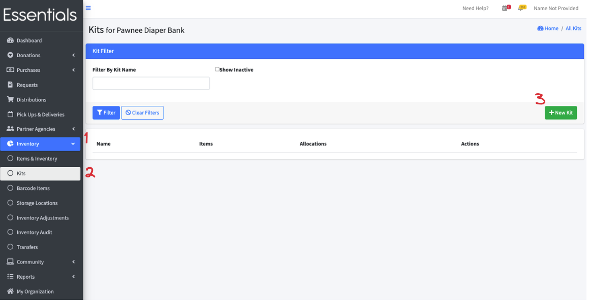
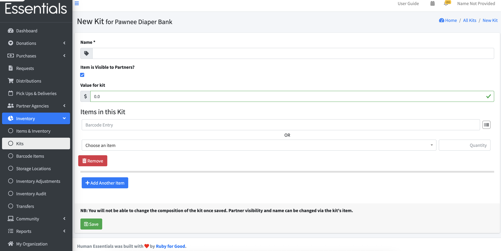
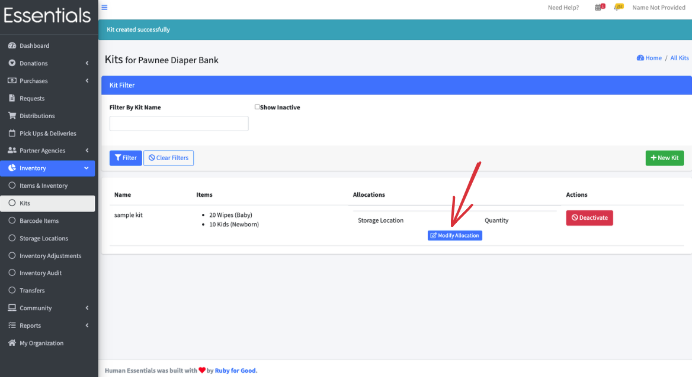
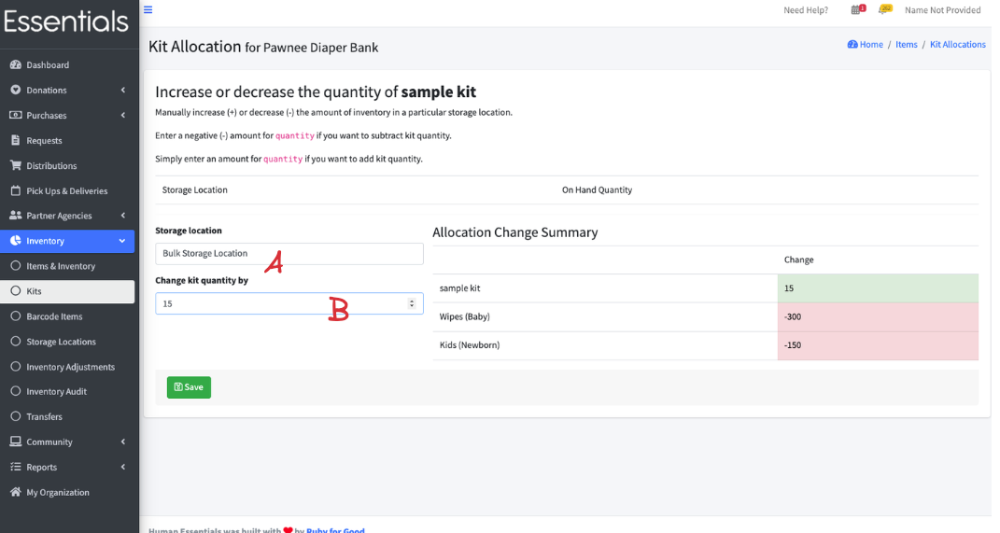
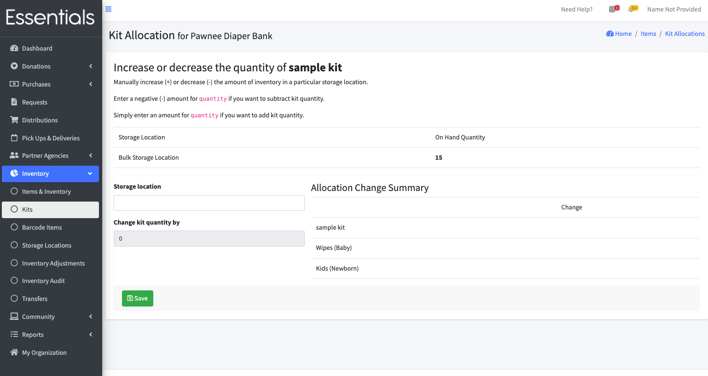
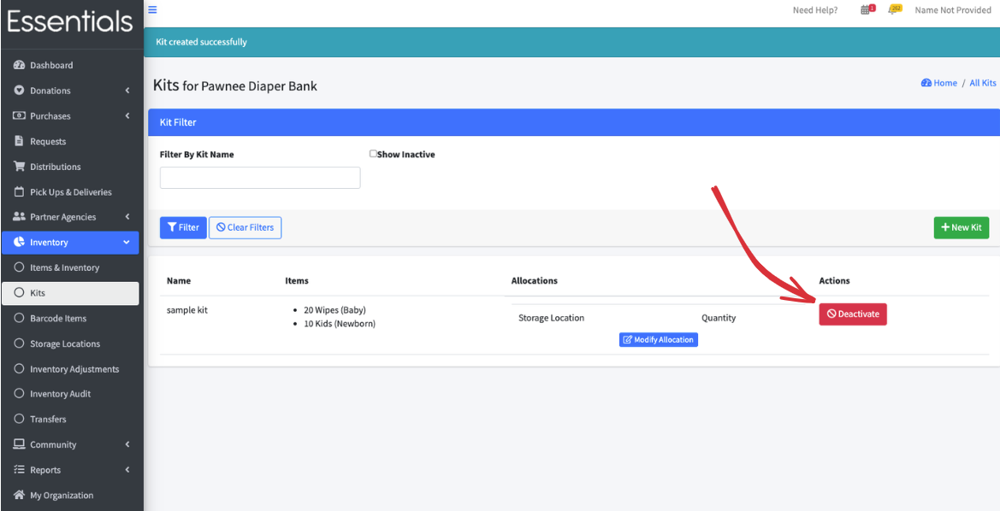
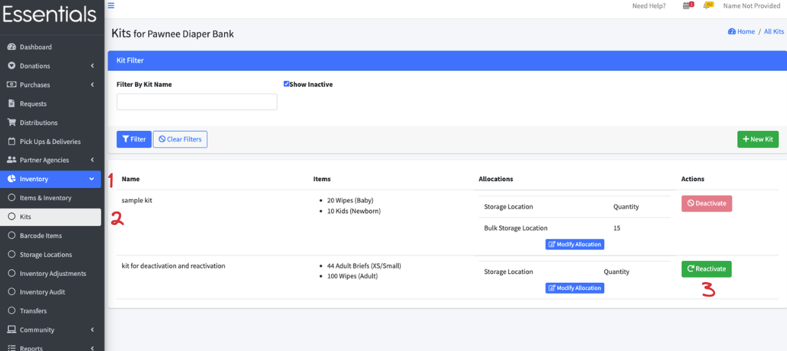

READY FOR REVIEW
# Kits

Many banks distribute Kits -- the classic example is a package that contains different types of menstrual supplies (e.g. pads, tampons, wipes).

What the Kits feature lets you do is to manage your inventory of what goes into the Kits versus what is in the Kits.

Working with Kits has two steps -- creating the Kit and allocating Kits

## Creating  versus allocating Kits

Creating a Kit is defining what is in a Kit -- so it's saying that, for example, a period Kit will contain 8 tampons and 4 pads.

Allocating Kits is akin to assembling Kits -- when you create the physical Kits from the supplies you have,  you then allocate those Kits in the system.  

In our example of a Kit with 8 tampons and 4 pads,  if you allocate 10 Kits,   you are going to be reducing your inventory of pads by 40 and your inventory of tampons by 80,  but increasing your inventory of period Kits by 10.

Then you distribute those period Kits.

## Creating a Kit

[!WARN]  You can't edit a Kit -- once you've defined it, it's set in stone.  So do be careful! 

To create a Kit,  click on "Inventory", then "Kits" in your left hand menu.  This brings up a page that shows all your current Kits.  
Then click the "+New Kit" button on the right hand side of the page.

This brings up the "New Kit" form, which has the following info:

- Name:  This is the Item name for the Kit -- what it will appear as in the drop-down lists and in any reports
- Item is Visible to Partners?  Check this if you allow Partners to order the Kit.  
[!INFO] If you need to control which Partners can request a Kit,  you'll need to put it in a category once you've defined it, through the Item page, after creation, and use Partner Groups to control which Partners can request the Item.
[(see Editing an Item)](inventory_items.md#editing-an-item), [Item Categories](inventory_items.md#item-categories) and [Partner Groups](pm_partner_groups.md)
- Value for Kit:  This is the Fair Market Value for the Kit.  We don't sum up the Items within the Kits for FMV calculations.
- Items in this Kit:
  You can enter multiple Items,  adding each Item with the following
    - Barcode Entry -- if you have already entered [Barcode Items](inventory_barcodes.md), you can just "boop" the Item into the Kit.
  OR
    - Choose an Item from the list of all [Items](inventory_Items.md) you have, and add the quantity of the Item that will be in the Kit.

To add the rest of your Items,  click "+Add Another Item."  If you need to remove an Item, click "Remove" under it.

Once you are satisfied with the definition of your Kit,  click "Save".  This will return you to the Kits screen, where you'll see your new Kit.

## Allocating Kits

Once you have created your Kit,  you can allocate it.   This represents assembling Kits from their components, and will reduce the inventory of those Items appropriately.

From the Kits page (Inventory | Kits),  click "Modify Allocation" on your Kit

This takes you to the Kit Allocation page
This lists your current on-hand quantity for each storage location you have Kits in, and lets you change the allocation.

Pick the Storage Location (A) and the amount you want to increase the Kits by (B).  When you put a number in the "Change Kit quantity ",  you'll see what effect the allocation will have on your inventory.

[!NOTE] you can also 'deallocate' Kits if need be, by putting a negative number in the "Change Kit quantity by" field.   When you deallocation Kits, the contents will be returned to the appropriate Items' inventory.

Then click "Save".   The system will check if there are enough of each component Item in the storage location.  If there isn't, it will give you an error.  If there is,  it will adjust the inventory appropriately, and return to this screen, which will reflect the new on-hand quantity.

## Deactivating a Kit

If you are no longer using a Kit,  you can deactivate it - which will remove it from the dropdowns, and from the Kits page (you can always see it by clicking the "show inactive" in the filter, then clicking "Filter")

You can only deactivate a Kit if it has no allocations.  To deactivate a Kit, click the "Deactivate" button beside it in the Kits page, and then click "OK" to confirm.

## Reactivating a Kit

To reactivate a Kit, go to the Kits page (Inventory | Kits).
Then click "Show Inactive" and "Filter".   This will show the Inactive Kits.
Then click "Reactivate" beside the Kit you wish to reactivate and click "OK" to confirm.  

[Prior: Audits](inventory_audits.md)
[Next: Barcodes](inventory_barcodes.md)

