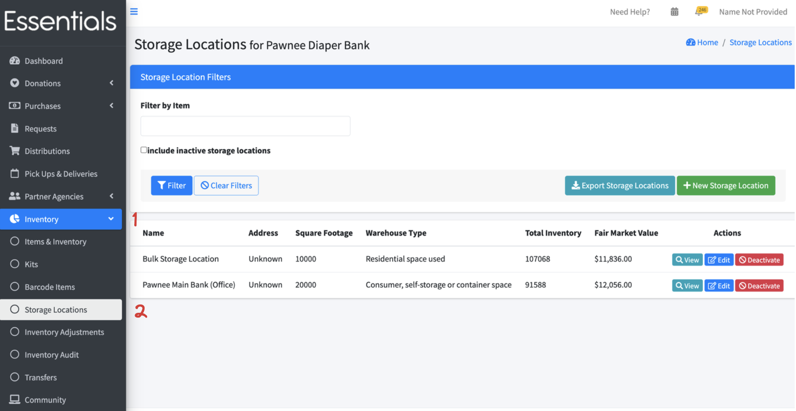
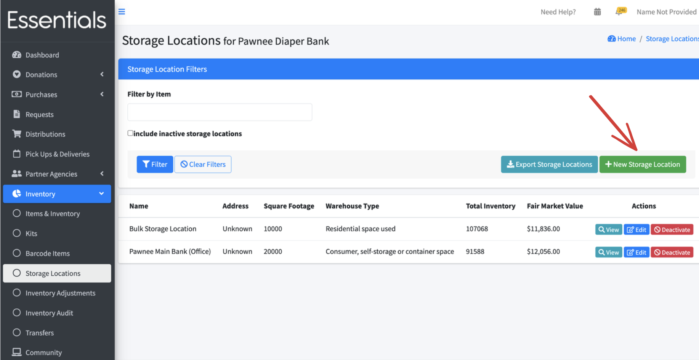
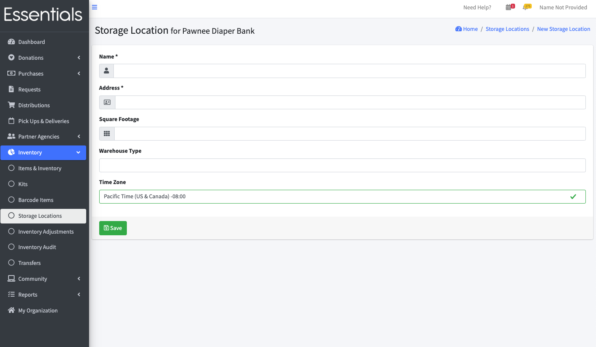
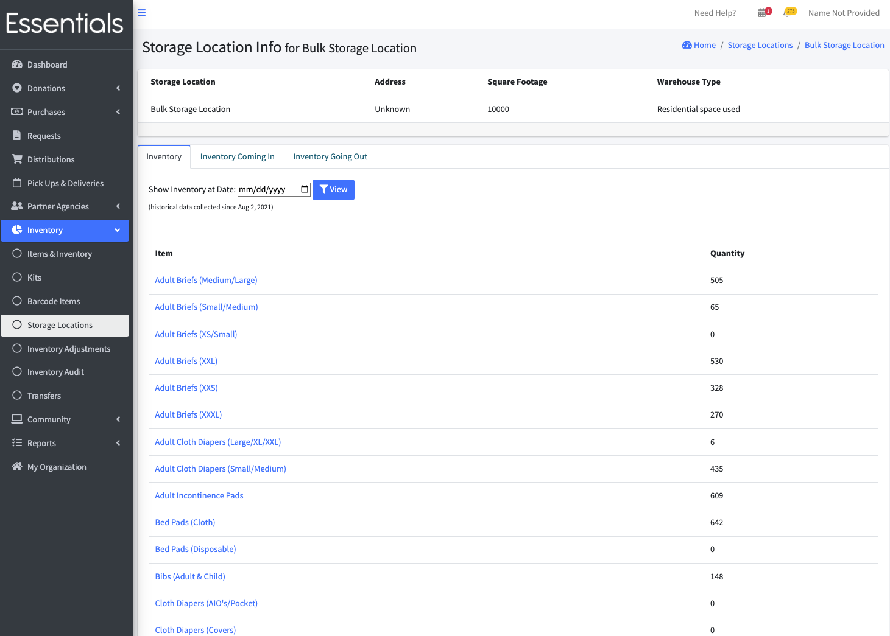
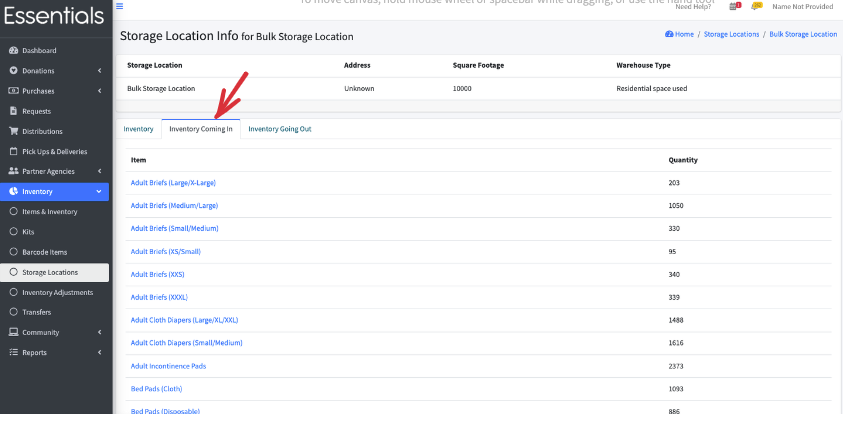
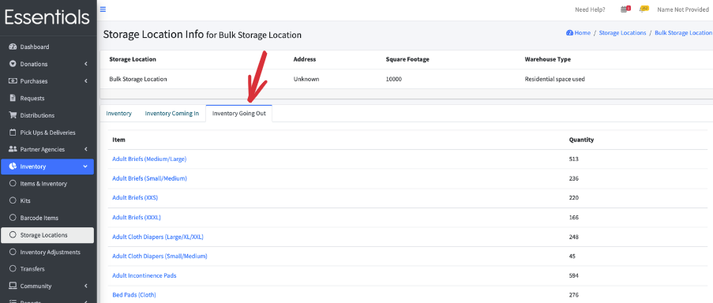
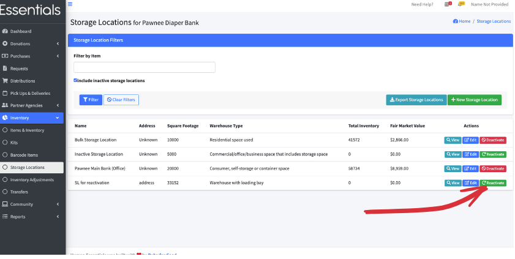

READY FOR REVIEW
# Storage Locations

You need at least one Storage Location.   Each Donation and Purchase increases the inventory in a Storage Location,  and each distribution is made from the inventory in a Storage Location.  

## Storage Location summary page 
To get to the Storage Location summary page, click "Inventory", then "Storage Locations" in the left-hand menu

This shows all your Storage Locations, and allows you to navigate to view, edit, or possibly deactivate each one.

## Adding a Storage Location
To add a Storage Location,  click "New Storage Location" on the Storage Location summary page.

This brings up the New Storage Location page

- Name is mandatory, and is used in drop-downs throughout the system to indicate the Storage Location
- Address is also mandatory, but is information only.
- Square Footage is used in the annual survey report
- Warehouse Type is used in the annual survey report
- Time Zone is used with the pickup and deliveries calendar, particularly with allowing you to sync your pickups calendar with Google Calendar

## Storage location view
To view a Storage Location, click the "View" button beside it in the Storage Location summary page.
The view has three tabs:  Inventory, Inventory Coming In, and Inventory Going Out

### Inventory 

Here you see the current levels of inventory for the chosen Storage Location.   You can see the inventory levels for past dates by choosing the date in "Show Inventory at Date" and clicking "View"
That shows the inventory at the beginning of the day.

### Inventory Coming In
This shows the sum of all the inventory coming in ([Purchases](essentials_purchases.md), [Donations](essentials_donations.md), [Adjustments](inventory_adjustments.md), [Transfers](inventory_transfers.md), and  [positive changes for kit allocations.deallocations](inventory_kits.md)) for the given Storage Location for all time

### Inventory Going Out
This shows the sum of all the inventory going out ([Distributions](essentials_purchases.md), [Adjustments](inventory_adjustments.md), and  [Transfers](inventory_transfers.md), and  [positive changes for kit allocations.deallocations](inventory_kits.md)) for the given Storage Location for all time

## Editing a Storage Location
You can edit your Storage Location (though it seems a very rare event), by clicking "Edit" beside the Storage Location in the Storage Location Summary Page.
The same fields are as available as for [New Storage Locations](inventory_storage_locations.md).  Make your updates and click save.

## Deactivating a Storage Location
You can only deactivate a Storage Location if the inventory for all its items is 0.
To deactivate the Storage Location, click "Deactivate" beside it on the Storage Location summary screen, then click "OK" to confirm.

## Reactivating a Storage Location
If you need to reactivate a Storage Location that was deactivated,  go to the Storage Locations summary screen (Inventory | Storage Locations),  then click "include inactive Storage Locations", then Filter.
This will include inactive Storage Locations in the list.   Find the Storage Location you want to use again and clic "Reactivate" beside it.

[Prior: Items](inventory_items.md)[Next: Audits ](inventory_audits.md)