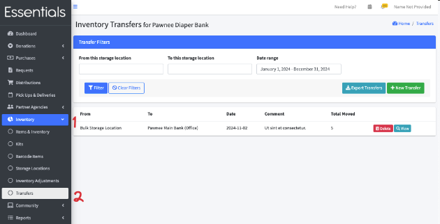
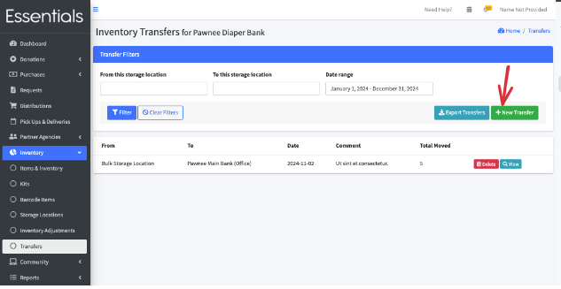
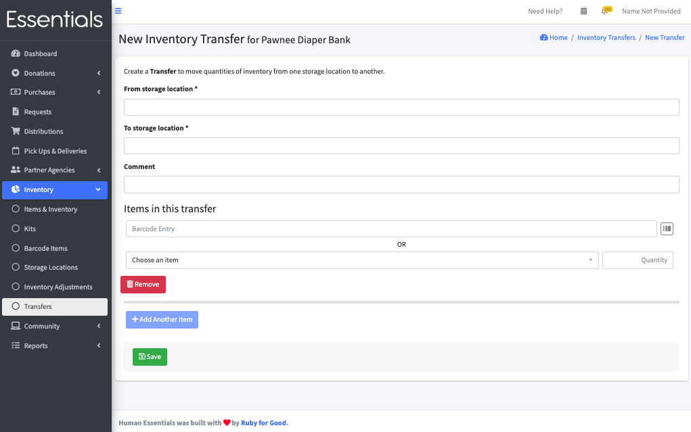
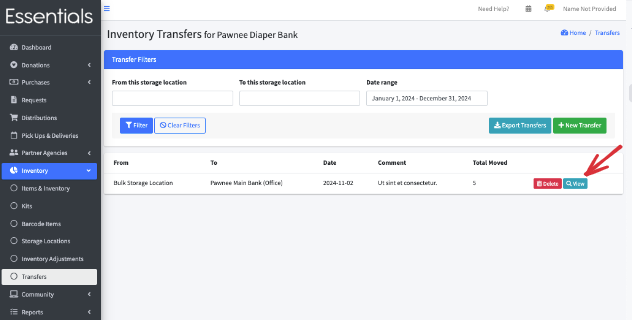
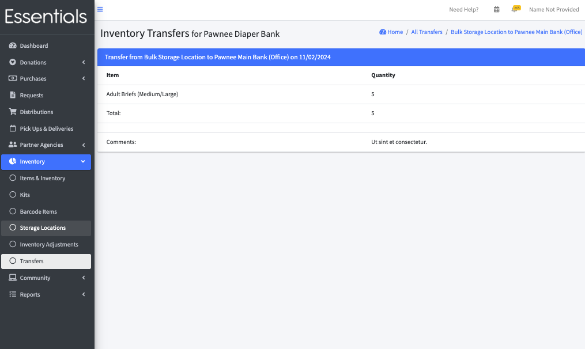
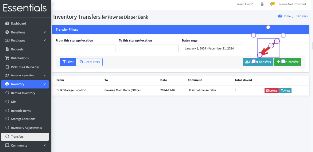
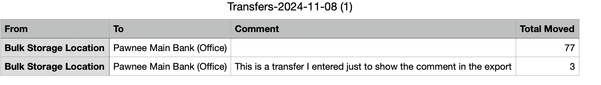

READY FOR REVIEW
# Transfers
If you have multiple Storage Locations, sometimes you have to move inventory between them.  
## Working with Transfers
To start working with Transfers, click "Inventory",  then "Transfers" in the left-hand menu.
That will bring up the Transfers page, which lists all your past Transfers in chronological order.  

You can filter the Transfers based on source (From), destination(to), and date.
From here you can make a new Transfer, add a Transfer, view the details of a past Transfer or delete it.

## Adding a Transfer
To add a Transfer, click the "+New Transfer" button on the Transfers page. 

That will bring up the New Inventory Transfer page.

Specify where the Items being moved are coming from, in "From Storage Location," and where they are going to in "To Storage Location".

The Comment field is a good place to note the reason for the Transfer, but you can leave it blank.

Then select the Item and quantity for each Item that is being Transferred.  If you have [barcodes](inventory_barcodes.md) set up,  you can use your barcode reader to "boop" in the materials being Transferred.

When you are done, click "Save".  The system will check that you have enough inventory in "From" to cover the Transfer.  If so, the inventory changes will take place immediately.

## Viewing the details of a Transfer
To view the details of a Transfer, click the "view" button beside it in the Transfers list.

This lists all the Items in the Transfer, and how much was transferred, as well as your comment.

## Deleting a Transfer

This should not happen very often!  

To delete a Transfer, click the "delete" button beside the Transfer.  
[Delete Transfer navigation](images/inventory/inventory_transfers_delete.png)

Then press "OK" to confirm.
This will check that the inventory levels in the two Storage Locations will allow the change.  If they will, it will roll back the inventory changes that were made when you entered the Transfer.

##### ** N.B. This is not undoable  *** 

----

[!NOTE]  If you do delete the wrong Transfer, you can find a record of any Transfer made since September 2024 in the "History" Report.  There you can find the amount transferred  for each Item, so that you could re-enter them.  The inventory changes in that case will be as of the date you re-enter, though.

----

## Exporting Transfers
To export a list of the Transfers, click "Export Transfers" on the Transfers page

The details in the export are lacking -- it doesn't show each Item, but only the total.

(Expanding it to include the Items transferred is a task on our things to do.  Please [reach out](intro_ii.md)) if this is a high priority for you.)

[Prior:  Adjustments](inventory_adjustments.md) [Next: Product Drives](community_product_drives.md)