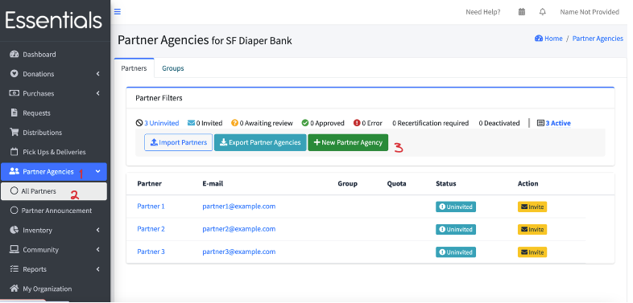
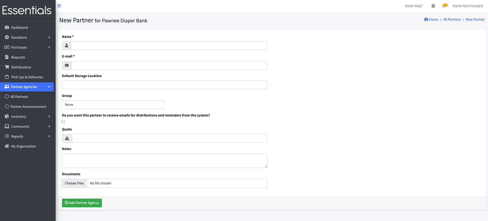

READY FOR REVIEW
# Adding a single Partner
To add a single Partner,  you can either Click on the "Add a Partner" button in the "Getting Started" section of your dashboard (if you are, indeed, just getting started), or click "Partner Agencies" in the left-hand menu, then "All Partners", then "New Partner Agency".  Then, fill in the following information, and click "Add Partner Agency".  

[!NOTE] This just sets up the Partner so you can distribute to them.  It does *not* notify or invite the Partner -- that is a separate step.
### Name (mandatory)
This is the name of the agency.  It will appear in dropdowns for you to select when filtering Requests or Distributions, or when entering a new Distribution.
### E-mail(mandatory)
This is the primary contact for the Partner.  Any system emails regarding the Partner, such as notifications of Distributions or reminders of Request deadlines, will be sent to this address.
### Default Storage Location
Choosing a default Storage Location here is a short-cut that will automatically fill in the Storage Location when you fulfill a Request from this Partner.  (Don't worry, you can change it.)
### Group
What Partner Group, if any, does the Partner belong to.  Partner Groups are very handy if you want to, say, allow only certain Partners to be able to request some Items.  For more details see [Partner Groups](pm_partner_groups.md)

[!NOTE] If you use Partner Groups, please note that any Partners that do not belong to a Partner Group will be able to choose from all the Items.  So if you need to restrict certain Items to a specific group, then you're going to have to have all your Partners belonging to some Partner Group
[!NOTE] Partners who belong to Partner Groups can *only* choose the Items that have the Item Categories specified for their Partner Group.

### Do you want this Partner to receive emails for Distributions and Reminders from the system?
See also the questions about customizing reminders in [your organization](getting_started_customization.md)

### Quota
This is an information-only quota -- it is meant to be total Items per request. We give a friendly "are you sure you wanted to order that much?" kind of warning on the partner's confirmation screen if they over order, but there is *no* actual enforcement.  If entered, this value is also displayed in your view of the requests.

### Notes
Bank-only notes about the Partner.

### Documents
Documents concerning the Partner -- bank only 

[Prior - Importing Partners](pm_importing_partners.md) [Next - Partner Groups](pm_partner_groups.md)