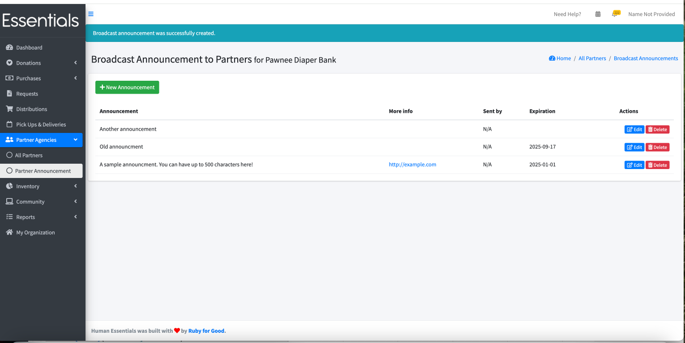
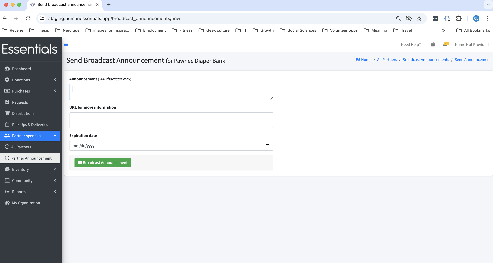

DRAFT USER GUIDE

# Partner announcements

Partner announcements are a great way to let your partners know about temporary situations -- like when you need to put some limits on what you can give out of a particular size.  Some banks also use them to point to other resources.
These announcements appear on the partner's dashboard,  so they'll be there whenever the partner logs in.

You can add multiple announcements, with links to additional information, and either have an expiry date or delete them when they are no longer useful. The announcments will be shown in reverse chronological order 

[TODO:  confirm that there isn't something odd, like the ones with expiries showing first]

## How to create an announcement

Click on "Partner Agencies" in the left hand menu, then "Partner Announcement".   This will bring up a list of all your partner announcements.

Click the "New Announcements" button to bring up a form for a new announcement

[TODO:  Also check that the "SEnt by" actually has meaning.   As org_admin1, it just says "N/A".]

Here you can fill in 
- Up to 500 characters for your announcement. 
- a URL for more information (useful for pointing to resources on your site)
- an expiry date.   This is optional - you can leave announcements up 'forever' if you want.  The expiry date is the last day the announcement will be shown [TODO: confirm that it's not the first day it's *not* shown.]

Then,  as soon as you click "Broadcast announcement",  the partners will see it when they log in.

## Changing an announcment
Simply click "edit" in the actions column beside the announcement you want to change, make your changes, and click "Broadcast announcement"

## Deleting an announcement
You may want to clear out your older announcements.  You can click "delete" beside any announcement to remove it from your view.  It also will be deleted from the partner's view,  if it was not yet expired.

[Prior:  Other partner information](pm_other_information.md) [Next: Inventory -- Items](inventory_items.md)
