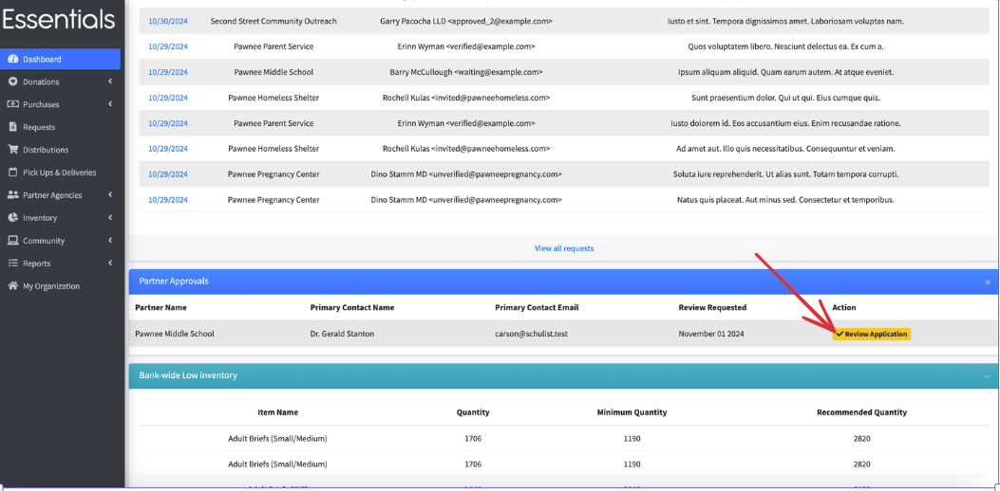
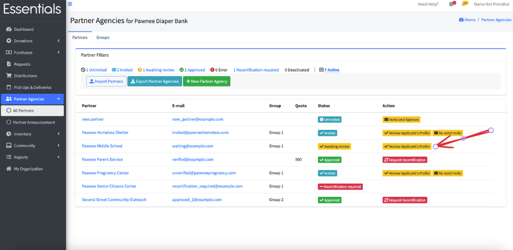
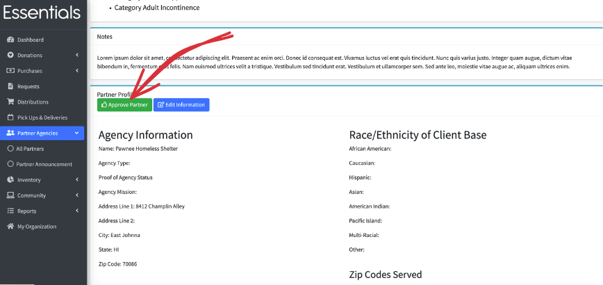
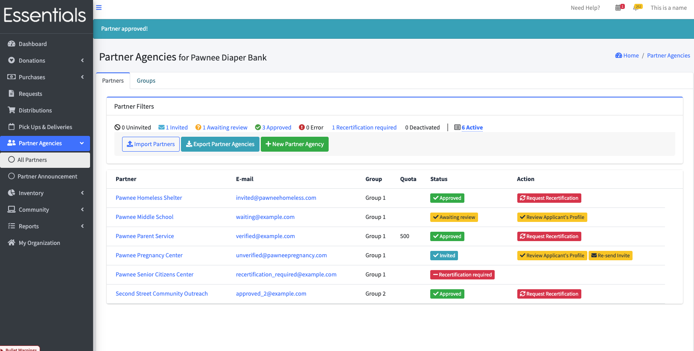

READY FOR REVIEW

# Approving Partners

There are three paths in to reviewing a Partner's information before approving them to make Requests: 

1/  There is a list of Partners awaiting approvals on the dashboard.   To start the approval process, click "Review Application";

or

2/  Click "Partner Agencies" and "All Partners" in the left-hand menu, then "Review Applicant's Profile" beside the Partner.

or

3/  Click "Partner Agencies" and "All Partners" in the left-hand menu, then click the Partner's name.  Scroll down to view the Partner Profile information, and click "Approve Partner" if it has what is needed.

----------------------------------

In any of these cases, you can view all the answers in the profile.  If something needs changing, you can do it yourself by clicking the "Edit Information" button,  or the Partner can make the change.   

See [Partner profiles](pm_partner_profiles.md#viewing-a-partner-profile) for details on the Partner Profile.

Once you have reviewed the Partner's info, and want to approve them to make requests,  click the "Approve Partner " button.   

You should see a "Partner Approved!" message,  and the status of the Partner will show as "Approved"

[Prior - Partner Profiles](pm_partner_profiles.md) [Next - Requesting Recertification](pm_requesting_recertification.md)
