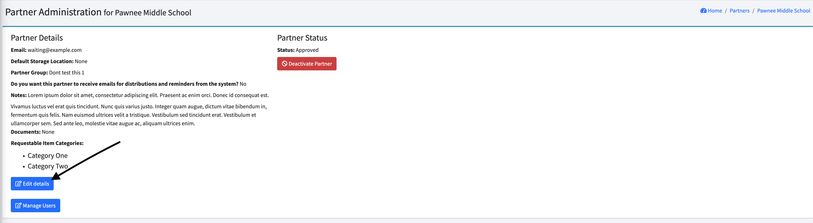

READY FOR REVIEW

# Editing a Partner

Note - this is editing a Partner's basic information,  not their [Partner Profile](pm_partner_profiles.md).  What's the difference?  The basic Partner information is what you enter when you are initially creating the Partner, whereas the Partner Profile contains a high level of detail that can be entered by the Partners themselves.

You can edit a partner's basic information by clicking [Partner Agencies] in the left-hand menu, then [All Partners], then click on  the partner you want to work with.

That will bring up this screen. Click "Edit Partner Information"  to bring up the Partner edit screen:

This is the same selection of information you provided when you initially added the partner.

Make your changes, and click "Update Partner" to save.

[Prior: Partner Groups](pm_partner_groups.md)[Next: Inviting a partner](pm_inviting_a_partner.md)
