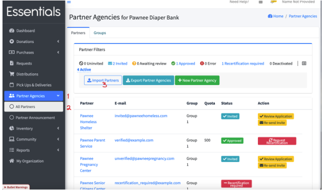
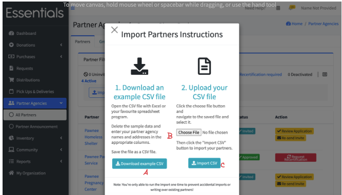

DRAFT USER GUIDE
# Importing partners

**N.B.** We've set up importing partners as a process you can only run once to prevent accidental imports and writing over existing partners.

To import partners,  you will need a .csv file containing their information -- this will just be the partner business name and primary contact email.  

We do provide an example file -- to get it,  click on "Partner Agencies",  "All Partners", then "Import Partners".  (If you are a brand-new bank you might have gotten here through the "Getting Started" instructions on the dashboard.)

You will see a pop-up with a "Download example CSV" button (A) on it.  Clicking that will download an example file for partner uploads.

That file is named partners_template.csv,  and you should be able to find it in your downloads directory. 

You can edit this in your favourite spreadsheet program,  or just as a text file.  

When you have the information completed,  navigate back to that same pop-up ( click on "Partner Agencies",  "All Partners", then "Import Partners" )
Now, follow the instructions under "2. Upload your CSV file " -- click "Choose File" (B), and pick the .csv file you've edited.   The file name will appear after the "Choose File" button.   Then, click "Import CSV".

If you see "Partners were imported successfully!",  that's good!   You should review the list of partners on that page to make sure that all of the partners were imported -- if there was a badly formatted email, that partner will not appear.
If you should get a "500" error,  it most likely means that your file is not formatted properly.

[Prior - The request/distribution cycle](pm_request_distribution_cycle.md) 
[Next - Adding a partner](pm_adding_a_partner.md)