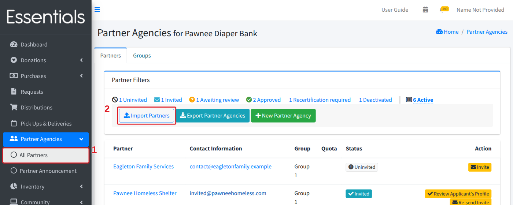
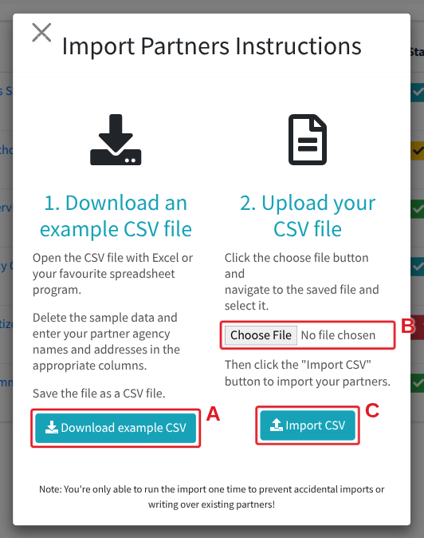

# Importing partners

If you have a lot of Partners, you can bring them all into the system at once from a .csv (comma-separated values) file, instead of adding them one at a time.

Imported Partners start out with the status "Uninvited" (see [Partner statuses](pm_partner_statuses.md)) -- you can distribute to them right away, and invite them to the system whenever you are ready.

## Getting the example file

We provide an example file to start from.  To get it,  click on "Partner Agencies",  "All Partners", then "Import Partners".  (If you are a brand-new bank you might have gotten here through the "Getting Started" instructions on the dashboard.)

You will see a pop-up with a "Download example CSV" button (A) on it.  Clicking that will download an example file for partner uploads.

That file is named partners_template_updated.csv,  and you should be able to find it in your downloads directory. 

## Filling in the file

You can edit this in your favorite spreadsheet program,  or just as a text file.  But you need to save it as a .csv  file.

Delete the sample rows and enter one row per Partner.  The columns are:

- name -- the agency's name (required)
- email -- the Partner's main email address (required, and it has to be unique across your Partners)
- default_storage_location -- the exact name of one of your active Storage Locations, or leave it blank.  This is used to pre-fill the Storage Location when you fulfill this Partner's Requests (see [Adding a Partner](pm_adding_a_partner.md#default-storage-location)).
- send_reminders -- true or false: whether the Partner should get reminder and Distribution emails from the system
- quota -- the informational per-Request quota for this Partner (see [Adding a Partner](pm_adding_a_partner.md#quota)), or leave it blank
- notes -- your bank-only notes about the Partner

Only name and email are needed -- you can leave the other columns blank (but keep the header row as it is).

## Uploading the file

When you have the information completed,  navigate back to that same pop-up ( click on "Partner Agencies",  "All Partners", then "Import Partners" )
Now, follow the instructions under "2. Upload your CSV file " -- click "Choose File" (B), and pick the .csv file you've edited.   The file name will appear after the "Choose File" button.   Then, click "Import CSV".

If you see "Partners were imported successfully!",  that's good!  

If some rows couldn't be imported (for instance, because a Partner with that email already exists), you'll see a message listing the Partners that did not import and why -- the rest of the rows are still imported.  If you entered a default_storage_location that doesn't match one of your Storage Locations, the Partner is still imported, with a warning, and without a default Storage Location.

[!NOTE] The pop-up says you can only run the import once.  In practice, importing the same file twice won't create duplicates -- the Partners whose emails already exist are rejected -- but it's still a good idea to check your Partner list before re-importing.

[Prior - Partner statuses](pm_partner_statuses.md) 
[Next - Adding a partner](pm_adding_a_partner.md)
