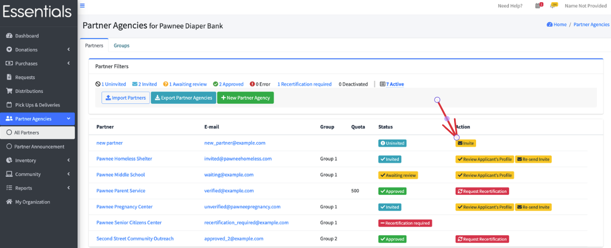
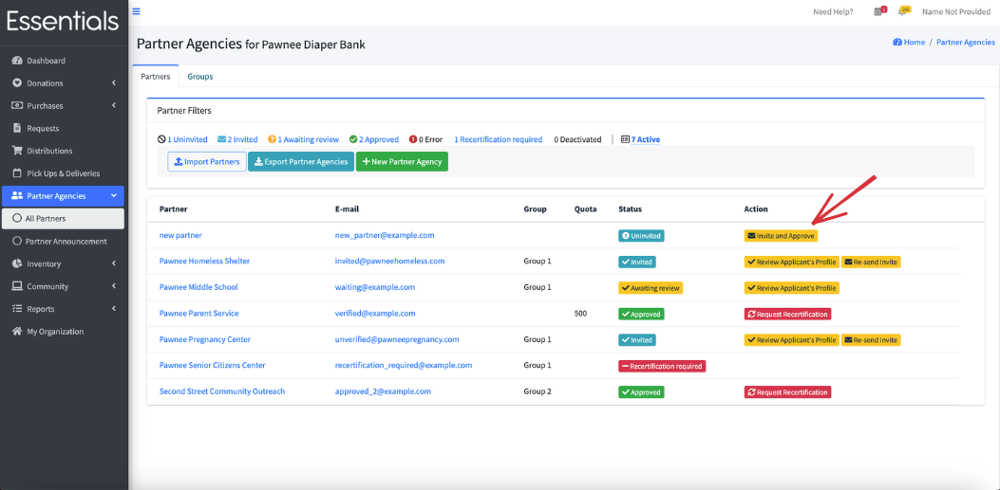

READY FOR REVIEW
# Inviting a Partner

Before a Partner can make Requests,  they have to be invited and approved.

When they are invited,  they will receive an email with a link so that they can set up their password.
These links expire in a couple of weeks,  but if they don't respond in time,  
you can direct them to use the "Forgot your password?" function on the sign-in page
(https://humanessentials.app/signin) to get a new link to set their password.

## Invite or Invite-and-Approve?
There are two options for enabling Partners to Request.  

The first, default, option is:

1/  You invite the Partner.

2/  They click on the link and set up their password.

3/  They then sign in and go into their "My Organization", update whatever profile information you need (se [profile](pm_partner_profiles.md).

4/  They submit it for your approval

5/  You approve it (there may be some back and forth here!)

6/  They can now make Requests.

If you choose "Use One step Partner invite and approve process?" in ["My Organization"](getting_started_customization.md),
then the sequence is:

1/  You invite and approve the Partner.

2/  They click on the link and set up their password.

3/  They can now make Requests.

The  *disadvantage* to the second method is that it may be harder to extract any
information you do need from your Partners which can impact your grant-writing and 
your annual reports.

# How to invite a Partner

1/  Click on "Partner Agencies" in the left hand menu, then "All Partners"
2/  Find the Partner you wish to invite.
3/  Click on the "Invite" button for that Partner.

# How to invite and approve a Partner
First, make sure that you have "Use one-step Partner invite and approve process" chosen in  ["My Organization"](getting_started_customization.md).
Then...

1/  Click on "Partner Agencies" in the left hand menu, then "All Partners"
2/  Find the Partner you wish to invite and approve.
3/  Click on the "Invite and Approve" button for that Partner.

[Prior:  Partner Groups   ](pm_partner_groups.md) [  Next: Partner Profiles](pm_partner_profiles.md)
