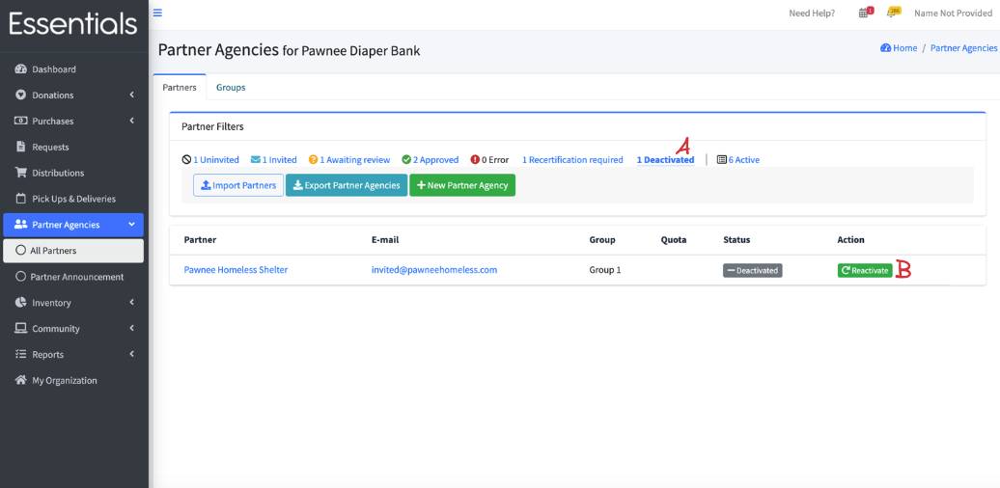

READY FOR REVIEW

# Making a Partner inactive

Unfortunately, sometimes a Partner will cease operations.  Should that occur, you can make them inactive.   This does not remove their historical information,  but they won't appear in your selections, or in the all partners list (unless you specifically choose "Deactivated")

To deactivate a Partner:

Go to the All Partners list (click on "Partner Agencies", then "All Partners" in the left hand menu),then click on the Partner name to bring up that Partner's screen.

Then click on "Deactivate Partner".  A confirmation screen will appear.  Click "OK".

You'll see a message that the Partner is successfully deactivated,  and they will not appear in the default All Partners list.

Note that if there has never been any activity for the Partner at all,  you will be prompted to delete instead.  This is permanent.

## But what if I need to see them?

If you need to see the information for a deactivated Partner, go to the All Partners list, and click on the "Deactivated" link (see A, below).
This will bring up a list of all the deactivated Partners. You can then click on them to view their information.

## Can I reactivate them?

Yes.  Bring up the list of deactivated Partners, then click on the "Reactivate" (B, above) button beside the partner.  Click "Ok" on the confirmation window that pops up.

This will restore them to the same status as when you deactivated them.

[Prior: Requesting recertification](pm_requesting_recertification.md) [Next: reactivating a partner](pm_partner_reactivation.md)
