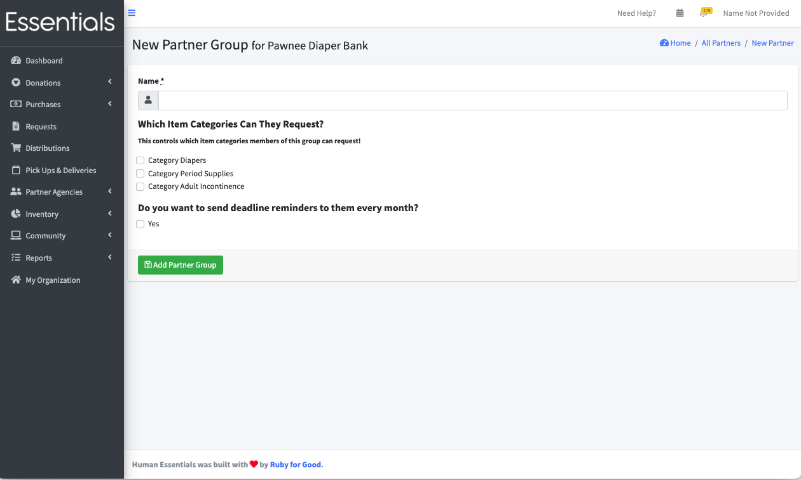

READY FOR REVIEW
# Partner Groups

You may have reasons that some partners are treated differently than others.  Reasons we've seen for this include:
- Some banks have 'tiers' of partners, where some partners have different rules about what and when they can request.  
- Some banks have grants that are tied to specific geographic areas, and set up specific Items for those grants (that only Partners in those geographic areas can request)

Partner Groups allow you to manage that.  They allow you to set the item categories (see [Item Categories](inventory_items.md)) that a Partner Group can request

If you are going to use Partner Groups, you should 
1/  Set up your Item Categories 
2/  Assign Items to them 
3/  Set up the Partner Groups, 
4/  Then assign a Partner Group to the Partners on an individual basis -- you may want to set up your groups before adding your partners.

# Adding a Partner Group
In the left-hand menu, click on "Partner Agencies", then "All Partners".   The Partner Agencies list will appear.  There are two tabs in this list "Partners" and "Groups".  Click on "Groups".
Then click on "New Partner Group"

This will bring up a form like this (the categories will be different):

## Fields in the partner group form
### Name
This is the name your bank will use to refer to the Partner Group.  It is not visible to the partners, and is not used in any reports.  It must be unique among your Partner Groups.
### Which Item Categories Can They Request?
This lists the item categories you entered (in (see [Item Categories](inventory_items.md)))

The Partners who are in this Partner Group will only be able to request the items in the categories you check here.  Note that they will not be able 
they will not be able to request any Items that are not in a category

For clarity - if you do not choose any categories, they will not be able to choose any items, so if you are using Partner Groups, you have to use Item Categories.

### Do you want to send deadline reminders to them every month?
This works in conjunction with "Reminder day" and "Deadline day", which is set on an organization level (see [Getting Started - Customization](getting_started_customization.md))

# What  if a partner isn't in a group?
If a Partner is not in a Partner Group,  they can request any item that is visible to partners.
If a Partner is not in a Partner Group,  they will receive reminder emails, if those emails have been set up on an organization level

[Prior - Adding a partner](pm_adding_a_partner.md)
[Next - Inviting a partner](pm_inviting_a_partner.md)