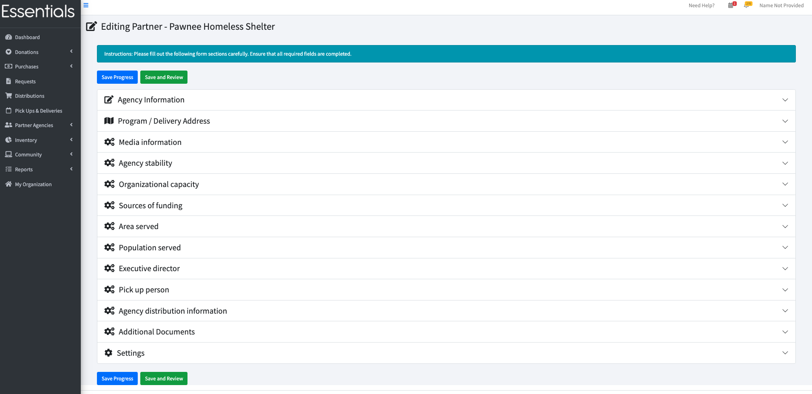

READY FOR REVIEW

# Partner Profiles
Partner Profiles allow you to gather and hold a lot of information about your Partners that may be useful for meeting your regulatory requirements, managing their experience, and for grant-writing.  

There is a *lot* of information in the profiles, and the information that is needed varies from bank to bank.  Once you decide what information you need from your partners, you can set up the Partner Profiles to show the sections that you need, customizing it through ["My organization"](getting_started_customization.md).

## How does a Partner fill in and submit their profile

In the Partner's view of the system,  they can click on "Edit My Profile" to fill in all the information you want.  
Once they have saved this,  they will also see a "Submit for Approval" button.   Clicking that changes their status to "Waiting for Approval", and makes them appear in your [dashboard](essentials_dashboard.md)  list of partners waiting for approval, as well as making a "Review Partner's application" button appear beside them in your view of all the Partners.

# Viewing a Partner Profile
The Partner's profile is viewable by clicking Partner Agencies in the left hand menu, then All Partners, then the name of the Partner. Scroll down to "Partner Profile"

More information about the partner profile can be found under "Editing a Partner's Profile", below.
# Editing a Partner's Profile
You can edit a Partner Profile clicking Partner Agencies in the left hand menu, then All Partners, then "view" beside the partner in question. Scroll down to "Partner Profile", then click "Edit Information."

This will bring you to the partner profile edit screen
It is initially presented with all the sections collapsed.  Clicking on any of them will open the appropriate section.

You can save your progress by pressing the "Save Progress" button -- that will save what you have done, but keep this screen up.
Clicking "Save and Review" will save what you've entered, and go to the profile view.
In either case,  the whole profile will be checked for errors, which you will have to resolve to save.

# The sections
The high level sections of the partner profile are:
- Agency Information (not configurable)
- Program / Delivery Address (if different)
- Media Information
- Agency Stability
- Organization Capacity
- Sources of Funding
- Area Served (County/Client Share %)
- Population Served
- Executive Director
- Primary Contact
- Pick up Person
- Race/Ethnicity of Client Base
- Agency Distribution Information
- Additional Documents
- Settings (not configurable)

Unless marked otherwise, above,  you can choose whether you and the partners will see these sections,  in your "My Organization" section (see ["Getting started - customization](getting_started_customization.md))

[!NOTE] The section screenshot images below have sample data in them.  Your initial screens may look a bit different as a result.
### Agency Information (not configurable)

This section contains basic agency information that most, if not all, partners will need to provide:
- Agency Name
- Agency Type
- Other Agency Type (i.e, details if "other" is chosen in Agency Type)
- 501(c)(3) IRS Determination Letter  -- this is a file to upload said letter.
- Agency Mission
- Address
- City
- State
- Zip Code

### Program / Delivery Address (if different)

Sometimes, a large agency may have a separate address for a specific program or for deliveries/shipping.
- Address
- City
- State
- Zip Code

### Media Information

This provides a place for the agency to indicate their major communication outlets. 

*If* the bank chooses to ask for this information,  the Partner must fill in at least one of the fields:

- Website
- Facebook
- Twitter   (yes, we know it's called X now)
- Instagram
- No Social Media Presence

### Agency Stability

This section is about the maturity of the agency. 

None of these fields are mandatory. 

- Year founded
- Form 990
- Program Name(s)
- Program Description(s)
- Agency Age
- Evidence Based?
- Case Management
- How Are Essentials (e.g. diapers, period supplies) Used in Your Program?
- Do You Receive Essentials From Other Sources?
- Currently Providing Diapers?

### Organization Capacity

This section has specific questions about the volume of the agency's needs.
- Client Capacity
- Storage Space (yes/no)
- Storage Space Description

### Sources of Funding

How does the agency get its funding?
- Sources of Funding
- How do you currently obtain diapers?
- Essentials Budget
- Essentials Funding Source

### Area Served (County/Client Share %)

This asks what county/county equivalents the agency serves and what proportion of their client share is in which area.

At this time, this only covers U.S. counties and equivalents.   We believe the list covers *all* of the U.S, including some areas that are not tecnically counties.    
Let us know if you need more!

The sum of the client share has to be either 0 or 100, and the numbers have to be positive whole numbers.

You start out with space for 1 county, but can add more with the "Add Another County button"

### Population Served

This section has three broad questions plus two subsections of of demographic questions:

[!NOTE] We have an issue in our queue to rework this, so the order may change.

- Clients Have An Income Requirement to Work With You?
- Do You Verify The Income Of Your Clients?

#### Race/Ethnicity of Client Base
This subsection is comprised of questions about the race/ethnicity of the client base and the poverty level of the Partner's client base.
There is no check on whether the numbers add up to 100 -- because there may be overlap.

- % African American
- % Caucasian
- % Hispanic
- % Asian
- % American Indian
- % Pacific Island
- % Multi-racial
- % Other

- Zip Codes Served

#### Poverty Information of those Served:
- % at FPL or Below   (FPL is Federal Poverty Line)
- % above 1-2 times FPL
- % Greater than 2 times FPL
- % Poverty Unknown

### Executive Director

![NOTE] This section currently contains both Executive Director and Primary Contact for the partner.  We have splitting them up in our queue.
Contact information for the head of the agency:
- 
- Executive Director Name
- Executive Director Phone
- Executive Director Email

This is for your information only.  It is not used for any emails.

#### Primary Contact
Contact information for your bank's primary contact 
- Primary Contact Name
- Primary Contact Phone
- Primary Contact Cell
- Primary Contact Email

This is for your information only.  It is not used for any emails.

### Pick Up Person
![screenshot of expanded pick up person section]
The Pick up person (as well as the person who made the Request) will receive an email  when a Distribution is scheduled, if the Distribution type is "Pick up"
- Pick Up Person Name
- Pick Up Person's Phone #
- Pick Up Person's Email 
  - This can be multiple, comma-separated emails.

### Agency Distribution Information

This section is about the agency's practices when distributing to their clients.
- Distribution Times
- New Client Times
- More Docs Required 
  - This is meant to be the documentation required for new clients

### Additional Documents

This is a place to upload additional documents that you need from your Partner.

### Settings (not configurable)

Many banks restrict the Partners to one kind of request (see [Customization](getting_started_customization.md)).  If you don't, the Partner can still simplify their request experience by unclicking the items that don't apply.
Only the options that you haven't already turned off will show up there,  and at least one has to be checked.
- Enable Quantity-based Requests
- Enable Child-based Requests
- Enable Requests for Individuals

[Prior: inviting a Partner](pm_inviting_a_partner.md) [Next: Approving a Partner](pm_approving_a_partner.md)