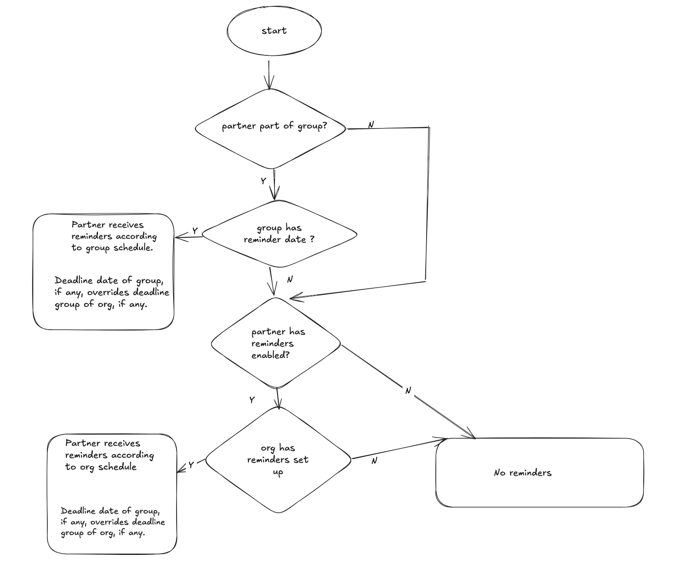

# Partner Reminder Emails 
You may configure a reminder schedule on an organization and/or Partner Group level. Partners who are covered by these categories, and who individually have reminders enabled, will receive an email based on the schedule, reminding them of the deadline for submitting requests. 

You may configure the date of the month or weekday of the month the reminders are sent, and the deadline date included in the email.

As you fill out the form, it should show you a preview of the next date the reminder will be sent, and the deadline date that will be included in that email.

Be aware that due to how these schedules are checked, it is unlikely that a newly created or updated schedule set to send a reminder the day it is created or update will actually send that reminder.

## Deadline day in reminder email
This is the day which will be included in the reminder email message.

It is assumed that the deadline day always occurs after the day the reminder is sent, and in cases where the deadline date specified is in the past, the deadline will be set to the next month.

As an example, the reminder is set to be every month on the 14th, and the deadline day is set to be the 7th. On January 14th, a reminder will be sent out and, since the 7th is in the past, the deadline date will be listed as February 7th.

## Reminder Schedule Priority
The logic which selects which reminder schedule, if any, to use to remind a partner is described below:

Some key points:
- If a Partner is part of a Partner Group that has a reminder schedule configured, they will receive reminders based on the Partner Group's reminder schedule even if that partner has reminders disabled.
- The reminder schedule and deadline day of a Partner Group will always supersede those set on the Organizational level.