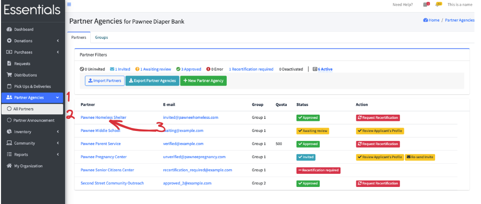
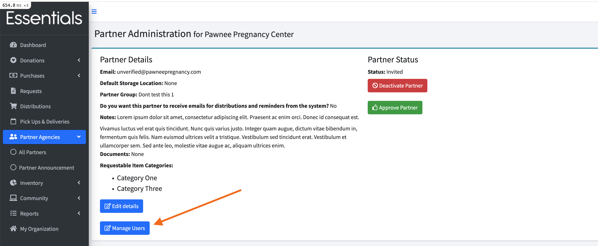

READY FOR REVIEW

# Administering Partner Users

Partners can add Users themselves,  but occasionally a bank may need to step in and administer Partner Users (for instance, if the only person who uses the system leaves the Partner.)

## Where do you administer Partner Users?

If you need to administer a Partner's Users,  click on "Partner Agencies" in the left-hand menu,  then "All Partners",
then click on the specific Partner you want to administer. 

Then  click "Manage Users" near the top of that screen.

This will bring you to a list of Users for that Partner.   Here you can invite new Users, start a reset password process (B) (they will receive an email with a link to reset their password), or remove access to that Partner from the User(C).  

[Prior - Partner reactivation](pm_Partner_reactivation.md)  [Next: Other Partner information](pm_other_information.md)