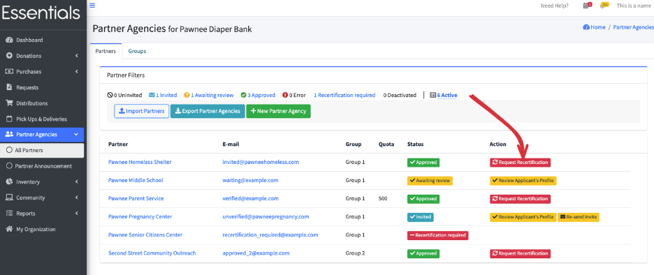

READY FOR REVIEW

# Requesting Recertification

From time to time, perhaps annually, you may want to confirm that the information your Partner has provided is still correct.   That is what "request recertification" is for.

[!WARN]  Once you request recertification, the Partner will not be able to enter Requests until you have approved them again!! 

If you request recertification from a Partner,  they will receive an email requesting that they update their information, and their status will change to "Recertification required".

Here is the text of that email 

---------
Hi [Partner name]

It's time to update your agency information!

Please log in to your account at http://humanessentials.app/users/sign_in

If no information has changed, please click Update.
If any information has changed, please amend it on the form and then click Update.

If you have any questions please contact [Bank name] at [Bank email]

Thank you and have a great day!

----------

To request recertification, go to the All Partners screen (click on "Partner Agencies", then "All Partners" in the left hand menu), then click the red "Request Recertification" button beside the Partner.  A confirmation window will pop up - check that you picked the right Partner, and click "OK".

This will change the status of the Partner to "Recertification required".

Once they have made their changes, you can [approve](pm_approving_a_partner.md) them again, which will restore their ability to make Pequests.

[!Note] They have a "Submit for Approval" button, which would change their status to "Waiting for Approval", and make them appear in your dashboard,  but you can bypass that step)

[Prior -- Approving a partner](pm_approving_a_partner.md)  [Next -- making a partner inactive ](pm_making_a_partner_inactive.md)
