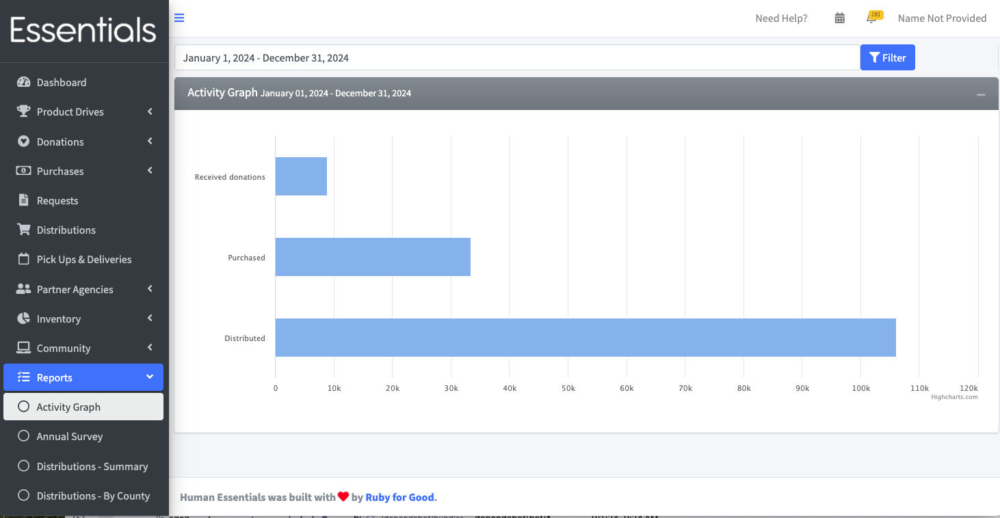
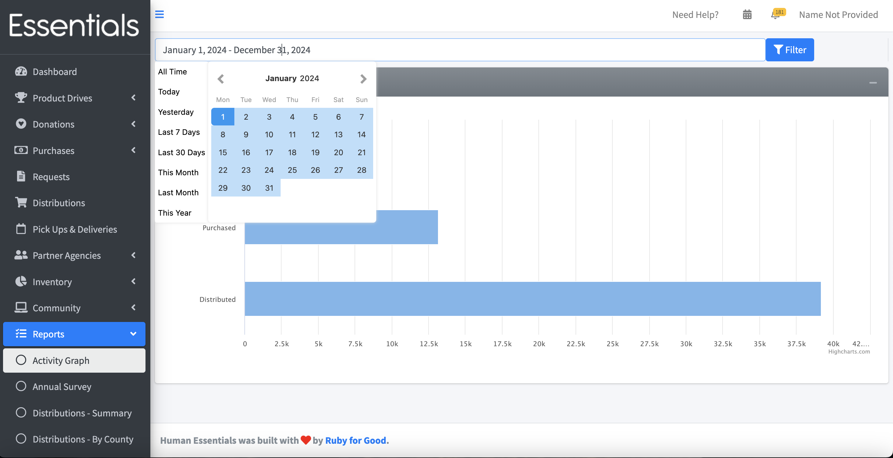

DRAFT USER GUIDE
# Activity Graph Report
This report is merely a visual representation of the number of items processed over a time period.

If you want to see a time period other than the current year,  change the date range and click "Filter".  Note,  we recommend you use the little pop-up gizmo to enter your date range, as the format of the date range is very fussy.

[Back to Manufacturers Donations](reports_manufacturers_donations.md)
[Next: User Management](user_management.md)

