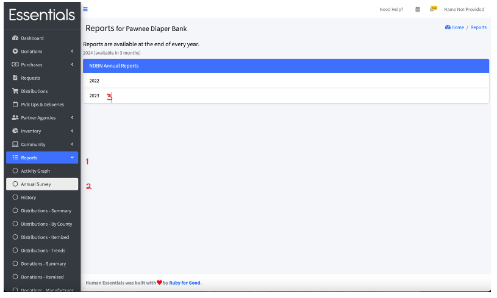
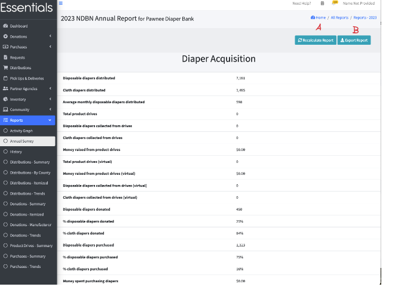
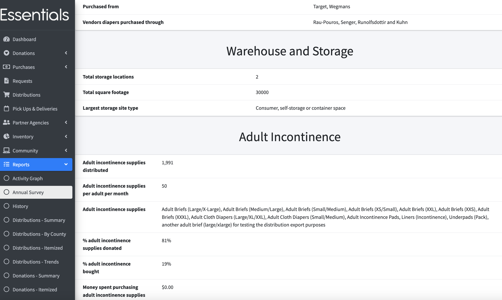
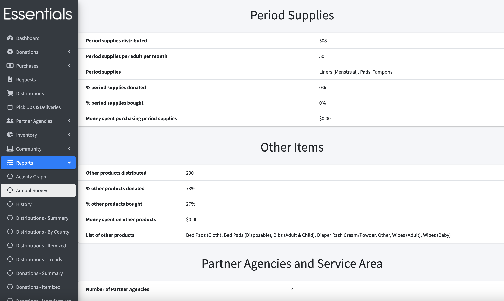
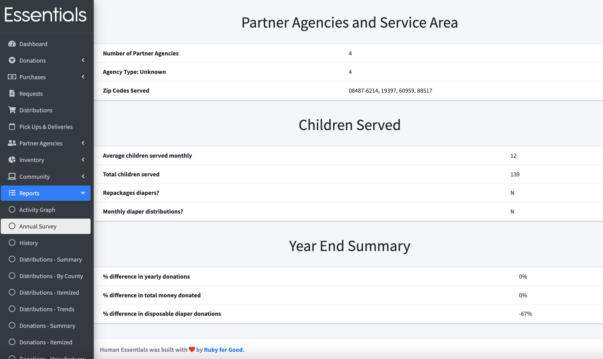

DRAFT USER GUIDE
## Annual Survey
The annual survey contains information useful for completing the NDBN or Alliance for Period Supplies annual survey, but also for grant writing.
Each year's annual survey becomes available January 1 of the following year.

## How to get the report

Click on "Reports", then "Annual Survey" in the left-hand menu.  Then click on the year of the report you wish to view.

This brings up the report.  

### Recalculation
If you have added information for that year since the last time you ran the report, you should recalculate the report by clicking "Recalculate Report" (A)
You may want to recalculate older reports as they will not reflect any changes we made since they were generated.

### Exporting
You can also extract the report to a csv file by clicking "Export Report" (B)

### Calculation notes

1/ We are in the process of changing the calculations so that items in kits appear in the totals for each value.  
At time of writing, the # of disposable and cloth diapers distributed include any diapers in kits,  and  period supplies also include period supplies in kits, but adult incontinence, and other do not.
At time of writing, purchased/donated supplies do not include any kit purchases/donations. ( We only know of one bank that currently has kits donated.)

2/ % donated / purchased is based on the number of items acquired,  not the number of items distributed.

3/ How we calculate per person values:  
    If you have entered a non-zero value for an [item](inventory_items.md#editing-an-item) in the quantity per individual field, we use that value.  Otherwise, we assume 50 of the item per individual. 

[Prior: Trends](reports_trends.md)        [Next: Distributions by County](reports_distributions_by_county.md)