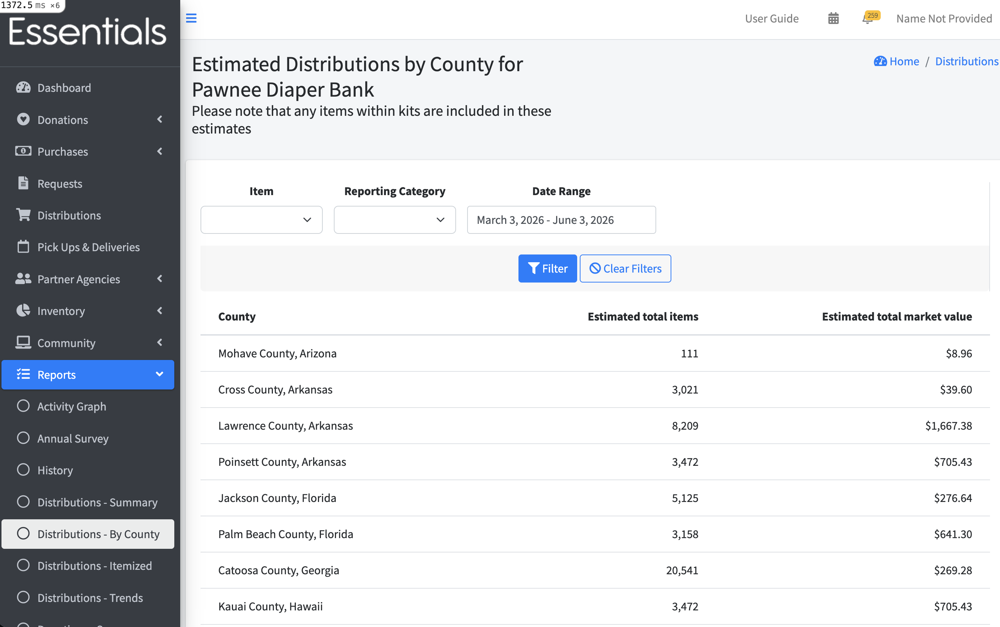
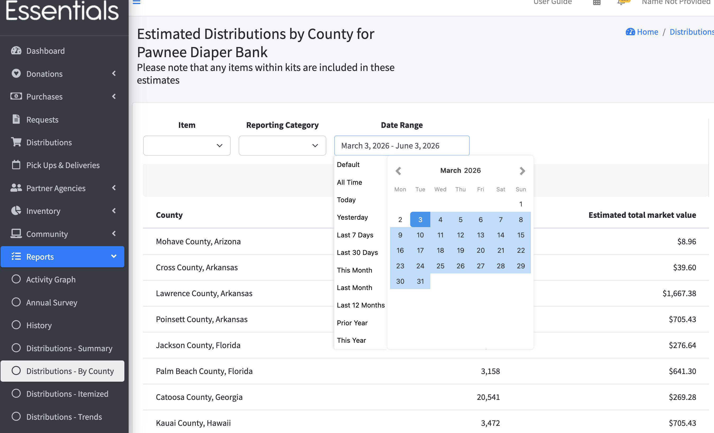
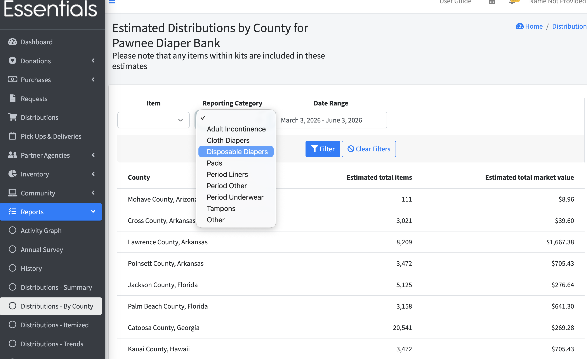

# Distributions by County Report

This report initially shows the total items and estimated total market value of the distributed Items for the time period.

We use the area served information entered in each partner's [profile](pm_partner_profiles.md) to allocate the items that have been distributed to them.  If that information has not been provided,  the items you've distributed are put into the 'Unspecified' category.

**N.B.  If you are using Kits, please note that this counts the items within the kits, rather than the kits.   You can not use this report to determine the number of kits that have been distributed to each county.**

If you want to see a time period other than the default of 60 days prior to 30 days forward from today,  change the date range and click "Filter".  We recommend you use the little pop-up gizmo to enter your date range, as the format of the date range is very fussy.

Similarly, you can also filter by a single item,  or by a reporting category, if, for example, you wanted to see distribution of disposable diapers,  you would select "Disposalbe Diapers" from the Reporting Category menu, and then click "Filter"

To go back to the default values,  click "Clear filters".

[Back to Annual Survey](reports_annual_survey.md)

[Next: Manufacturer Donations Report](reports_manufacturers_donations.md)