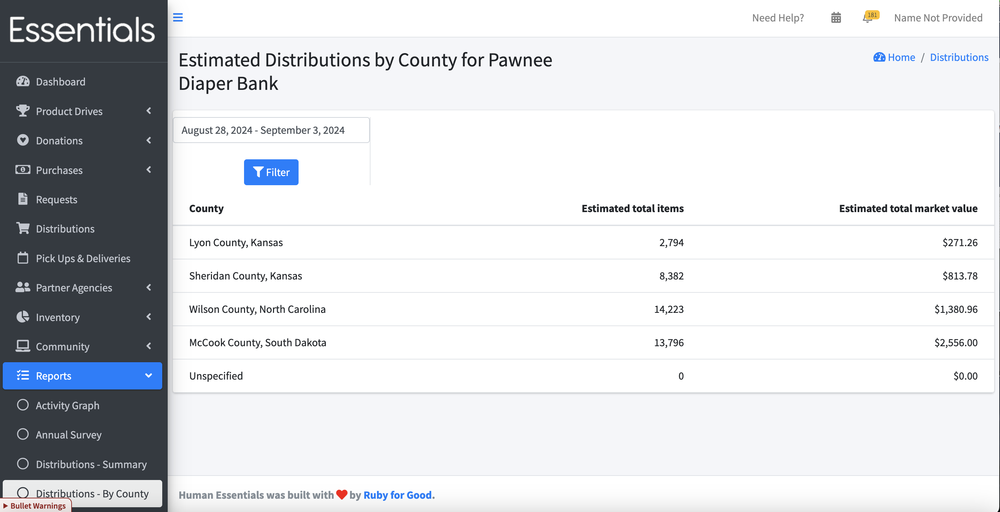

DRAFT USER GUIDE
# Distributions by County Report

This report shows the total items and estimated total market value of the distributed items for the time period.

We use the area served information entered in each partner's [profile](pm_partner_profiles.md) to allocate the items that have been distributed to them.  If that information has not been provided,  the items you've distributed are put into the 'Unspecified' category.

  
**N.B.** If you are using kits, please note that this treats each kit as an item,  rather than counting the items within the kits separately.

If you want to see a time period other than the default of 60 days prior to 30 days forward from today,  change the date range and click "Filter".  We recommend you use the little pop-up gizmo to enter your date range, as the format of the date range is very fussy.

[Back to Annual Survey](reports_annual_survey.md)

[Next: Manufacturer Donations Report](reports_manufacturers_donations.md)