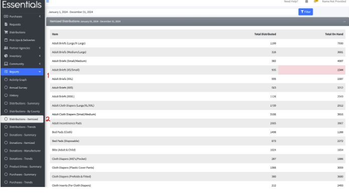

READY FOR REVIEW

# Itemized Reports

The itemized reports break down the inventory by Item over a given time period.   There are itemized reports for Donations and for Distributions.  
The following will use the itemized report for Distributions,  but the itemized report for Donations basically works the same way.

To show this report,  click on "Reports" in the left-hand menu, then "Distributions - Itemized"

The initial view that comes up will show the Items distributed during the default period of 60 days prior to, 30 days forward from today.  
This is based on the "issued at" date,  so even if you edit your distribution after the fact, any changes will be kept with that date.

If the amount on hand is less than the minimum quantity you provided for that Item (see [Items](inventory_items.md)), then the on hand amount will be highlighted in red.  

You can change the timeframe that this report covers in the usual way -- use the gizmo that will appear if you click on the date range at the top of the report to set the dates, then click "Filter"

[Prior -- Summary Reports](reports_summary_reports.md)    [Next -- Trends Reports](reports_trends.md)