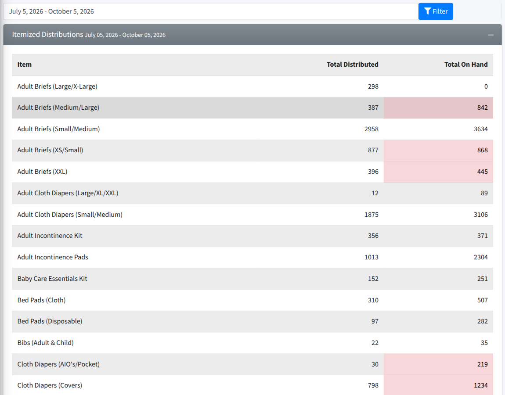
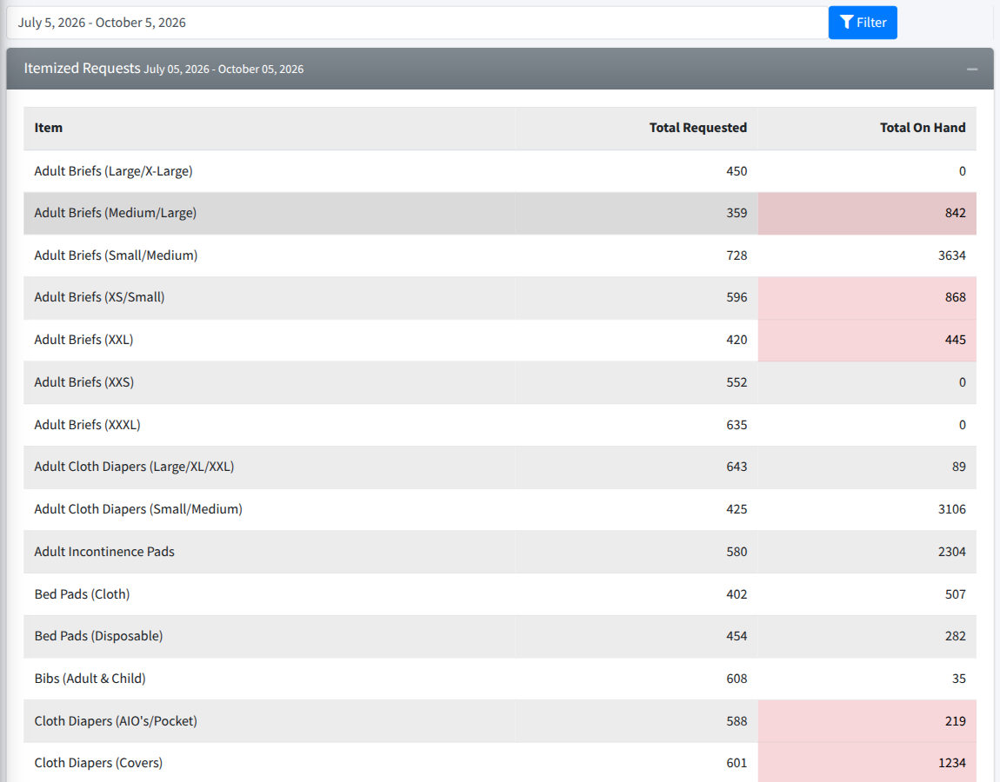

# Itemized Reports

The itemized reports break down the inventory by Item over a given time period.   There are itemized reports for Donations, for Distributions, and for Requests.  
The following will use the itemized report for Distributions,  but the itemized reports for Donations and Requests basically work the same way.

To show this report,  click on "Reports" in the left-hand menu, then "Distributions - Itemized"

The initial view that comes up will show the Items distributed during the default period of 60 days prior to, 30 days forward from today.  
This is based on the "issued at" date,  so even if you edit your distribution after the fact, any changes will be kept with that date.

If the amount on hand is less than the minimum quantity you provided for that Item (see [Items](inventory_items.md)), then the on hand amount will be highlighted in red.  

You can change the timeframe that this report covers in the usual way -- use the gizmo that will appear if you click on the date range at the top of the report to set the dates, then click "Filter"

## Requests - Itemized
The Requests - Itemized report ("Reports", then "Requests - Itemized") shows, for each Item, the total quantity your Partners requested in the period alongside your current total on hand -- a quick way to spot where demand is outrunning supply.  As with the other itemized reports, the on-hand amount is highlighted in red when it is below the Item's minimum quantity.

[Prior -- Summary Reports](reports_summary_reports.md)    [Next -- Trends Reports](reports_trends.md)