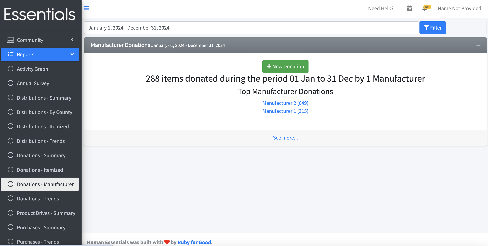
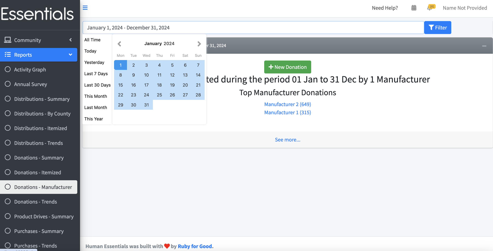

READY FOR REVIEW
# Manufacturers Donations Report

To access this report,  click 'Reports", then "Donations - Manufacturers"

This shows the number of items donated by Manufacturers over the indicated time period (default 60 days prior to 30 days forward from today), as well as the top Manufacturers donating in that time period.

From here, you can click on the listed Manufacturers to see a breakdown of their Donations.

Or enter a new Donation (by clicking on "New Donation", naturally.)

Or see all Donations for the time period, by clicking on 'See more...'

If you want to see a time period other than the default,  change the date range and click "Filter".  We recommend you use the little pop-up gizmo to enter your date range, as the format of the date range is very fussy.

[Back to Distributions by County](reports_distributions_by_county.md)

[Next: Activity Graph](reports_activity_graph.md)